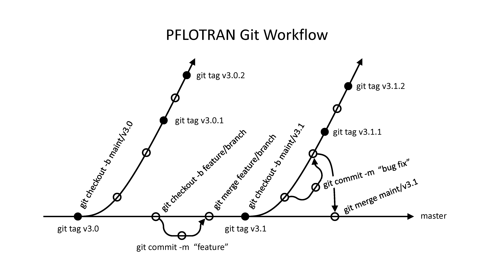

Back to :ref:`developer-guide`

.. _configuration-management-plan:

Configuration Management Plan
=============================

Organizational Roles and Responsibilities
-----------------------------------------

Individuals contributing to PFLOTRAN development are categorized 
into one of the following roles with corresponding responsibilities.  
The roles are listed in descending order and a given role inherits 
all responsibilities of underlying roles.  The ultimate of objective 
of this governing hierarchy is to address and protect the needs of 
the entire PFLOTRAN community while accommodating the desires of 
individuals.  

- **Lead Developer** The single person who is the principal developer of PFLOTRAN (for a project).  This person authorizes underlying roles and is ultimately responsible for all modifications to the project.
- **Senior Developer:** Persons with push privileges to the maintenance and master branches in the main project repository. Senior Developers review and assign feature request and problem reports.  They have authority to merge pull requests but cannot merge their own pull requests.  They must clean up mistakes missed during the review of merged pull requests.  
- **Developer:** Persons with push privileges to feature branches in the main project repository.
- **Contributor:** Persons who contribute documentation, source code and tests through pull requests submitted from forks (online clones) of the main project repository.

In the case of the overall, open source PFLOTRAN development project, 
the main project repository is on Bitbucket and a Contributor must 
fork the repository through Bitbucket.  Only a Developer or higher 
can push to Bitbucket from any clone.

Note that individual projects may (and should) assign project-specific 
roles aligned with the above.  For instance, many projects (with 
quality requirements) should assign a lead developer ultimately 
responsible for quality assurance on that project.  In these cases, 
Lead Developer is synonymous with Code Custodian, Code Sponsor.
Members of the PFLOTRAN team are assigned to these respective roles, 
but the public declaration of these assignments is unnecessary as we 
all work together for the benefit of the PFLOTRAN community.

Configurable Items
------------------
Configurable items within the PFLOTRAN project include:

- Documentation: Communication describing ideation, implementation, testing and/or user interaction is considered documentation.

 + Software Quality Assurance Plan :sup:`*`
 + Software Configuration Management Plan
 + Software Requirements Document :sup:`*`
 + Developer Guide
 + Theory Guide
 + User Guide
 + Quality Assurance (QA) Testing :sup:`*`

- Source code:  ASCII text files to be compiled or assembled to create the PFLOTRAN executable.

 + Fortran [.F90] source files in PFLOTRAN_DIR/src/pflotran

- Third-party libraries: Software libraries developed and maintained by external entities that are linked to the PFLOTRAN source code during compilation.

 + BLAS/LAPACK (e.g. fblaslapack, Intel MKL)
 + HDF5
 + METIS/ParMETIS
 + MPI (e.g. MPICH, OpenMPI)
 + PETSc

- Scripts: ASCII text files that contain instructions to be interpreted at run time.

 + Makefiles, Python scripts and shell scripts in PFLOTRAN_DIR and below

- Testing environments: ASCII text and binary files employed in testing to ensure software accuracy and robustness.

 + Configuration files [.cfg], Makefiles, Python scripts, input decks, and Gold files [.gold] in PFLOTRAN_DIR/regression_tests
 + pFUnit source files [.pf] and Makefiles in PFLOTRAN_DIR/src/pflotran/unittests

:sup:`*` :emphasis:`specific to a project.`

Approach to Storing PFLOTRAN Configurable Items
-----------------------------------------------

Documentation
+++++++++++++
All documentation is stored electronically under Git distributed 
version control in an online repository.  The preferred format is 
reStructuredText. Through scripting and the Sphinx documentation 
generator, the reStructuredText source is tagged with a date and 
version number and compiled to HTML or PDF format for distribution.  
Note that Sphinx can be employed in the cloud (e.g. at Codeship) 
to automatically build and update the HTML documentation stored at 
documentation.pflotran.org.

The PFLOTRAN Developer Guide, Theory Guide and User Guide are written 
in the reStructuredText format and stored in a Git repository at 
bitbucket.org/pflotran/pflotran-documentation.  This Configuration 
Management Plan is stored within the Developer Guide.  The PFLOTRAN 
Software Quality Assurance Plan and Requirements Document are stored 
at bitbucket.org/pflotran/pflotran-qa

Source Code
+++++++++++
All source code is stored electronically under Git version control in an online repository at bitbucket.org/pflotran/pflotran.

Third-Party Libraries
+++++++++++++++++++++
The versions of third-party libraries utilized in the compilation of 
PFLOTRAN are identified by version number or commit number (when 
version controlled).  Consistent and compatible version numbers are 
defined by documented installation instructions for all frozen 
releases of PFLOTRAN.  In cases where third-party library A 
automatically installs third-party library B, there is no need for 
PFLOTRAN to record version numbers for library B, as long library A 
is versioned. Third-party libraries currently required by PFLOTRAN 
are listed under Configurable Items.

Scripts
+++++++
All scripts are stored identically to source code.

Test Environments
+++++++++++++++++
All files associated with building and executing testing environments are stored identically to source code.

Approach to Git Version Control
-------------------------------
The figure below illustrates the Git workflow for PFLOTRAN development.  
All code development is performed within Git development or feature 
branches that originate from the master or a maintenance branch.  
The master or maintenance branches will never be modified directly.  

.. _git-workflow:

*master* Branch
+++++++++++++++
All major code development (e.g. development of process models, 
refactoring of infrastructure) is performed in feature branches 
derived from the flexible and agile master branch.  Development 
branches are tested and (peer) reviewed through pull requests 
submitted through the Bitbucket repository.  A pull request is 
not merged unless it passes all regression and unit tests run 
automatically through cloud-based continuous integration resources 
(e.g. Travis CI, Codeship).  Peer review is necessary to assess 
conformity with PFLOTRAN’s Fortran coding standards and to ensure 
that regression and unit tests cover the newly developed features.  
A Developer cannot peer review her/his own pull request, at least 
one Senior Developer must approve the pull request, and only Senior 
Developers can merge pull requests to master.

For code releases, the master branch will be:

- Tested to ensure quality,
- Tagged with a Semantic version number MAJOR.MINOR.PATCH,

  + Incrementing MINOR when backwards compatible and MAJOR otherwise,
  + PATCH is set to zero,

- Split to a frozen and deliberate maintenance branch named “maint/vMAJOR.MINOR”.  

Jira is used to document major code enhancements to the master 
branch (i.e. new process models, major refactors).  However, to 
enable flexible and agile development, documentation within Jira 
is not required for less major code modifications (e.g. 
reorganizing and optimizing code, changing variable names, etc.)

*maintenance* Branch
++++++++++++++++++++
Code development within maintenance branches is limited to bug 
fixes and/or minor corrections (e.g. fixing misspelled variables, 
documentation, etc.).  This process is deliberate and change 
requests document the modifications through Jira.  Patched releases 
are re-tested to ensure quality and tagged with an updated Semantic 
version number where the PATCH in the previous version number is 
incremented by one.  Review of pull requests submitted to frozen 
maintenance branches is more stringent than pull requests submitted 
to the flexible master branch.  These maintenance pull requests must 
pass all regression, unit, and QA testing, and changes must be 
properly documented within Jira.  Pull requests for maintenance 
branches are also submitted to the master branch and accepted under 
the master branch pull request acceptance criteria (i.e. without the 
need for formal QA testing and documentation).

Configuration Management FAQ
----------------------------
*How is access to configurable items controlled?* 

Configurable items are only modified within feature branches and 
updated through pull requests submitted against the master or 
maintenance branches.  Only Senior Developers can merge pull requests 
to the master or maintenance branches.  Therefore, only Senior 
Developers have the ability to access configurable items directly.  
In addition, Bitbucket delivers automated notifications that allow 
anyone to monitor changes to a repository.  These notifications are 
enabled and monitored by Senior Developers.

*How is the history of configurable items preserved?*

Git version control preserves the history of configurable items.  
In addition, all modifications to frozen maintenance branches are 
recorded through Jira tasks associated with the maintenance branches.  
Tags labelled with Semantic versioning enable rewinding to specific 
releases.  SHA-1 hashes associated with Git commits will recall any 
commit in the history of the repository.

*How is assembly of project deliverables automated?*

Bitbucket cloud resources host all PFLOTRAN source code, 
documentation and testing repositories.  Bitbucket supports webhooks 
that notify continuous integration resources (i.e. Codecov, Codeship, 
Travis CI) regarding changes to its repositories.  Continuous 
integration resources build and test all changes to PFLOTRAN 
repositories when branches are updated and/or pull requests are 
submitted.  Senior Developers (and Developers, Contributors and users 
subscribed to emailing lists) are notified when continuous integration 
resources report the following:

- Failure to download, configure and build PFLOTRAN and third-party libraries,
- Failure to pass all unit and regression tests,
- Failure to download, configure, build and upload documentation (to the PFLOTRAN website),
- Failure to pass all QA testing criteria.

*How is review and approval implemented?*

See Review and Approval.

*How are configuration audits performed?*

A person (potentially a PFLOTRAN user) knowledgeable in software 
configuration and coding and documentation standards who is not a 
PFLOTRAN Developer (or higher) audits the PFLOTRAN configuration 
management process annually to ensure compliance.

*How are contributors to the project trained?*

See the Introduction to the PFLOTRAN Developer Guide.
