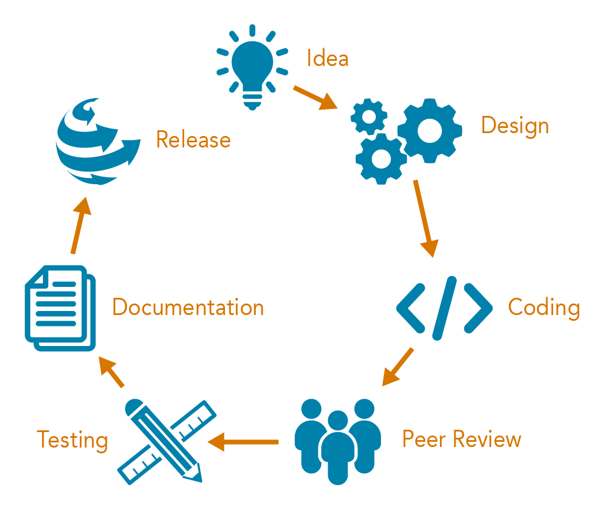

Back to :ref:`developer-guide`

.. _development-life-cycle:

Development Life Cycle
======================

The figure below illustrates the PFLOTRAN development lifecycle where 
an idea is designed, encoded, and released to the community after 
being peer reviewed, tested and documented:

- **Idea:** formulation of a new, enhance or increasingly optimized feature to be implemented.
- **Design:** development of technical specifications for the new feature. 
- **Coding:** programming the feature in the source code and provisioning regression and unit tests.
- **Peer Review:** responding to feedback from the developer and user community.
- **Testing:** ensuring feature accuracy through validation and verification.
- **Documentation:** describing the feature's implementation and instructing on its use.
- **Release:** distributing the feature to the community.

Linkage to Quality Assurance and Configuration Management
---------------------------------------------------------

Idea and Design
+++++++++++++++
Developers document and discuss concepts, theories, and implementation 
plans through workflows convenient to the immediate developer community. 
Inclusion of experienced developers better ensures compatibility, 
minimizing the need to refactor code during the Peer Review stage.

Coding
++++++
Prior to implementation, developers receive training regarding best 
practices for software development.  Developers then encode process 
models and supporting software infrastructure according to the 
implementation plan. They create unit and regression tests that cover 
the new sections of code to preserve the capability as implemented. 

Peer Review
+++++++++++
Fellow developers review the proposed changes to ensure conformity 
with programming standards and existing software design and workflow. 
The iterative process of development and review continues until 
convergence, at which point, the modifications are accepted and merged 
with the main code.  

Testing
+++++++
Verification and/or validation tests are implemented to confirm the 
accuracy of the implemented process model.

Documentation
+++++++++++++
Documentation is updated with information regarding the design, 
implementation and use of the new process model and/or software 
infrastructure.

Release
+++++++
Peer Review, Testing, and Documentation are confirmed by Senior 
Developers, and the new capability is released to the user community.

Retirement
----------
PFLOTRAN is an open source code that is freely available online.  
Anyone may download, utilize and modify the code in conformity with 
software licensing.  However, when the time comes that PFLOTRAN is no 
longer being actively developed, an email will be posted to the user 
mailing list publicizing the retirement of the code.  An auto-reply 
message will respond to all submitted user emails indicating the same.  
A notice of retirement will be committed to all user documentation, 
including the PFLOTRAN version banner at the top of the screen output.  
Push privileges to the main online repository will be revoked for all 
developers.
