Pc-Saturation & Relative Permeability Functions
===============================================

.. _how-to-test-CCs:

How To Test Characteristic Curves
---------------------------------

The :ref:`characteristic-curves-card` card allows testing of the specific capillary
pressure-saturation functions and relative permeability functions chosen for
the simulation. Testing can be done by including the keyword ``TEST``
within the ``CHARACTERISTIC_CURVES`` block. Including this keyword will produce 
output (.dat files) which provides (a) the capillary pressure for the entire 
range of liquid saturation, (b) the liquid saturation for the entire range of 
capillary pressures, (c) the analytical derivative of liquid saturation with 
respect to the capillary pressure, (d) the numerical derivative of liquid 
saturation with respect to the capillary pressure, (e) the liquid relative 
permeability values for the range of liquid saturation, (f) the gas relative 
permeability values for the range of liquid saturation, and the (g) analytical 
and (h) numerical derivatives of the relative permeability functions with 
respect to liquid saturation.

Example 
~~~~~~~
 ::

  CHARACTERISTIC_CURVES cc1
    SATURATION_FUNCTION VAN_GENUCHTEN
      LIQUID_RESIDUAL_SATURATION 0.d0
      M 0.5d0
      ALPHA 1.d-4
      MAX_CAPILLARY_PRESSURE 1.d6
    /
    PERMEABILITY_FUNCTION MUALEM_VG_LIQ
      LIQUID_RESIDUAL_SATURATION 0.d0
      M 0.5d0
    /
    PERMEABILITY_FUNCTION MUALEM_VG_GAS
      LIQUID_RESIDUAL_SATURATION 0.d0
      GAS_RESIDUAL_SATURATION 1.d-40
      M 0.5d0
    /
    TEST
  /
  
Including the ``TEST`` keyword in the ``CHARACTERISTIC_CURVES`` block, as shown 
above, will produce the following output files, shown as examples only:

pflotran_sat_pc.dat:

 ::
 
  "saturation", "capillary pressure"
  0.000000E+00  1.000000E+09 
  1.000000E-02  1.000000E+09
  2.000000E-02  1.000000E+09
  3.000000E-02  1.000000E+09
  4.000000E-02  1.000000E+09
  5.000000E-02  1.000000E+09
  6.000000E-02  1.000000E+09
  7.000000E-02  1.000000E+09
  8.000000E-02  1.000000E+09
  9.000000E-02  1.000000E+09
  1.000000E-01  1.000000E+09
  1.100000E-01  1.000000E+09
  1.200000E-01  1.000000E+09
  1.300000E-01  1.000000E+09
  1.400000E-01  1.000000E+09
  1.500000E-01  1.000000E+09
  1.600000E-01  7.593750E+08
  1.700000E-01  3.513358E+08
  1.800000E-01  1.802032E+08
  1.900000E-01  1.000000E+08
  2.000000E-01  5.904900E+07
  ...           ...
  
pflotran_pc_sat.dat:

 ::
 
  "capillary pressure", "saturation", "dsat/dpres", "dsat/dpres_numerical"
  1.000000E+00  1.000000E+00  0.000000E+00  0.000000E+00
  2.000000E+00  1.000000E+00  0.000000E+00  0.000000E+00
  3.000000E+00  1.000000E+00  0.000000E+00  0.000000E+00
  4.000000E+00  1.000000E+00  0.000000E+00  0.000000E+00
  5.000000E+00  1.000000E+00  0.000000E+00  0.000000E+00
  6.000000E+00  1.000000E+00  0.000000E+00  0.000000E+00
  7.000000E+00  1.000000E+00  0.000000E+00  0.000000E+00
  8.000000E+00  1.000000E+00  0.000000E+00  0.000000E+00
  9.000000E+00  1.000000E+00  0.000000E+00  0.000000E+00
  1.000000E+01  1.000000E+00  0.000000E+00  0.000000E+00
  2.000000E+01  1.000000E+00  0.000000E+00  0.000000E+00
  3.000000E+01  1.000000E+00  0.000000E+00  0.000000E+00
  4.000000E+01  1.000000E+00  0.000000E+00  0.000000E+00
  5.000000E+01  1.000000E+00  0.000000E+00  0.000000E+00
  6.000000E+01  1.000000E+00  0.000000E+00  0.000000E+00
  7.000000E+01  1.000000E+00  0.000000E+00  0.000000E+00
  8.000000E+01  1.000000E+00  0.000000E+00  0.000000E+00
  9.000000E+01  1.000000E+00  0.000000E+00  0.000000E+00
  1.000000E+02  1.000000E+00  0.000000E+00  0.000000E+00
  2.000000E+02  1.000000E+00  0.000000E+00  0.000000E+00
  ...           ...
  
pflotran_liquid_rel_perm.dat:

 ::
 
  "saturation", "liquid relative permeability", "liquid dkr/dsat", "liquid dkr/dsat_numerical"
  0.000000E+00  0.000000E+00  0.000000E+00  0.000000E+00
  1.000000E-02  0.000000E+00  0.000000E+00  0.000000E+00
  2.000000E-02  0.000000E+00  0.000000E+00  0.000000E+00
  3.000000E-02  0.000000E+00  0.000000E+00  0.000000E+00
  4.000000E-02  0.000000E+00  0.000000E+00  0.000000E+00
  5.000000E-02  0.000000E+00  0.000000E+00  0.000000E+00
  6.000000E-02  0.000000E+00  0.000000E+00  0.000000E+00
  7.000000E-02  0.000000E+00  0.000000E+00  0.000000E+00
  8.000000E-02  0.000000E+00  0.000000E+00  0.000000E+00
  9.000000E-02  0.000000E+00  0.000000E+00  0.000000E+00
  1.000000E-01  0.000000E+00  0.000000E+00  6.969172E-46
  1.100000E-01  2.203846E-15  1.652884E-12  1.652943E-12
  1.200000E-01  3.989387E-13  1.496020E-10  1.496049E-10
  1.300000E-01  8.348157E-12  2.087039E-09  2.087069E-09
  1.400000E-01  7.221562E-11  1.354043E-08  1.354058E-08
  1.500000E-01  3.849960E-10  5.774940E-08  5.774996E-08
  1.600000E-01  1.511178E-09  1.888972E-07  1.888989E-07
  1.700000E-01  4.801937E-09  5.144933E-07  5.144973E-07
  1.800000E-01  1.307242E-08  1.225540E-06  1.225549E-06
  1.900000E-01  3.162278E-08  2.635231E-06  2.635249E-06
  2.000000E-01  6.969172E-08  5.226879E-06  5.226913E-06
  ...           ...
  
pflotran_gas_rel_perm.dat:

 ::
 
  "saturation", "gas relative permeability", "gas dkr/dsat", "gas dkr/dsat_numerical"
  0.000000E+00  1.000000E+00  0.000000E+00  0.000000E+00
  1.000000E-02  1.000000E+00  0.000000E+00  0.000000E+00
  2.000000E-02  1.000000E+00  0.000000E+00  0.000000E+00
  3.000000E-02  1.000000E+00  0.000000E+00  0.000000E+00
  4.000000E-02  1.000000E+00  0.000000E+00  0.000000E+00
  5.000000E-02  1.000000E+00  0.000000E+00  0.000000E+00
  6.000000E-02  1.000000E+00  0.000000E+00  0.000000E+00
  7.000000E-02  1.000000E+00  0.000000E+00  0.000000E+00
  8.000000E-02  1.000000E+00  0.000000E+00  0.000000E+00
  9.000000E-02  1.000000E+00  0.000000E+00  0.000000E+00
  1.000000E-01  1.000000E+00  0.000000E+00 -6.250000E-01
  1.100000E-01  9.937136E-01 -6.333929E-01 -6.333930E-01
  1.200000E-01  9.873154E-01 -6.469643E-01 -6.469643E-01
  1.300000E-01  9.807617E-01 -6.643325E-01 -6.643327E-01
  1.400000E-01  9.740181E-01 -6.848812E-01 -6.848814E-01
  1.500000E-01  9.670549E-01 -7.082013E-01 -7.082015E-01
  1.600000E-01  9.598459E-01 -7.339817E-01 -7.339819E-01
  1.700000E-01  9.523679E-01 -7.619671E-01 -7.619673E-01
  1.800000E-01  9.445999E-01 -7.919370E-01 -7.919373E-01
  1.900000E-01  9.365232E-01 -8.236948E-01 -8.236951E-01
  2.000000E-01  9.281207E-01 -8.570601E-01 -8.570604E-01
  ...           ...
  
By plotting these output files against the equations documented under
:ref:`pc-sat-functions-general` and 
:ref:`relative-permeability-functions-general`, 
a visual comparison can be made of the accuracy of the implemented
characteristic curves within PFLOTRAN.

Testing Results For Pc-Saturation Functions
-------------------------------------------

The following plots show a visual comparison between the PFLOTRAN implementation
of the capillary pressure and saturation functions, and the equation for these 
functions as given in Chen et al. (1999), or the Theory Guide in the case of
the linear relationships. The results of the SMOOTH option is also tested for 
the Brooks-Corey relationships. For the linear saturation
function relationship, the value of alpha given does not modify the solution
significantly, therefore, the value of alpha is held constant, while the 
liquid residual saturation is varied between 0.05 and 0.30.

Chen, J., J. W. Hopmans, and M. E. Grismer (1999) Parameter estimation of 
two-fluid capillary pressure-saturation and permeability functions, Advances in
Water Resources, Vol. 22, No. 5, pp. 479-493.

.. _bc-sat-pc:

Brooks-Corey
~~~~~~~~~~~~
This option is specified with ``SATURATION_FUNCTION BROOKS_COREY`` in the
:ref:`characteristic-curves-card` card.

.. math::

   S_e =& \left({\frac{1}{\alpha p_c}}\right)^{\lambda}
   
   p_c =& \frac{S_e^{-1/\lambda}}{\alpha}
   
   S_e =& \frac{S_l - S_{rl}}{1 - S_{rl}}
   
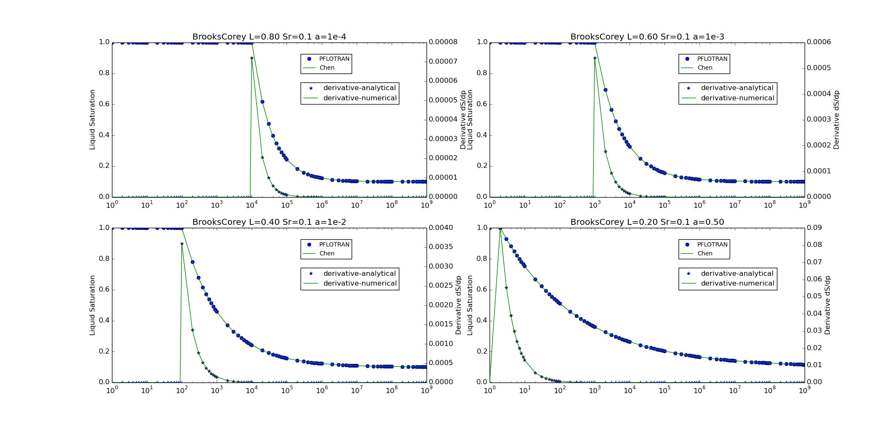

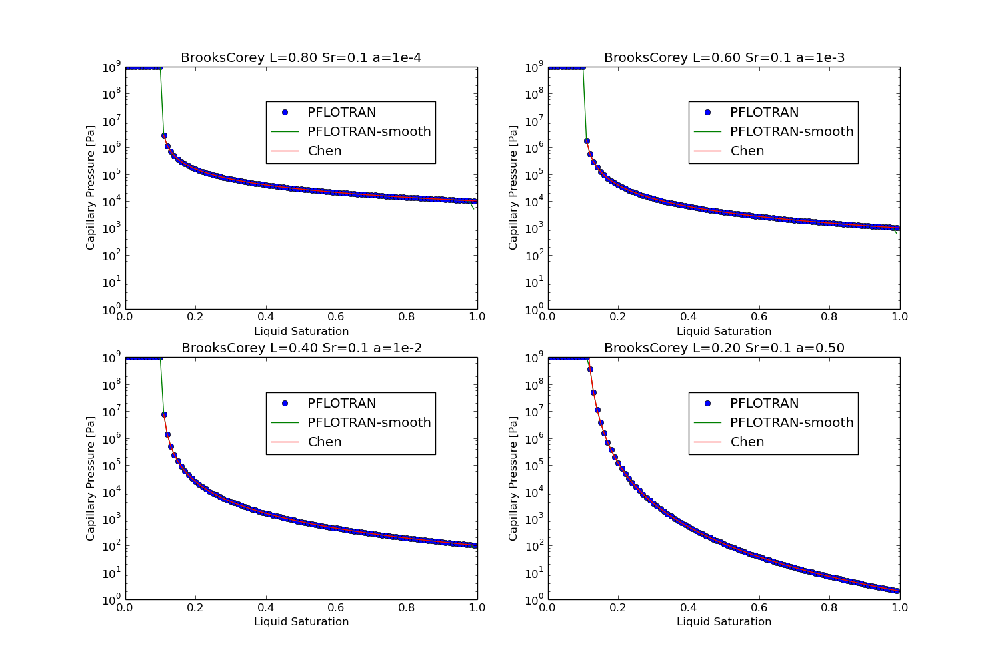
   
Note, similar relationships are used for the ``SATURATION_FUNCTION`` options
``BRAGFLO_KRP2, BRAGFLO_KRP3, BRAGFLO_KRP4,`` and ``BRAGFLO_KRP12`` options,
with minor tweaks. 

.. _krp2-sat-pc:

KRP2
""""

For option :ref:`characteristic-curves-card` 
``SATURATION_FUNCTION BRAGFLO_KRP2``,

.. math::

   P_t =& ak^v
   
   S_{e1} =& \frac{S_l - S_{rl}}{1 - S_{rl}}
   
   p_c =& 0 \hspace{0.55in} S_l \leq S_{rl}
   
   p_c =& \frac {P_t} {S_{e1}^{1/\lambda}} \hspace{0.55in} otherwise
   
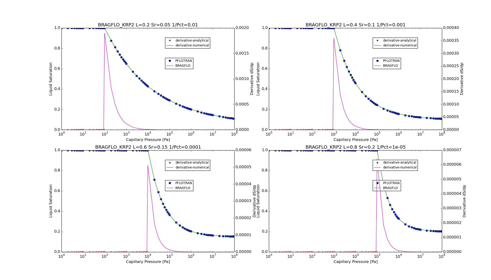

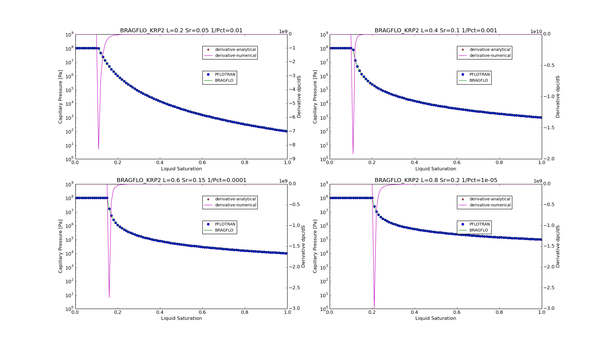
   
.. _krp3-sat-pc:

KRP3
""""
   
For option :ref:`characteristic-curves-card` 
``SATURATION_FUNCTION BRAGFLO_KRP3``,

.. math::

   P_t =& ak^v
   
   S_{e2} =& \frac{S_l - S_{rl}}{1 - S_{rl} - S_{rg}}
   
   p_c =& P_t \hspace{0.55in} S_g \leq S_{rg}
   
   p_c =& \frac {P_t} {S_{e2}^{1/\lambda}} \hspace{0.55in} S_{l} > S_{rl}
   
   p_c =& 0 \hspace{0.55in} otherwise
   
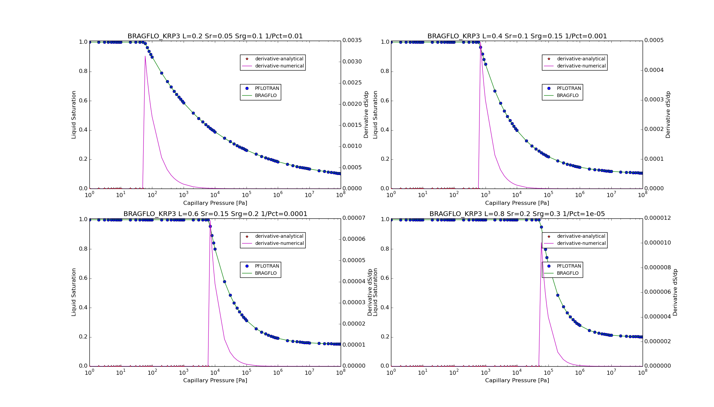

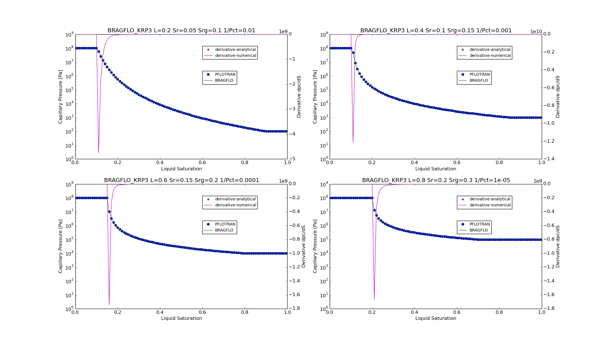
   
.. _krp4-sat-pc:

KRP4
""""

For option :ref:`characteristic-curves-card` 
``SATURATION_FUNCTION BRAGFLO_KRP4``,

.. math::

   P_t =& ak^v
   
   S_{e2} =& \frac{S_l - S_{rl}}{1 - S_{rl} - S_{rg}}
   
   p_c =& \frac {P_t} {S_{e2}^{1/\lambda}} \hspace{0.55in} S_g \leq S_{rg}
   
   p_c =& \frac {P_t} {S_{e2}^{1/\lambda}} \hspace{0.55in} S_{l} > S_{rl}
   
   p_c =& 0 \hspace{0.55in} otherwise
   
.. figure:: figures/BRAGFLO_KRP4_satpc_function.png
   :width: 90%

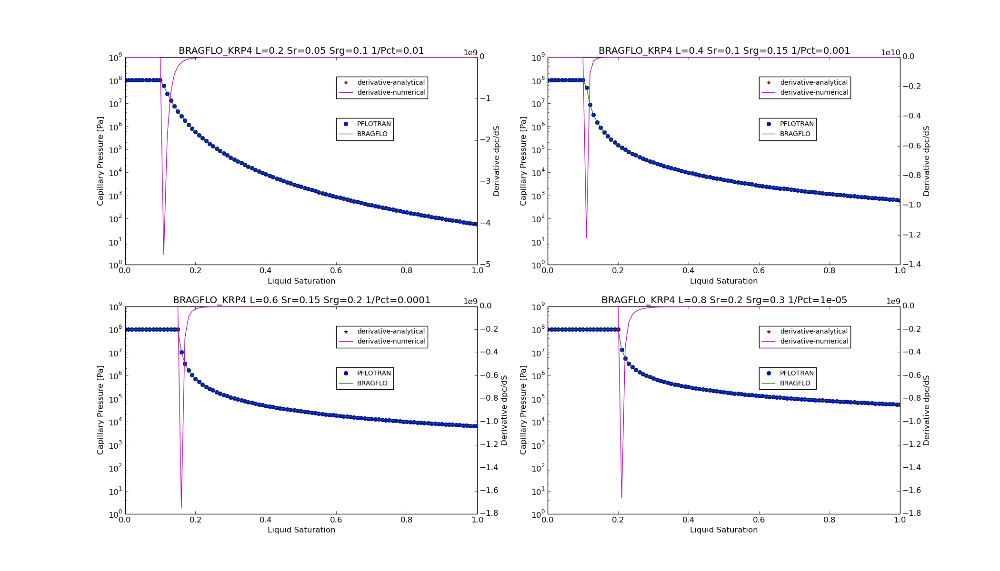
   
.. _krp12-sat-pc:

KRP12
"""""
   
For option :ref:`characteristic-curves-card` 
``SATURATION_FUNCTION BRAGFLO_KRP12``,

.. math::

   P_t =& ak^v

   S_{e21} =& max \left[{ min \left[{ \frac{S_l - \left(S_{MIN} - S_{EFFMIN}\right)}{1 - \left(S_{MIN} - S_{EFFMIN}\right)},1 }\right],S_{EFFMIN} }\right]
   
   p_c =& \frac {P_t} {S_{e21}^{1/\lambda}}
   
The value of :math:`S_{e21}` is not allowed to go above 1.0 or below 
:math:`S_{EFFMIN}`.
   
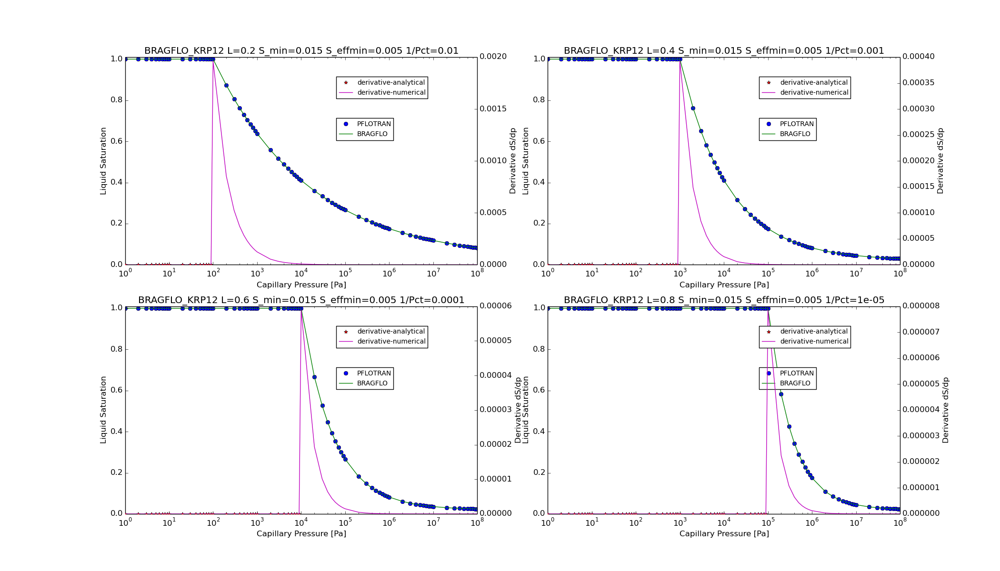

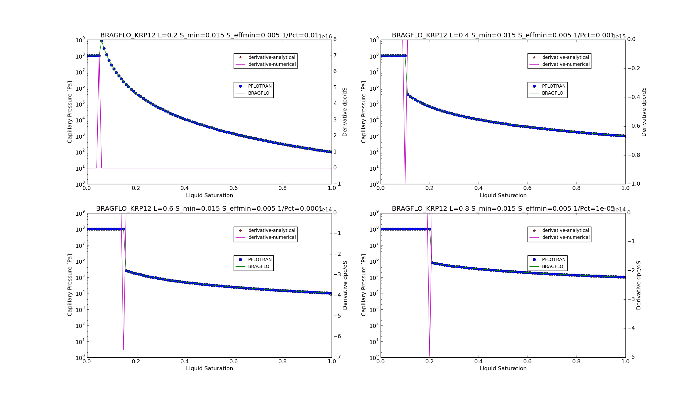

   

.. _vg-sat-pc:
   
van Genuchten
~~~~~~~~~~~~~
This option is specified with ``SATURATION_FUNCTION VAN_GENUCHTEN`` in the
:ref:`characteristic-curves-card` card.

.. math::

   S_e =& \left({1 + (\alpha p_c)^{n}}\right)^{-m}
   
   p_c =& \frac{1}{\alpha}\left({S_e^{-1/m}-1}\right)^{1/n}
   
   S_e =& \frac{S_l - S_{rl}}{1 - S_{rl}}
   
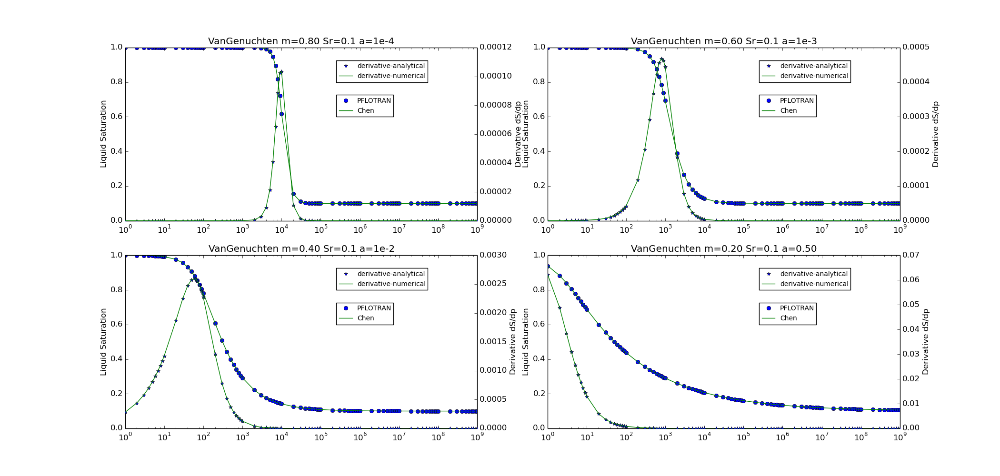

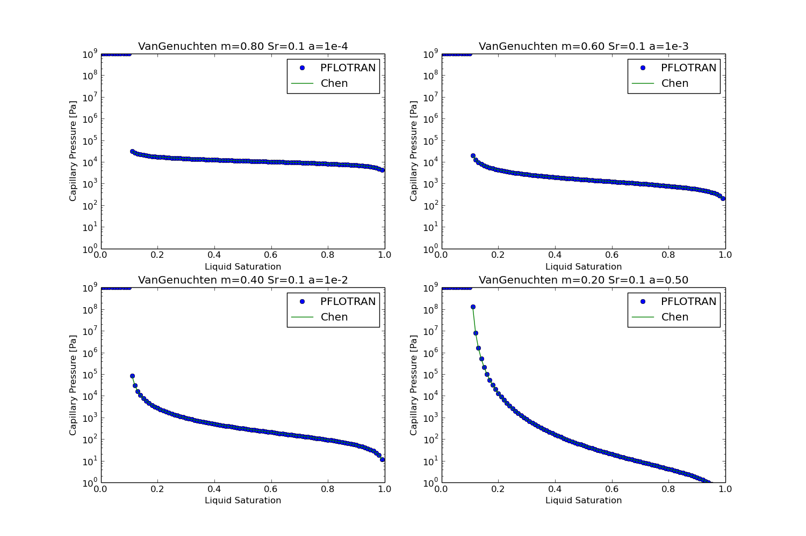
   
Note, similar relationships are used for the ``SATURATION_FUNCTION`` options
``BRAGFLO_KRP1`` and ``BRAGFLO_KRP8`` options, with minor tweaks.

.. _krp1-sat-pc:

KRP1
""""

For option :ref:`characteristic-curves-card` 
``SATURATION_FUNCTION BRAGFLO_KRP1``,

.. math::

   P_t =& ak^v
   
   S_{e2} =& min \left[{\frac{S_l - S_{rl}}{1 - S_{rl} - S_{rg}},1}\right]
   
   p_c =& p_0 \left({S_{e2}^{-1/m}-1}\right)^{1-m} \hspace{0.55in} S_g \leq S_{rg}
   
   p_c =& p_0 \left({S_{e2}^{-1/m}-1}\right)^{1-m} \hspace{0.55in} S_l > S_{rl}
   
   p_c =& 0 \hspace{0.55in} otherwise
   
where the parameter :math:`p_0` is derived by setting :math:`S_{eg}` in the 
KRP4 and KRP1 capillary pressure saturation relationships to 0.5, equating the 
KRP4 to the KRP1 relationship, and then solving for :math:`p_0` in the KRP1 
side of the relationship, e.g.,

.. math::
   
   p_0 \left({0.5^{-1/m}-1}\right)^{1-m} = P_t{0.5^{1/\lambda}}
   
   p_0 = P_t 2^{1/\lambda}\left({0.5^{-1/m}-1}\right)^{m-1}
   
   \lambda = \frac{m}{1-m}
   
The value of :math:`S_{e2}` is not allowed to go over 1.0.

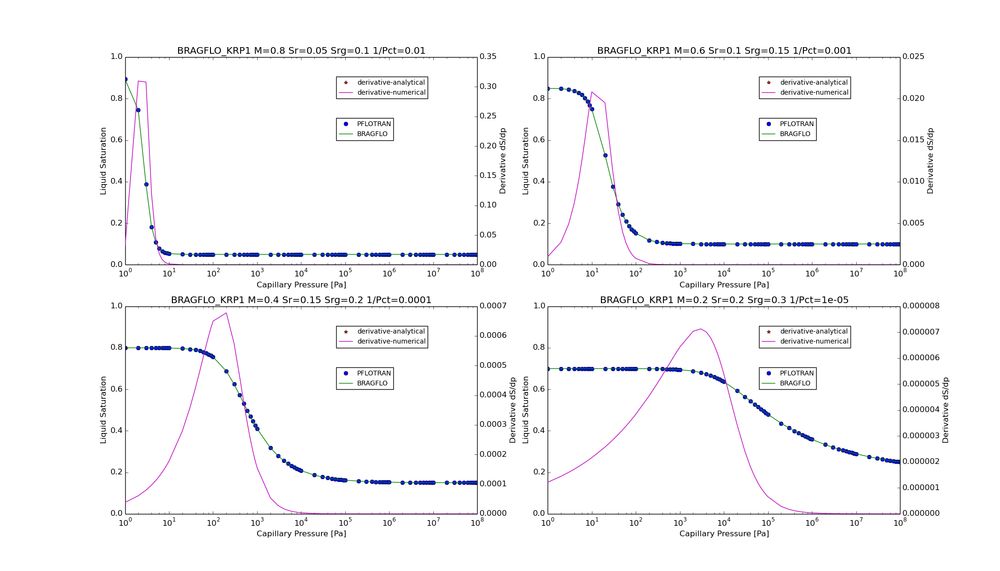

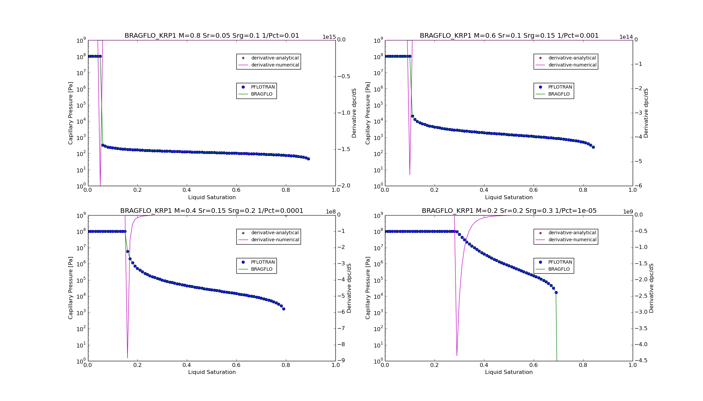
   
.. _krp8-sat-pc:

KRP8
""""

For option :ref:`characteristic-curves-card` 
``SATURATION_FUNCTION BRAGFLO_KRP8``,

.. math::

   P_t =& ak^v
   
   S_{e1} =& \frac{S_l - S_{rl}}{1 - S_{rl}}
   
   p_c =& p_0 \left({S_{e1}^{-1/m}-1}\right)^{1-m} \hspace{0.55in} S_{e1} < 1 \hspace{0.25in} and \hspace{0.25in} S_l > S_{rl}
   
   p_c =& 0 \hspace{0.55in} otherwise
   
   p_0 =& P_t 2^{1/\lambda}\left({ \left[{ \frac{0.5(1-S_{rg}-S_{rl})}{1-S_{rl}} }\right]^{-1/m} -1}\right)^{m-1}
   
   \lambda =& \frac{m}{1-m}

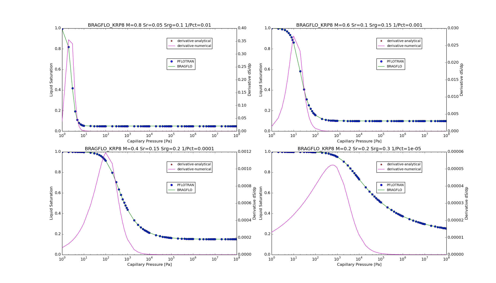

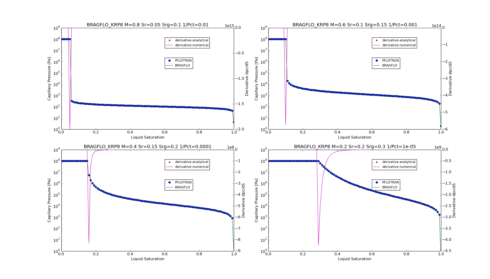
   
   

.. _lin-sat-pc:

Linear
~~~~~~
This option is specified with ``SATURATION_FUNCTION LINEAR`` in the
:ref:`characteristic-curves-card` card.

.. math::

   S_e =& \frac{p_c^{max}-p_c}{p_c^{max}-\frac{1}{\alpha}}
   
   p_c =& S_e\left({\frac{1}{\alpha}-p_c^{max}}\right) + p_c^{max}
   
   S_e =& \frac{S_l - S_{rl}}{1 - S_{rl}}
   
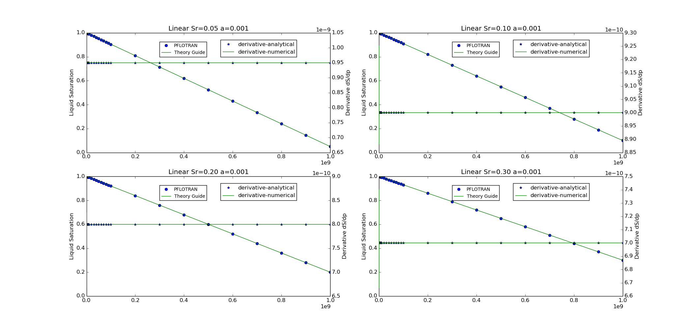
   
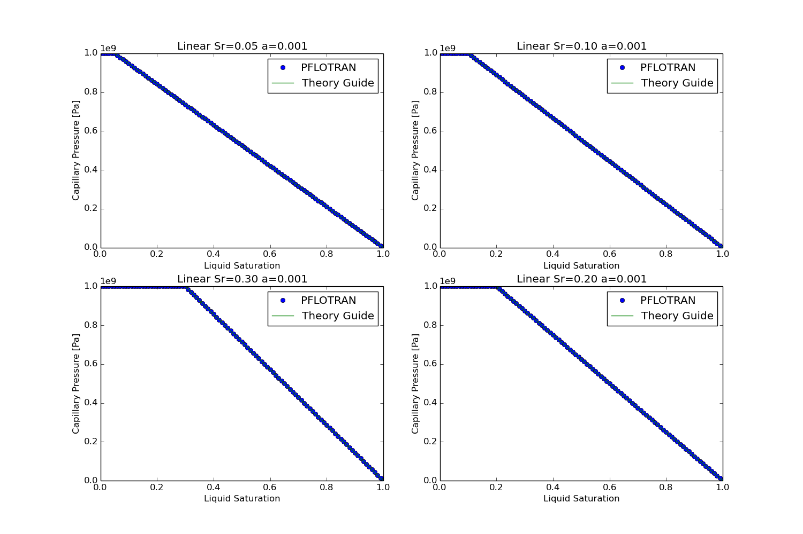
   
.. _krp5-sat-pc:

KRP5
""""
   
For option :ref:`characteristic-curves-card` 
``SATURATION_FUNCTION BRAGFLO_KRP5``,

.. math::

   P_t =& ak^v

   S_{e2} =& \frac{S_l - S_{rl}}{1 - S_{rl} - S_{rg}}
   
   p_c =& p_c^{max}  \hspace{0.55in} S_l \leq S_{rl}
   
   p_c =& P_t  \hspace{0.55in} S_g \leq S_{rg}
   
   p_c =& S_{e2}\left({P_t-p_c^{max}}\right) + p_c^{max}  \hspace{0.55in} otherwise

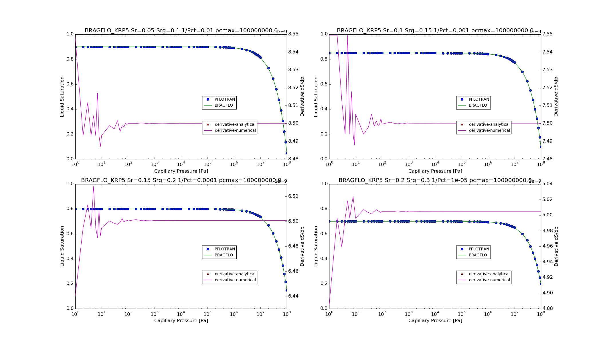

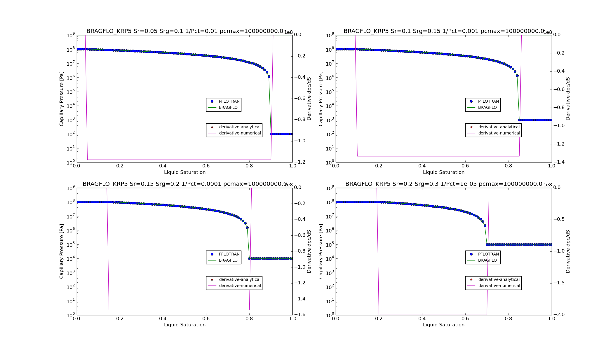
   
   
   
.. _krp9-sat-pc:

Vauclin et al. (KRP9)
~~~~~~~~~~~~~~~~~~~~~
This option is specified with ``SATURATION_FUNCTION BRAGFLO_KRP9`` in the
:ref:`characteristic-curves-card` card.

.. math::

   S_e =& \frac{(1-S_l)}{S_l}
   
   p_c =& 0 \hspace{0.55in} S_{l} \leq S_{rl}
   
   p_c =& a S_{e}^{1/b} \hspace{0.55in} otherwise
   
where parameters :math:`a=3783.0145` and :math:`b=2.9`

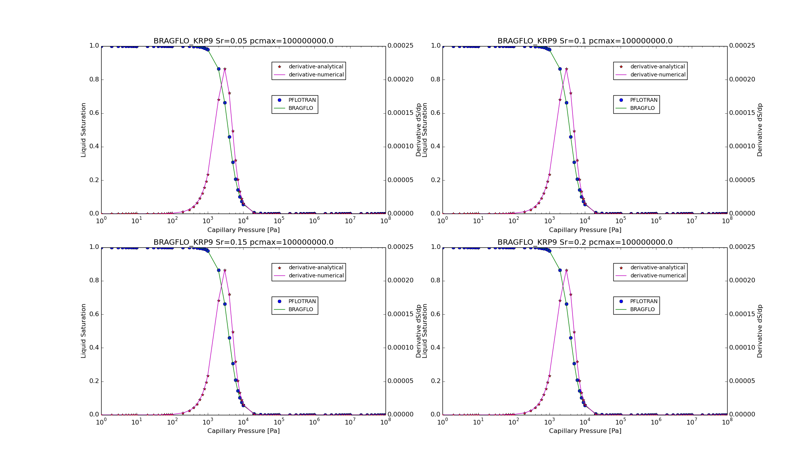

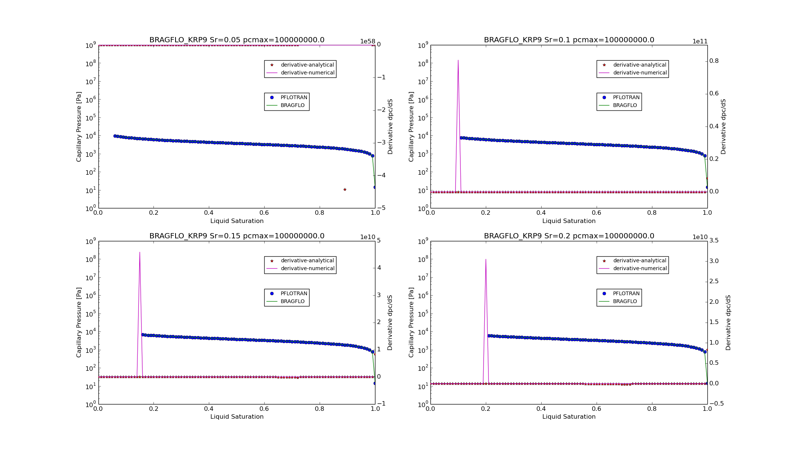
   
   
.. _krp11-sat-pc:
   
Open Cavity Modification (KRP11)
~~~~~~~~~~~~~~~~~~~~~~~~~~~~~~~~
This option is specified with ``SATURATION_FUNCTION BRAGFLO_KRP11`` in the
:ref:`characteristic-curves-card` card. It simply sets the capillary pressure
to zero and the liquid saturation to unity.

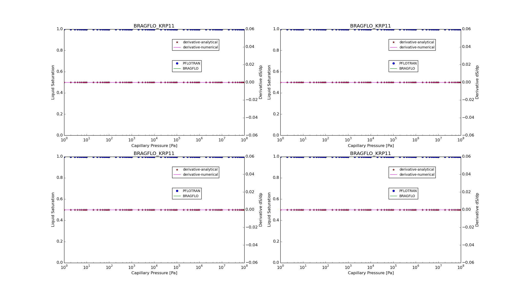

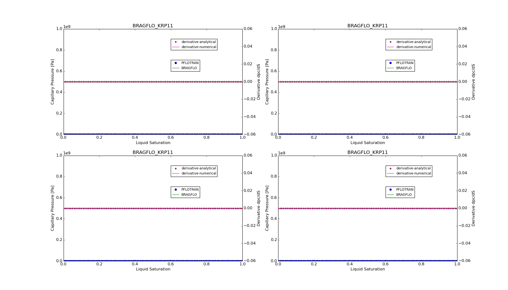
   
   
.. _mk_sat:

Modified Kosugi
~~~~~~~~~~~~~~~
This option is specified with ``SATURATION_FUNCTION MODIFIED_KOSUGI`` in
the :ref:`characteristic-curves-card` card.

.. math::

   S_e =& \frac{1}{2}\mathrm{erfc}\left\lbrace\frac{\log \left[f(p_c)\right] - \log \kappa + \mu_Z} {\sqrt{2}\sigma_Z}\right \rbrace&

   f(p_c) =& p_c - \frac{\kappa}{r_\mathrm{max}} &\mathrm{NPARAM}=3

   f(p_c) =& \frac{1}{\frac{1}{p_c} - \frac{r_0}{\kappa}} -\frac{\kappa}{r_\mathrm{max}} & \mathrm{NPARAM}=4

where :math:`\kappa=0.149 \; \mathrm{[cm^2]}` is a constant from the
Young-Laplace equation (:math:`2\gamma`), :math:`\mathrm{log}` is the
base-:math:`e` logarithm, and :math:`\mathrm{erfc}` is the
complimentary error function. Given the parameters
:math:`\sigma_Z=0.336`, :math:`\mu_Z=-6.25`, :math:`S_{rl}=0.153`, the
following figures illustrate the function and its derivatives over a
range of saturation and capillary pressures.

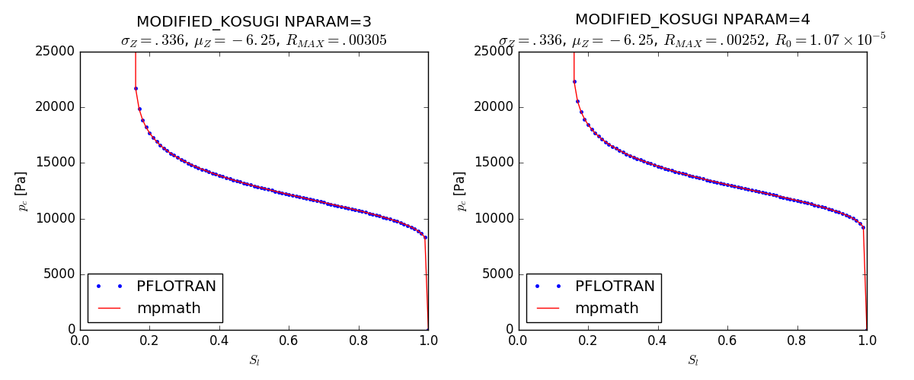

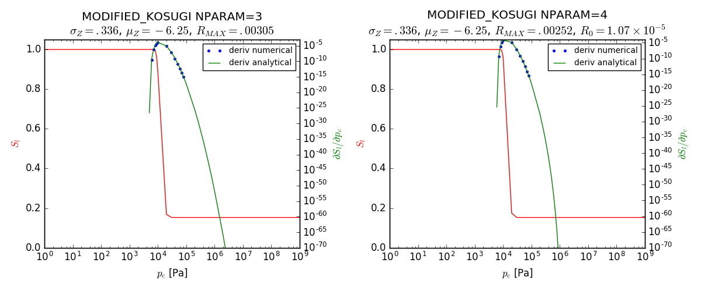

Testing Results For Relative Permeability Functions
---------------------------------------------------

The following plots show a visual comparison between the PFLOTRAN implementation
of the relative permeability functions, and the equation for the relative
permeability as given in Chen et al. (1999), the Theory Guide, or BRAGFLO.
The linear Mualem curves remain untested against the thoery guide, but they are 
plotted.

Chen, J., J. W. Hopmans, and M. E. Grismer (1999) Parameter estimation of 
two-fluid capillary pressure-saturation and permeability functions, Advances in
Water Resources, Vol. 22, No. 5, pp. 479-493.

.. _bcb-rel-perm:

Brooks-Corey-Burdine 
~~~~~~~~~~~~~~~~~~~~
This option is specified with ``PERMEABILITY_FUNCTION BURDINE_BC_[LIQ/GAS]`` 
in the :ref:`characteristic-curves-card` card.

.. math::
  
   k^r_l =& S_{el}^{3+2/\lambda}

   k^r_g =& \left({1-S_{eg}}\right)^2 \left({1-S_{eg}^{1+2/\lambda}}\right)
   
   S_{el} =& \frac{S_{l}-S_{rl}}{1-S_{rl}}
   
   S_{eg} =& \frac{S_{l}-S_{rl}}{1-S_{rl}-S_{rg}}

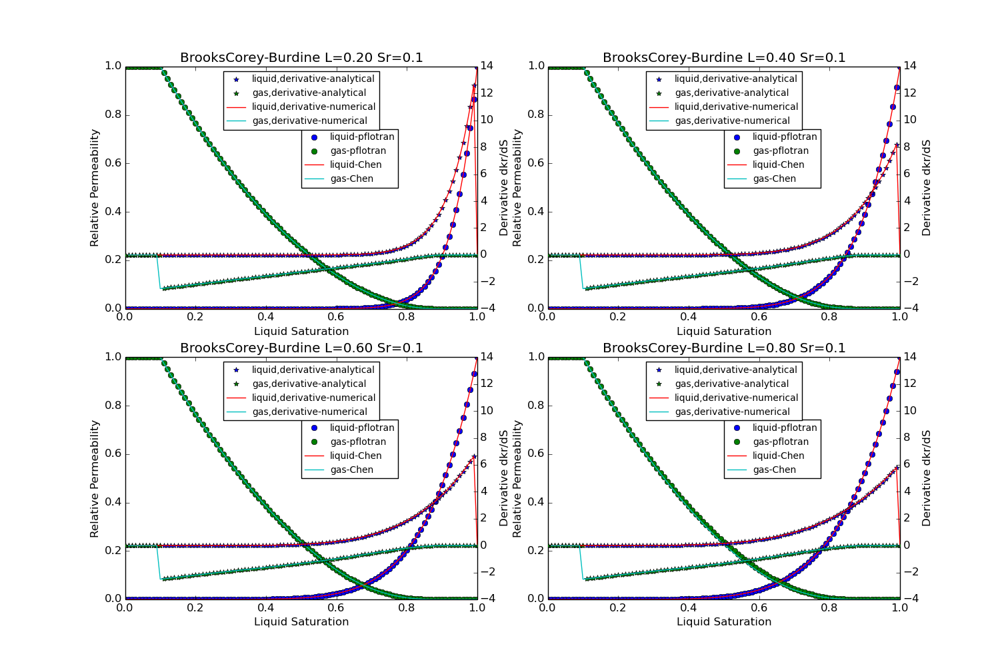
   
.. _krp2-rel-perm:

KRP2
""""
   
For option :ref:`characteristic-curves-card` 
``PERMEABILITY_FUNCTION BRAGFLO_KRP2_[LIQ/GAS]``,

.. math::

   k^r_l =& 0 \hspace{0.55in} S_l \leq S_{rl}
  
   k^r_l =& S_{e1}^{3+2/\lambda} \hspace{0.55in} otherwise
   
   k^r_g =& 1 \hspace{0.55in} S_l \leq S_{rl}

   k^r_g =& \left({1-S_{e1}}\right)^2 \left({1-S_{e1}^{1+2/\lambda}}\right) \hspace{0.55in} otherwise
   
   S_{e1} =& \frac{S_{l}-S_{rl}}{1-S_{rl}} 

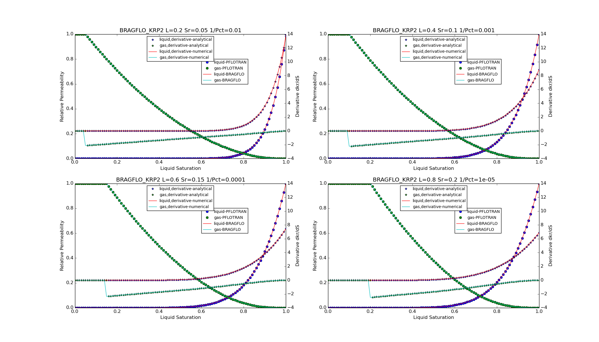
   
.. _krp3-rel-perm:

KRP3
""""
   
For option :ref:`characteristic-curves-card` 
``PERMEABILITY_FUNCTION BRAGFLO_KRP3_[LIQ/GAS]``,

.. math::

   k^r_l =& 1 \hspace{0.55in} S_g \leq S_{rg}
  
   k^r_l =& S_{e2}^{3+2/\lambda} \hspace{0.55in} S_l > S_{rl}
   
   k^r_l =& 0 \hspace{0.55in} otherwise
   
   k^r_g =& 0 \hspace{0.55in} S_g \leq S_{rg}

   k^r_g =& \left({1-S_{e2}}\right)^2 \left({1-S_{e2}^{1+2/\lambda}}\right) \hspace{0.55in} S_l > S_{rl}
   
   k^r_g =& 1 \hspace{0.55in} otherwise
   
   S_{e2} =& \frac{S_{l}-S_{rl}}{1-S_{rl}-S_{rg}} 

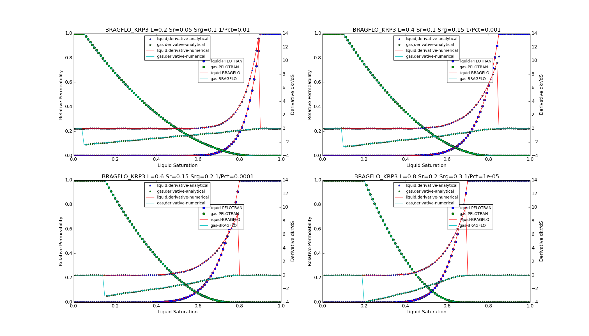
   
.. _krp4-rel-perm:

KRP4
""""
   
For option :ref:`characteristic-curves-card` 
``PERMEABILITY_FUNCTION BRAGFLO_KRP4_[LIQ/GAS]``,

.. math::

   k^r_l =& S_{e1}^{3+2/\lambda} \hspace{0.55in} S_g \leq S_{rg}
  
   k^r_l =& S_{e1}^{3+2/\lambda} \hspace{0.55in} S_l > S_{rl}
   
   k^r_l =& 0 \hspace{0.55in} otherwise
   
   k^r_g =& 0 \hspace{0.55in} S_g \leq S_{rg}

   k^r_g =& \left({1-S_{e2}}\right)^2 \left({1-S_{e2}^{1+2/\lambda}}\right) \hspace{0.55in} S_l > S_{rl}
   
   k^r_g =& 1 \hspace{0.55in} otherwise
   
   S_{e1} =& \frac{S_{l}-S_{rl}}{1-S_{rl}} 
   
   S_{e2} =& \frac{S_{l}-S_{rl}}{1-S_{rl}-S_{rg}} 

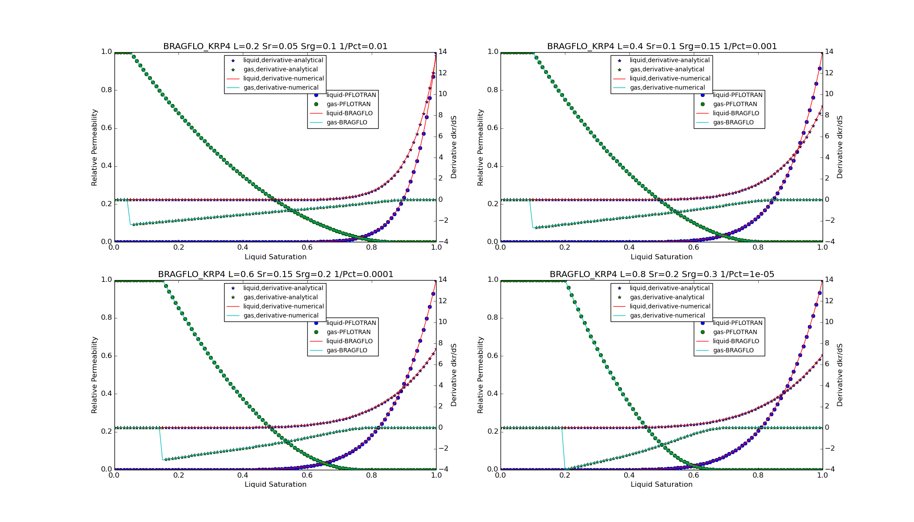
   
.. _krp12-rel-perm:

KRP12
"""""
   
For option :ref:`characteristic-curves-card` 
``PERMEABILITY_FUNCTION BRAGFLO_KRP12_[LIQ/GAS]``,

.. math::

   k^r_l =& S_{e1}^{3+2/\lambda} \hspace{0.55in} S_g \leq S_{rg}
  
   k^r_l =& S_{e1}^{3+2/\lambda} \hspace{0.55in} S_l > S_{rl}
   
   k^r_l =& 0 \hspace{0.55in} otherwise
   
   k^r_g =& 0 \hspace{0.55in} S_g \leq S_{rg}

   k^r_g =& \left({1-S_{e2}}\right)^2 \left({1-S_{e2}^{1+2/\lambda}}\right) \hspace{0.55in} S_l > S_{rl}
   
   k^r_g =& 1 \hspace{0.55in} otherwise
   
   S_{e1} =& max \left[{ min \left[{ \frac{S_{l}-S_{rl}}{1-S_{rl}},1 }\right] ,0 }\right] 
   
   S_{e2} =& max \left[{ min \left[{ \frac{S_{l}-S_{rl}}{1-S_{rl}-S_{rg}},1 }\right] ,0 }\right] 

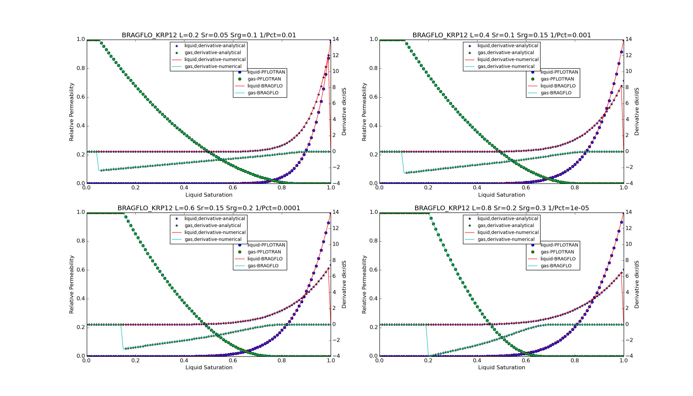

.. _bcm-rel-perm:
   
Brooks-Corey-Mualem
~~~~~~~~~~~~~~~~~~~
This option is specified with ``PERMEABILITY_FUNCTION MUALEM_BC_[LIQ/GAS]`` 
in the :ref:`characteristic-curves-card` card.

.. math::

   k^r_l =& S_{el}^{2.5+2/\lambda}
   
   k^r_g =& \sqrt{1-S_{eg}} \left({1-S_{eg}^{1+1/\lambda}}\right)^{2}

   S_{el} =& \frac{S_{l}-S_{rl}}{1-S_{rl}}
   
   S_{eg} =& \frac{S_{l}-S_{rl}}{1-S_{rl}-S_{rg}}

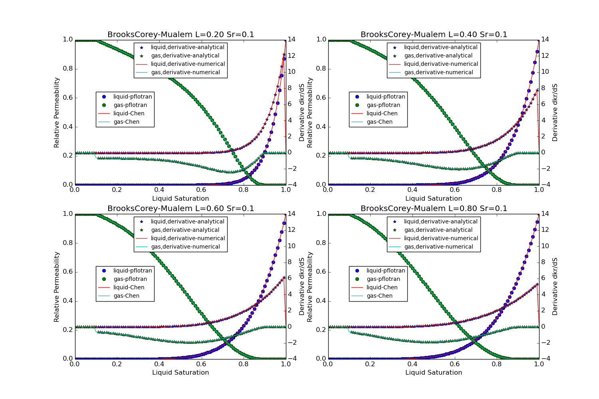
   
   
.. _vgb-rel-perm:
   
van Genuchten-Burdine
~~~~~~~~~~~~~~~~~~~~~
This option is specified with ``PERMEABILITY_FUNCTION BURDINE_VG_[LIQ/GAS]`` 
in the :ref:`characteristic-curves-card` card.

.. math::

   k^r_l =& S_{el}^2 \left({1-\left({1-S_{el}^{1/m}}\right)^m}\right)
   
   k^r_g =& \left({1-S_{eg}}\right)^2 \left({1-S_{eg}^{1/m}}\right)^m

   S_{el} =& \frac{S_{l}-S_{rl}}{1-S_{rl}}
   
   S_{eg} =& \frac{S_{l}-S_{rl}}{1-S_{rl}-S_{rg}}

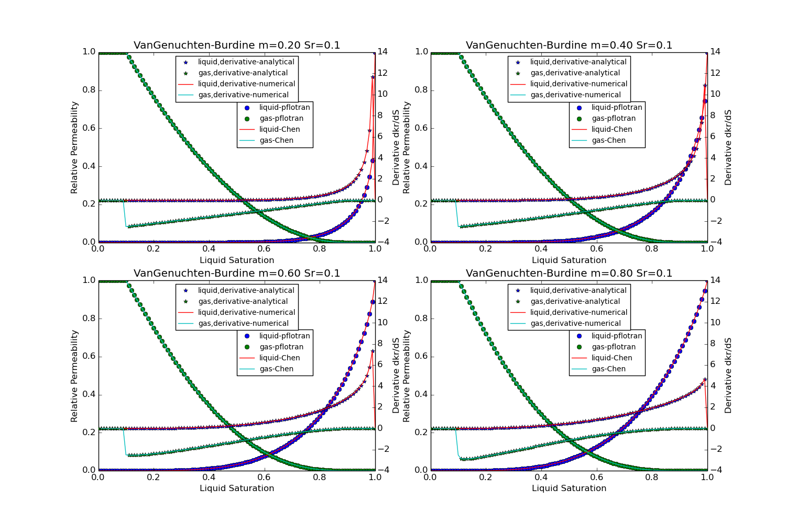
   
   
.. _vgm-rel-perm:

van Genuchten-Mualem
~~~~~~~~~~~~~~~~~~~~
This option is specified with ``PERMEABILITY_FUNCTION MUALEM_VG_[LIQ/GAS]`` 
in the :ref:`characteristic-curves-card` card.

.. math::

   k^r_l =& \sqrt{S_{el}}\left({1-\left({1-S_{el}^{1/m}}\right)^m}\right)^2
   
   k^r_g =& \sqrt{1-S_{eg}}\left({1-S_{eg}^{1/m}}\right)^{2m}

   S_{el} =& \frac{S_{l}-S_{rl}}{1-S_{rl}}
   
   S_{eg} =& \frac{S_{l}-S_{rl}}{1-S_{rl}-S_{rg}}

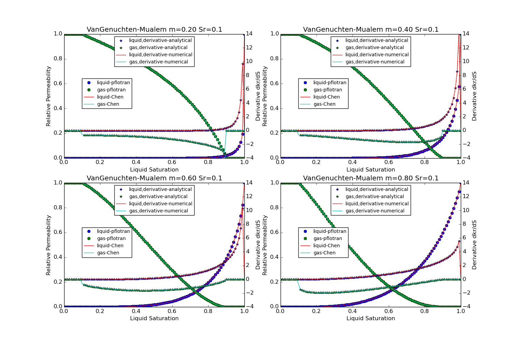
   
.. _krp1-rel-perm:

KRP1
""""
   
For option :ref:`characteristic-curves-card` 
``PERMEABILITY_FUNCTION BRAGFLO_KRP1_[LIQ/GAS]``,

.. math::

   k^r_l =& \sqrt{S_{e1}}\left({1-\left({1-S_{e1}^{1/m}}\right)^m}\right)^2 \hspace{0.55in} S_g \leq S_{rg}
   
   k^r_l =& \sqrt{S_{e1}}\left({1-\left({1-S_{e1}^{1/m}}\right)^m}\right)^2 \hspace{0.55in} S_l > S_{rl}

   k^r_l =& 0 \hspace{0.55in} otherwise
   
   k^r_g =& 0 \hspace{0.55in} S_g \leq S_{rg}
   
   k^r_g =& \sqrt{1-S_{e2}}\left({1-S_{e2}^{1/m}}\right)^{2m} \hspace{0.55in} S_l > S_{rl}

   k^r_g =& 1 \hspace{0.55in} otherwise
   
   S_{e1} =& min \left[{\frac{S_l - S_{rl}}{1 - S_{rl}},1}\right]
   
   S_{e2} =& min \left[{\frac{S_l - S_{rl}}{1 - S_{rl} - S_{rg}},1}\right]
   
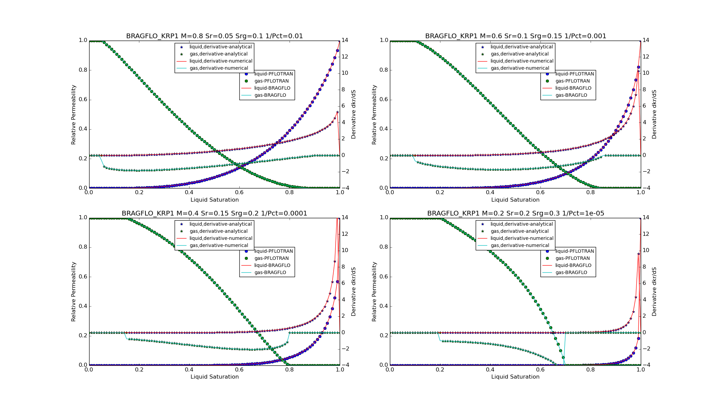
   
.. _krp8-rel-perm:

KRP8
""""
   
For option :ref:`characteristic-curves-card` 
``PERMEABILITY_FUNCTION BRAGFLO_KRP8_[LIQ/GAS]``,

.. math::

   k^r_l =& \sqrt{S_{e1}}\left({1-\left({1-S_{e1}^{1/m}}\right)^m}\right)^2 \hspace{0.55in} S_l>S_{rl} \hspace{0.2in} and \hspace{0.2in} S_{e1}<1
   
   k^r_l =& 1 \hspace{0.55in} S_l>S_{rl} \hspace{0.2in} and \hspace{0.2in} S_{e1} \geq 1

   k^r_l =& 0 \hspace{0.55in} otherwise
   
   k^r_g =& \sqrt{1-S_{e1}}\left({1-S_{e1}^{1/m}}\right)^{2m} \hspace{0.55in} S_l>S_{rl} \hspace{0.2in} and \hspace{0.2in} S_{e1}<1
   
   k^r_g =& 0 \hspace{0.55in} S_l>S_{rl} \hspace{0.2in} and \hspace{0.2in} S_{e1} \geq 1

   k^r_g =& 1 \hspace{0.55in} otherwise
   
   S_{e1} =& \frac{S_l - S_{rl}}{1 - S_{rl}}
   
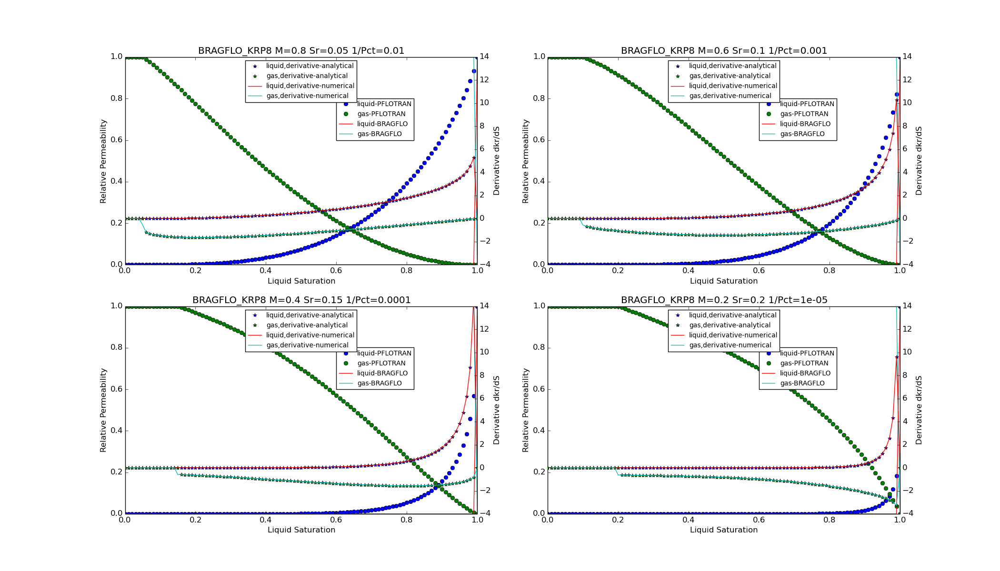
   
   
.. _lb-rel-perm:

Linear-Burdine
~~~~~~~~~~~~~~
This option is specified with ``PERMEABILITY_FUNCTION BURDINE_LINEAR_[LIQ/GAS]`` 
in the :ref:`characteristic-curves-card` card.

.. math::

   k^r_l =& s_{el}
   
   k^r_g =& 1 - s_{eg}

   S_{el} =& \frac{S_{l}-S_{rl}}{1-S_{rl}}
   
   S_{eg} =& \frac{S_{l}-S_{rl}}{1-S_{rl}-S_{rg}}

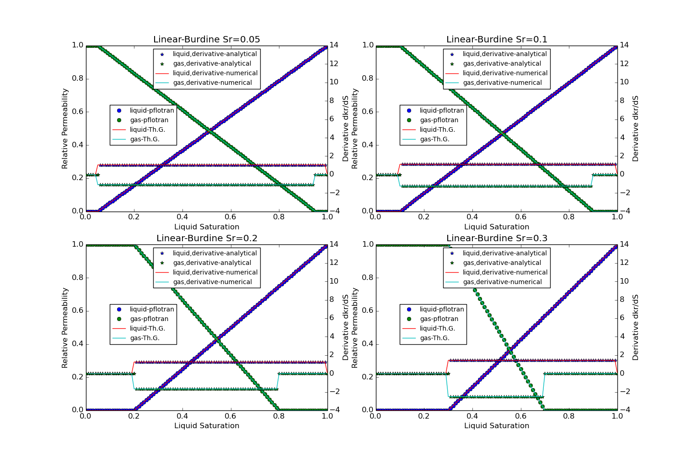
   
.. _krp5-rel-perm:
   
KRP5
""""
   
For option :ref:`characteristic-curves-card` 
``PERMEABILITY_FUNCTION BRAGFLO_KRP5_[LIQ/GAS]``,

.. math::

   k^r_l =& 0 \hspace{0.55in} S_l \leq S_{rl}
  
   k^r_l =& 1 \hspace{0.55in} S_g \leq S_{rg}
   
   k^r_l =& S_{e2} \hspace{0.55in} otherwise
   
   k^r_g =& 1 \hspace{0.55in} S_l \leq S_{rl}

   k^r_g =& 0 \hspace{0.55in} S_g \leq S_{rg}
   
   k^r_g =& 1-S_{e2} \hspace{0.55in} otherwise
      
   S_{e2} =& \frac{S_{l}-S_{rl}}{1-S_{rl}-S_{rg}} 

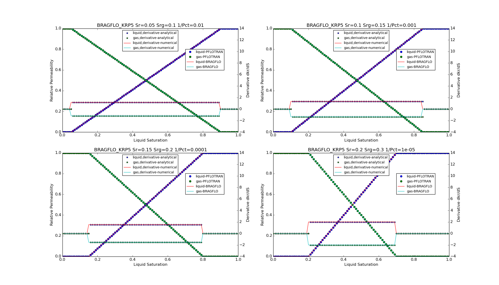

   
.. _lm-rel-perm:

Linear-Mualem
~~~~~~~~~~~~~
This option is specified with ``PERMEABILITY_FUNCTION MUALEM_LINEAR_[LIQ/GAS]`` 
in the :ref:`characteristic-curves-card` card.

.. math::

   k^r_l =& \sqrt{s_{el}}\frac{\ln\left({p_c/p_c^{max}}\right)}{\ln\left({\frac{1}{\alpha}/p_c^{max}}\right)}
   
   k^r_g =& \sqrt{1-s_{eg}}\left({1-\frac{k^{r}_{l}}{\sqrt{s_{eg}}}}\right)

   S_{el} =& \frac{S_{l}-S_{rl}}{1-S_{rl}}
   
   S_{eg} =& \frac{S_{l}-S_{rl}}{1-S_{rl}-S_{rg}}

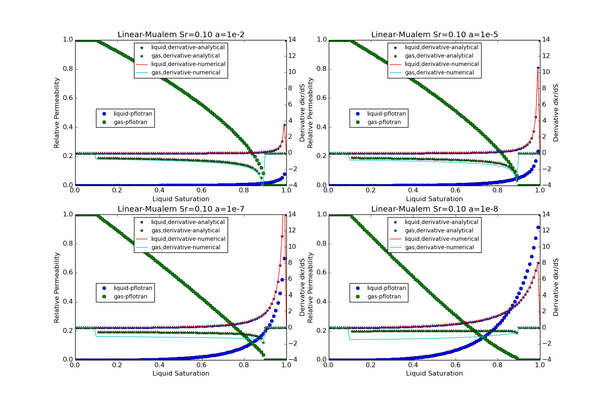
   
   
.. _mk-rel-perm:

Modified Kosugi
~~~~~~~~~~~~~~~
This option is specified with ``PERMEABILITY_FUNCTION MODIFIED_KOSUGI_[LIQ/GAS]``
in the :ref:`characteristic-curves-card` card

.. math::

   k^r_l =& \frac{1}{2}\sqrt{S_{el}} \,\mathrm{erfc} \left[\frac{\sigma_Z}{\sqrt{2}} + \mathrm{erfc}^{-1} \left( 2 S_{el} \right) \right]

   k^r_g =& \frac{1}{2}\sqrt{S_{eg}} \,\mathrm{erfc} \left[\frac{\sigma_Z}{\sqrt{2}} + \mathrm{erfc}^{-1} \left( 2 S_{eg} \right) \right]

   S_{el} =& \frac{S_l - S_{rl}}{1 - S_{rl}}

   S_{eg} =& \frac{S_g - S_{rl}}{1 - S_{rl} - S_{rg}}

where :math:`\mathrm{erfc^{-1}}` is the inverse complimentary error
function. Given the parameters :math:`\sigma_Z=0.336`,
:math:`\mu_Z=-6.25`, :math:`S_{rl}=0.153`, and :math:`S_{rg}=0.001`,
the following figure illustrates the function and its derivatives over
a range of liquid saturation.

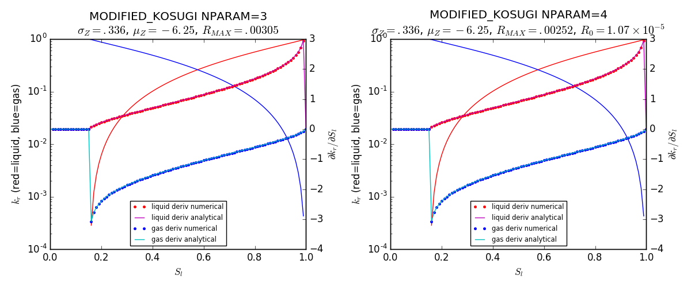

.. _krp9-rel-perm:

Vauclin et al. (KRP9)
~~~~~~~~~~~~~~~~~~~~~
This option is specified with ``PERMEABILITY_FUNCTION BRAGFLO_KRP9_[LIQ/GAS]`` 
in the :ref:`characteristic-curves-card` card.

.. math::

   k^r_l =& 0 \hspace{0.55in} S_l \leq S_{rl} 

   k^r_l =& \frac{1}{1 + a S_e^{b}} \hspace{0.55in} otherwise
   
   k^r_g =& 1 \hspace{0.55in} S_l \leq S_{rl} 
   
   k^r_g =& 1 - k^r_l \hspace{0.55in} otherwise
   
   S_{e} =& \frac{1 - S_l}{S_l} 
   
where the parameters :math:`a=28.768353` and :math:`b=1.7241379`.
   
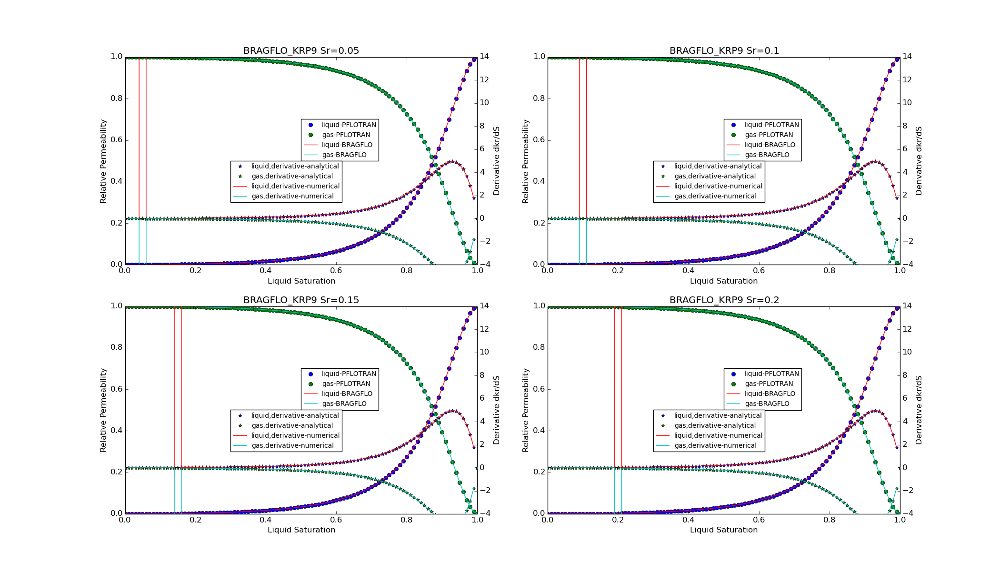
   

.. _krp11-rel-perm:

Open Cavity Modification (KRP11)
~~~~~~~~~~~~~~~~~~~~~~~~~~~~~~~~
This option is specified with ``PERMEABILITY_FUNCTION BRAGFLO_KRP11_[LIQ/GAS]`` 
in the :ref:`characteristic-curves-card` card.

.. math::
   
   k^r_l =& 0 \hspace{0.55in} S_l \leq S_{rl} 
   
   k^r_l =& 1 \hspace{0.55in} S_g \leq S_{rg}
   
   k^r_l =& \frac{S_l-S_{rl}}{\Gamma} \hspace{0.55in} S_l \leq (S_{rl}+\Gamma)
   
   k^r_l =& 1 \hspace{0.55in} S_g \leq (S_{rg}+\Gamma)
   
   k^r_l =& 1 \hspace{0.55in} otherwise
   
   k^r_g =& 1 \hspace{0.55in} S_l \leq S_{rl} 
   
   k^r_g =& 0 \hspace{0.55in} S_g \leq S_{rg}
   
   k^r_g =& 1 \hspace{0.55in} S_l \leq (S_{rl}+\Gamma)
   
   k^r_g =& \frac{S_g-S_{rg}}{\Gamma} \hspace{0.55in} S_g \leq (S_{rg}+\Gamma)
   
   k^r_g =& 1 \hspace{0.55in} otherwise
   
   \Gamma =& TOLC(1-S_{rl}-S_{rg})
   
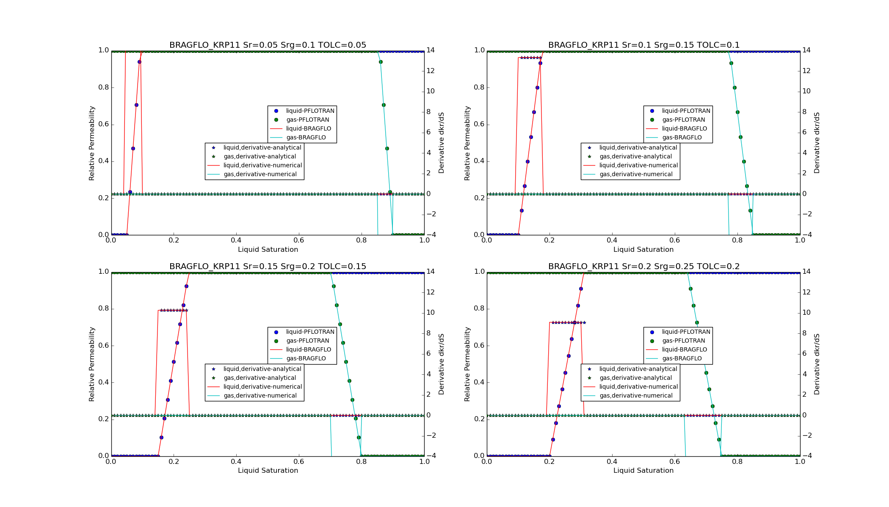

