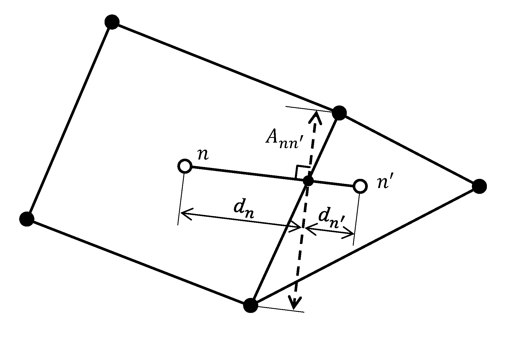

Method of Solution
==================

The flow and heat equations (Modes: RICHARDS, MPHASE, FLASH2, TH, …) are
solved using a fully implicit backward Euler approach based on
Newton-Krylov iteration. Both fully implicit backward Euler and operator
splitting solution methods are supported for reactive transport.

Integrated Finite Volume Discretization
---------------------------------------

The governing partial differential equation for mass conservation of primary species :math:`j` can be written in the general form

.. math::
   :label: mass-cons-soln
   
   \frac{{{\partial}}}{{{\partial}}t} A_j + {\boldsymbol{\nabla}}\cdot{\boldsymbol{F}}_j = Q_j,

with accumulation :math:`A_j`, flux :math:`{\boldsymbol{F}}_j` and
source/sink :math:`Q_j`. Integrating over a REV corresponding to the
:math:`n`\ th grid cell with volume :math:`V_n` yields

.. math::
   :label: source-sink-soln
   
   \frac{d}{dt}\int_{V_n} A_j \, dV + \int_{V_n} {\boldsymbol{\nabla}}\cdot{\boldsymbol{F}}_j = \int_{V_n}Q_j\, dV.

The accumulation term has the finite volume form

.. math::
   :label: accum-soln
   
   \frac{d}{dt}\int_{V_n} A_j \, dV = \frac{A_{jn}^{t+\Delta t} - A_{jn}^t}{\Delta t} \, V_n,

with time step :math:`\Delta t`. The flux term can be expanded as a
surface integral using Gauss’ theorem

.. math::
   :label: flux-soln
   
   \int_{V_n} {\boldsymbol{\nabla}}\cdot{\boldsymbol{F}}_j &= \int_{{{\partial}}V_n} {\boldsymbol{F}}_j \cdot d{\boldsymbol{S}},\\
   &= \sum_{n'} F_{j,nn'} A_{nn'},

where the latter finite volume form is based on the two-point flux
approximation, where the sum over :math:`n'` involves nearest neighbor
grid cells connected to the :math:`n`\ th node with interfacial area
:math:`A_{nn'}`. The discretized flux has the form for fluid phase
:math:`{{\alpha}}`

.. math::
   :label: flux-fluid-soln
   
   F_{j,nn'}^{{\alpha}}= \big(q_{{\alpha}}X_j^{{\alpha}}\big)_{nn'} - \big(\porosity s_{{\alpha}}\tau_{{\alpha}}D_{{\alpha}}\big)_{nn'}
   \frac{X_{jn'}^{{\alpha}}- X_{jn}^{{\alpha}}}{d_{n'}+d_n},

with perpendicular distances to interface :math:`nn'` from nodes
:math:`n` and :math:`n'` denoted by :math:`d_{n'}` and :math:`d_n`,
respectively. Upstream weighting is used for the advective term

.. math::
   :label: upstream-soln

   \big(q_{{\alpha}}X_j^{{\alpha}}\big)_{nn'} = \left\{
   \begin{array}{ll}
   (q_{{\alpha}})_{nn'}X_{jn'}, & (q_{{\alpha}})_{nn'} > 0\\
   (q_{{\alpha}})_{nn'}X_{jn}, &  (q_{{\alpha}})_{nn'} < 0
   \end{array}
   \right..

Depending on the type of source/sink term, the finite volume
discretization has the form

.. math::
   :label: FV-disc-soln
   
   \int_{V_n}Q_j\, dV = Q_{jn} V_n,

for reaction rates that are distributed continuously over a control
volume, or for a well with point source
:math:`Q_j = \hat Q_j \delta({\boldsymbol{r}}-{\boldsymbol{r}}_0)`:

.. math::
   :label: CV-soln
   
   \int_{V_n}Q_j\, dV = \hat Q_{jn}.

Two Point Flux Approximation
----------------------------
The figure below illustrates the implementation of two point fluxes through Eqs :eq:`flux-soln` and :eq:`flux-fluid-soln` above. 

   Schematic of two point flux approximation geometry for two unstructured grid cells.

The dashed line represents :math:`A_{nn'}`, the area of the face projected onto the plane that is normal to the vector connecting cells :math:`n` and :math:`n'`. 
:math:`d_{n'}` and :math:`d_n` are the distances on either side of the projected face.

When converting an implicit unstructured grid (defined by elements and vertices) with non-orthogonal faces between cells to an explicit unstructured grid format where connection face areas are assumed to be orthogonal to the connecting vector, the user must project the face area onto the orthogonal plane. 
In other words, the connection areas defined by the explicit unstructured grid format are assumed to be :math:`A_{nn'}`.

Projection and Averaging of Anisotropic Permeability Tensors
~~~~~~~~~~~~~~~~~~~~~~~~~~~~~~~~~~~~~~~~~~~~~~~~~~~~~~~~~~~~
Anisotropic permeabilities are assigned with a diagonal or full tensor prescribed for each grid cell.
For flux calculations, each cell's permeability tensor is projected onto the unit vector :math:`u` connecting the cell centers.
The tensor (projection) can be weighted *linearly*:

.. math::
   :label: direction-of-u 
   
   k = k_x u_x + k_y u_y + k_z u_z,

in the direction of *flow*:

.. math::
   :label: direction-of-flow 
   
   k = k_x u_x^2 + k_y u_y^2 + k_z u_z^2,

or in the direction of the *potential* gradient:

.. math::
   :label: direction-of-potential

   k = \frac{1}{\frac{u_x^2}{k_x} + \frac{u_y^2}{k_y} + \frac{u_z^2}{k_z}}

Assuming a 2D permeability tensor

.. math::
   :label: perm-tensor

   \begin{bmatrix}
   k_{xx} & k_{xy} \\
   k_{yx} & k_{yy} 
   \end{bmatrix}

with :math:`k_{xx}` = 1e-12, :math:`k_{yy}` = 2e-12, and :math:`k_{xy}` = :math:`k_{yx}` = 0, the figure below illustrates how these weighting functions impact the resulting scalar permeability :math:`(k)` calculated for each cell on either side of the flux calculation. 
The angle :math:`\theta` describes the orientation of :math:`u` where for 0, :math:`u` points in the x-direction and for :math:`\frac{\pi}{2}`, :math:`u` points in the y-direction. 
**This example clearly illustrates how linear weighting should only be used for orthogonal Cartesian grids.**

.. figure:: ./figs/perm_tensor_to_scalar.png
   :name: fig:perm_tensor
   :scale: 60
   :align: center

In all cases, the resulting projected scalar permeabilities on either side of the face are distance-weighted, harmonically averaged:

.. math::
   :label: harmonic-perm

   k_\text{ave} = \frac{k_n k_{n'}(d_n+d_{n'})}{d_n k_{n'} + d_{n'} k_n}.

Global Implicit Newton-Raphson Linear and Logarithmic Update
------------------------------------------------------------

In a fully implicit formulation the nonlinear equations for the residual
function :math:`{\boldsymbol{R}}` given by

.. math::
   :label: res-soln
   
   {\boldsymbol{R}}({\boldsymbol{x}}) = {\boldsymbol{0}},

are solved using an iterative solver based on the Newton-Raphson
equations

.. math::
   :label: NR-soln
   
   {\boldsymbol{J}}^{(i)} \delta{\boldsymbol{x}}^{(i+1)} = -{\boldsymbol{R}}^{(i)},

at the :math:`i`\ th iteration. Iteration stops when

.. math::
   :label: iter-soln
   
   \left|{\boldsymbol{R}}^{(i+1)}\right| < \epsilon,

or if

.. math::
   :label: iter2-soln
   
   \big|\delta{\boldsymbol{x}}^{(i+1)}\big| < \delta.

However, the latter criteria does not necessarily guarantee that the
residual equations are satisfied. The solution is updated from the
relation

.. math::
   :label: soln-update-soln
   
   {\boldsymbol{x}}^{(i+1)} = {\boldsymbol{x}}^{(i)} + \delta{\boldsymbol{x}}^{(i+1)}.

For the logarithm of the concentration with
:math:`{\boldsymbol{x}}=\ln{\boldsymbol{y}}`, the solution is updated
according to

.. math::
   :label: conc-update-soln
   
   \ln{\boldsymbol{y}}^{(i+1)} = \ln{\boldsymbol{y}}^{(i)} + \delta\ln{\boldsymbol{y}}^{(i+1)},

or

.. math::
   :label: conc-update2-soln
   
   {\boldsymbol{y}}^{(i+1)} = {\boldsymbol{y}}^{(i)} {\rm e}^{\delta\ln{\boldsymbol{y}}^{(i+1)}}.

Example
~~~~~~~

To illustrate the logarithmic update formulation the simple linear
equation

.. math::
   :label: ex1-soln
   
   x= x_0,

is considered. The residual function is given by

.. math::
   :label: ex2-soln
   
   R = x - x_0,

with Jacobian

.. math::
   :label: ex3-soln
   
   J = \frac{{{\partial}}R}{{{\partial}}x}.

In the linear formulation the Newton-Raphson equations are given by

.. math::
   :label: ex4-soln
   
   J\delta x &= -R,\\
   \delta x &= -(x-x_0)\\
   x{'} &= x + \delta x = x_0.

In the logarithmic formulation the Jacobian is given by

.. math::
   :label: ex5-soln
   
   J = \frac{{{\partial}}R}{{{\partial}}\ln x} = x \frac{{{\partial}}R}{{{\partial}}x},

and the Newton-Raphson equations are now nonlinear becoming

.. math::
   :label: ex6-soln
   
   J^i\delta \ln x^{i+1} = -R^i,

with the solution update

.. math::
   :label: ex7-soln
   
   \ln x^{i+1} = \ln x^i + \delta \ln x^{i+1},

or

.. math::
   :label: ex8-soln
   
   x^{i+1} = x^i {{\rm{e}}}^{\delta \ln x^{i+1}}.

It follow that

.. math::
   :label: ex9-soln
   
   x^i \delta \ln x^{i+1} = -(x^i-x_0),

with the solution

.. math::
   :label: ex10-soln
   
   \delta \ln x^{i+1} = \frac{x_0-x^i}{x^i},

and thus

.. math::
   :label: ex11-soln
   
   x^{i+1} = x^i \exp \left(\frac{x_0- x^{i}}{x^i}\right).

Given that a solution :math:`x` exists it follows that

.. math::
   :label: ex12-soln
   
   \lim_{i\rightarrow\infty} x^{i} &\rightarrow x,\\
   \lim_{i\rightarrow\infty} \frac{x^{i+1}}{x^{i}} &\rightarrow 1,\\
   \lim_{i\rightarrow\infty} \exp \left(\frac{x_0- x^{i}}{x^i}\right) &\rightarrow 1,\\
   \lim_{i\rightarrow\infty} x^{i} &\rightarrow x_0.

Multirate Sorption
~~~~~~~~~~~~~~~~~~

The residual function incorporating the multirate sorption model can be
further simplified by solving analytically the finite difference form of
kinetic sorption equations. This is possible when these equations are
linear in the sorbed concentration :math:`S_{j{{\alpha}}}` and because
they do not contain a flux term. Thus discretizing
Eqn. :eq:`sja` in time using the fully implicit backward
Euler method gives

.. math::
   :label: Euler-soln
   
   \frac{S_{j{{\alpha}}}^{t+\Delta t}-S_{j{{\alpha}}}^t}{\Delta t} = k_{{\alpha}}^{} \big(f_{{\alpha}}^{} S_{j{{\alpha}}}^{\rm eq} - S_{j{{\alpha}}}^{t+\Delta t}\big).

Solving for :math:`S_{j{{\alpha}}}^{t+\Delta t}` yields

.. math::
   :label: sjadt

   
   S_{j{{\alpha}}}^{t+\Delta t} = \frac{S_{j{{\alpha}}}^t + k_{{\alpha}}^{} \Delta t f_{{\alpha}}^{} S_j^{\rm eq}}{1+k_{{\alpha}}\Delta t}.

From this expression the reaction rate can be calculated as

.. math::
   :label: rr-soln
   
   \frac{S_{j{{\alpha}}}^{t+\Delta t}-S_{j{{\alpha}}}^t}{\Delta t} = \frac{k_{{\alpha}}}{1+k_{{\alpha}}\Delta t} \big(f_{{\alpha}}^{} S_{j{{\alpha}}}^{\rm eq} - S_{j{{\alpha}}}^t\big).

The right-hand side of this equation is a known function of the solute
concentration and thus by substituting into Eqn. :eq:`totj`
eliminates the appearance of the unknown sorbed concentration. Once the
transport equations are solved over a time step, the sorbed
concentrations can be computed from Eqn. :eq:`sjadt`.

Operator Splitting
------------------

Operator splitting involves splitting the reactive transport equations
into a nonreactive part and a part incorporating reactions. This is
accomplished by writing Eqns. :eq:`rteqn` as the two coupled
equations

.. math::
   :label: two-coupled1-soln
   
   \frac{{{\partial}}}{{{\partial}}t}\big(\porosity \sum_{{\alpha}}s_{{\alpha}}\Psi_j^{{\alpha}}\big) +
   \nabla\cdot\sum_{{\alpha}}\big({\boldsymbol{q}}_{{\alpha}}- \porosity s_{{\alpha}}{\boldsymbol{D}}_{{\alpha}}{\boldsymbol{\nabla}}\big)\Psi_j^{{\alpha}}= Q_j,

and

.. math::
   :label: two-coupled2-soln
   
   \frac{d}{d t}\big(\porosity \sum_{{\alpha}}s_{{\alpha}}\Psi_j^{{\alpha}}\big) = - \sum_m\nu_{jm} I_m -\frac{{{\partial}}S_j}{{{\partial}}t},

The first set of equations are linear in :math:`\Psi_j` (for
species-independent diffusion coeffients) and solved over over a time
step :math:`\Delta t` resulting in :math:`\Psi_j^*`. The result for
:math:`\Psi_j^*` is inverted to give the concentrations :math:`C_j^*` by
solving the equations

.. math::
   :label: diff_coefs-soln
   
   \Psi_j^* = C_j^* + \sum_i \nu_{ji} C_i^*,

where the secondary species concentrations :math:`C_i^{*}` are nonlinear
functions of the primary species concentrations :math:`C_j^{*}`. With
this result the second set of equations are solved implicitly for
:math:`C_j` at :math:`t+\Delta t` using :math:`\Psi_j^*` for the
starting value at time :math:`t`.

Constant :math:`K_d`
~~~~~~~~~~~~~~~~~~~~

As a simple example of operator splitting consider a single component
system with retardation described by a constant :math:`K_d`. According
to this model the sorbed concentration :math:`S` is related to the
aqueous concentration by the linear equation

.. math::
   :label: skd
   
   
   S = K_d C.

The governing equation is given by

.. math::
   :label: gov-soln
   
   \frac{{{\partial}}}{{{\partial}}t} \porosity C + {\boldsymbol{\nabla}}\cdot\big({\boldsymbol{q}}C -\porosity D {\boldsymbol{\nabla}}C\big) = -\frac{{{\partial}}S}{{{\partial}}t}.

If :math:`C(x,\,t;\, {\boldsymbol{q}},\,D)` is the solution to the case
with no retardation (i.e. :math:`K_d=0`), then
:math:`C(x,\,t;\, {\boldsymbol{q}}/R,\,D/R)` is the solution with
retardation :math:`(K_d>0)`, with

.. math::
   :label: R-soln
   
   R = 1+\frac{1}{\porosity}K_d.

Thus propagation of a front is retarded by the retardation factor
:math:`R`.

In operator splitting form this equation becomes

.. math::
   :label: op-split1-soln
   
   \frac{{{\partial}}}{{{\partial}}t} \porosity C + {\boldsymbol{\nabla}}\cdot\big({\boldsymbol{q}}C -\porosity D {\boldsymbol{\nabla}}C\big) = 0,

and

.. math::
   :label: op-split2-soln
   
   \frac{d}{d t} \porosity C = -\frac{d S}{d t}.

The solution to the latter equation is given by

.. math::
   :label: op-split3-soln
   
   \porosity C^{t+\Delta t} - \porosity C^* = -\big(S^{t+\Delta t} - S^t\big),

where :math:`C^*` is the solution to the nonreactive transport equation.
Using Eqn. :eq:`skd`, this result can be written as

.. math::
   :label: result-soln
   
   C^{t+\Delta t} = \frac{1}{R} C^* + \left(1-\frac{1}{R}\right) C^t.

Thus for :math:`R=1`, :math:`C^{t+\Delta t}=C^*` and the solution
advances unretarded. As :math:`R\rightarrow\infty`,
:math:`C^{t+\Delta t} \rightarrow C^t` and the front is fully retarded.
