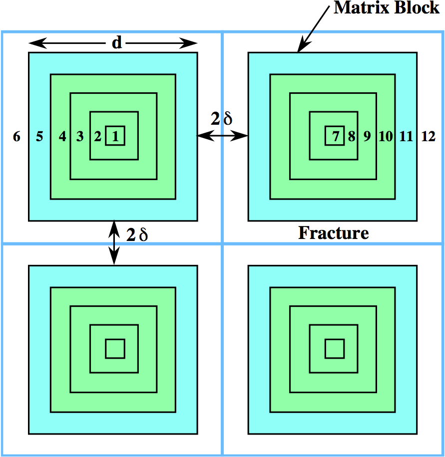

.. _multiple_continuum:

Multiple Continuum Model
------------------------

Two forms of multiple continuum models are available in PFLOTRAN, one based on thermal conduction and the other incorporating multicomponent reactive transport. Both models only account for diffusion in the secondary continua (matrix) modeled as a  disconnected one-dimensional domains referred to as the DCDM (Dual Continuum Disconnected Matrix) model (Lichtner, 2000), but include advection in the primary continuum. 

In contrast to the approach used by TOUGH’s MINC method in which primary and secondary continua are treated as a single system of equations solved simultaneously, in the PFLOTRAN implementation the primary and secondary continua are solved separately treating the secondary continua as a 1D system of equations. Parallelization is highly efficient because the secondary continuum equations are embarrassingly parallel. The results should be identical between the two implementations.
Details of the implementation of the DCDM model in
PFLOTRAN and its scalability on multiple processor cores are presented in Lichtner and Karra (2014).

Thermal Conduction 
~~~~~~~~~~~~~~~~~~

A thermal conduction model employing a multiple continuum model has been
added to modes ``MPHASE`` and ``TH``. 
The formulation is based on Pruess
and Narasimhan (1985) using a integrated finite volume approach to
develop equations for fracture (primary continuum) and matrix (secondary
continua) temperatures :math:`T_{\alpha}` and :math:`T_{\beta}`,
respectively, with fracture volume fraction denoted by
:math:`\epsilon_{{\alpha}}`. 
In what follows the matrix porosity is assumed to be zero.

In terms of partial differential equations the heat conservation
equations may be written as

.. math::
   :label: heat-cons-th
   
   \frac{{{\partial}}}{{{\partial}}t} \epsilon_{{\alpha}}\Big[\varphi_{{\alpha}}\rho_{{\alpha}}U_{{\alpha}}+ (1-\varphi_{{\alpha}}) \rho_r C_r T_{{\alpha}}\Big] &+ {\boldsymbol{\nabla}}\cdot \Big({\boldsymbol{q}}_{{\alpha}}\rho_{{\alpha}}H_{{\alpha}}-
   \kappa_a{\boldsymbol{\nabla}}T_{{\alpha}}\Big) \nonumber\\
   &= -\sum_\beta A_{{{\alpha}}{{\beta}}} \kappa_{{{\alpha}}{{\beta}}}\frac{{{\partial}}T_{{\beta}}}{{{\partial}}n},

and

.. math::
   :label: heat-cons2-th

   \frac{{{\partial}}}{{{\partial}}t} \rho_r C_r T_{{\beta}}+ \frac{{{\partial}}}{{{\partial}}\xi} \Big(-\kappa_{{\beta}}\frac{{{\partial}}T_{{\beta}}}{{{\partial}}\xi}\Big) = 0,

for fracture and matrix temperatures :math:`T_{{\alpha}}` and
:math:`T_{{\beta}}`, respectively, where :math:`\xi` represents the
matrix coordinate assumed to be an effective 1D domain. The boundary
condition

.. math::
   :label: bc-th
   
   T_{{\beta}}(\xi_M,\,t\,|\,{\boldsymbol{r}}) = T_{{\alpha}}({\boldsymbol{r}},\,t),

is imposed at the fracture-matrix interface, where :math:`\xi_M` denotes
the outer boundary of the matrix.

Using the control volume configuration shown in `Figure
10 <#fig:fminc>`__, with fracture nodes designated by the subscript
:math:`n` and matrix nodes by :math:`m`, the integrated finite volume
form of the heat transport equation for the :math:`n`\ th fracture
control volume is given by

.. math::
   :label: pricont
   
   &\Big[\varphi_{{\alpha}}\Big(\big(\rho_{{\alpha}}U_{{\alpha}}\big)_n^{k+1} - \big(\rho_{{\alpha}}U_{{\alpha}}\big)_n^{k}\Big) + (1-\varphi_{{\alpha}})\Big(\big(\rho_r C_r T_{{\alpha}}\big)_n^{k+1} - \big(\rho_r C_r T_{{\alpha}}\big)_n^{k}\Big)\Big] \frac{V_n^{{\alpha}}}{\Delta t} \nonumber\\
   &\qquad + \sum_{n'} \Big[\big(q_{{\alpha}}\rho_{{\alpha}}H_{{\alpha}}\big)_{nn'} + \frac{\kappa_{nn'}^{{\alpha}}}{d_n+d_{n'}}\big(T_{{{\alpha}}n} - T_{{{\alpha}}n'}\big) \Big] A_{nn'}^{{\alpha}}\nonumber\\
   &\qquad + \sum_{l = 1}^{N_{{\beta}}}\frac{\kappa_{nM}^{{{\alpha}}{{\beta}}_l}}{d_n+d_{M}}\big(T_{{{\alpha}}n}-T_{{{\beta}}_l M}\big) A_{nM}^{{{\beta}}_l} = 0,

where :math:`V_n^{{\alpha}}` denotes the fracture volume, and

.. math::
   :label: Big-th
   
   \Big(\big(\rho_r C_r T_{{\beta}}\big)_m^{k+1} - \big(\rho_r C_r T_{{\beta}}\big)_m^{k}\Big) \frac{V_m^{{\beta}}}{\Delta t} &+ \sum_{m'} \frac{\kappa_{mm'}^{{\beta}}}{d_m+d_{m'}}\big(T_{{{\beta}}m} - T_{{{\beta}}m'}\big) A_{mm'}^{{\beta}}\nonumber\\
   &+ \delta_{mM}^{}\frac{\kappa_{nM}^{{{\alpha}}{{\beta}}}}{d_n+d_{M}}\big(T_{{{\alpha}}n} - T_{{{\beta}}M}\big) A_{nM}^{{\beta}}= 0,

for the :math:`m`\ th matrix node with volume :math:`V_m^{{\beta}}`. The
matrix node designated by :math:`M` refers to the outer most node in
contact with the fracture (see Figure [fnodestruct]). More than one type
of matrix geometry is included in the above equations as indicated by
the sum over :math:`l` in Eqn. :eq:`pricont`, where
:math:`N_{{\beta}}` denotes the number of different secondary continua.
However, it should be noted that the current implementation in PFLOTRAN
only allows coupling to a single secondary continuum
:math:`(N_{{\beta}}=1)`. The fracture volume :math:`V_n^{{\alpha}}` is
related to the REV volume :math:`V_n` by

.. math::
   :label: frac-th
   
   \epsilon_{{\alpha}}= \frac{V_n^{{\alpha}}}{V_n}.

Thermal conductivity at the interface between two control volumes is
calculated using the harmonic average

.. math::
   :label: harmonic-th
   
   \kappa_{ll'} = \frac{\kappa_l \kappa_{l'}(d_l+d_{l'})}{d_l \kappa_{l'}+d_{l'}\kappa_l}.

.. math::
   :label: qquad-th
   
   \qquad
   \bigg|\quad\mathop{\bullet}_{\ \ \ \, \displaystyle 1 \ {{\beta}}}\quad\bigg| \qquad \cdots \qquad
   \bigg|\quad\mathop{\bullet}_{\ \ \ \, \displaystyle l \ {{\beta}}}\quad\bigg| \qquad \cdots \qquad
   \bigg|\quad\mathop{\bullet}_{\ \ \ \, \displaystyle M \ {{\beta}}}\quad
   \bigg|\quad\mathop{\bullet}_{\ \ \ \, \displaystyle n \ {{\alpha}}}\quad\bigg|\nonumber

For better convergence uniform logarithmic spacing is used for the
matrix nodes

.. math::
   :label: matrix-nodes-th
   
   \Delta \xi_m = \rho \,\Delta \xi_{m-1},

specifying :math:`\Delta\xi_M` and :math:`l_M` for the outer most matrix
node and matrix block size, respectively. The factor :math:`\rho` is
determined from the constraint

.. math::
   :label: constraint-th
   
   l_M = 2\sum_{m=1}^{M} \Delta \xi_m,

which requires that :math:`\rho` satisfy the equation

.. math::
   :label: rho-th
   
   \frac{l_M}{2\Delta \xi_1} = \frac{\rho^M-1}{\rho-1},

with the inner and outer grid spacing related by

.. math::
   :label: grid-spacing-th
   
   \Delta\xi_M = \rho^{M-1} \Delta \xi_1.

   Control volumes in DCDM multiple continuum model with fracture
   aperture :math:`2\delta` and matrix block size :math:`d`.

According to the geometry in `Figure 10 <#fig:fminc>`__ assuming a 3D
orthogonal set of fractures,

.. math::
   :label: fractures-th
   
   V_n = (d+2\delta)^3,

and

.. math::
   :label: fractures2-th
   
   V_n^{{\alpha}}= (d+2\delta)^3 - d^3,

giving

.. math::
   :label: epsilon-th
   
   \epsilon_{{\alpha}}&= 1-\frac{d^3}{(d+2\delta)^3} = 1-\left(\dfrac{1}{1+\dfrac{2\delta}{d}}\right)^3,\\
   & ~\simeq~ \frac{6\delta}{d}.

The fracture aperture :math:`2\delta` is found to be in terms of
:math:`\epsilon_{{\alpha}}` and :math:`d`

.. math::
   :label: 2delta-th
   
   2\delta = d \left(\frac{1}{(1-\epsilon_{{\alpha}})^{1/3}} -1\right).

A list of different sub-continua geometries and parameters implemented
in PFLOTRAN is given in Table [tdcdmgeom]. Different independent and
dependent parameters for the nested cube geometry are listed in
Table [tnestedcube]. The interfacial area :math:`A_{nn'}^{{\alpha}}`
between fracture control volumes is equal to :math:`\Delta y \Delta z`,
:math:`\Delta z \Delta x`, :math:`\Delta x \Delta y` for :math:`x`,
:math:`y`, and :math:`z` directions, respectively.

In the case of nested cubes there are four possible parameters
:math:`(\epsilon_{{\alpha}}, \, 2\delta, \, l_m,\, l_f)`, where
:math:`l_m` denotes the matrix block size and :math:`l_f` refers to the
fracture spacing, two of which are independent.

The fracture-matrix interfacial area :math:`A_{nM}` per unit volume is
equal to

.. math::
   :label: frac-matrix-A-th
   
   A_{nM}^{{\beta}}= \frac{{{\mathcal N}}_{{\beta}}}{V} A_{{\beta}}^0,

where the number density :math:`{{\mathcal N}}_{{\beta}}/V` of secondary
continua of type :math:`{{\beta}}` is equal to

.. math::
   :label: num-density-th
   
   \frac{{{\mathcal N}}_{{\beta}}}{V} = \frac{1}{V} \frac{V_{{\beta}}}{V_{{\beta}}^0} = \frac{\epsilon_{{\beta}}}{V_{{\beta}}^0},

and :math:`A_{{\beta}}^0` and :math:`V_{{\beta}}^0` refer to the area
and volume of each geometric type as listed in Table [tdcdmgeom].

+------------------+------------------------------+--------------------------------+
| Geometry         | Area :math:`A_{{\beta}}^0`   | Volume :math:`V_{{\beta}}^0`   |
+==================+==============================+================================+
| Slab             | :math:`A`                    | :math:`A l`                    |
+------------------+------------------------------+--------------------------------+
| Nested Cubes     | :math:`6d^2`                 | :math:`d^3`                    |
+------------------+------------------------------+--------------------------------+
| Nested Spheres   | :math:`4 \pi R^2`            | :math:`4/3 \pi R^3`            |
+------------------+------------------------------+--------------------------------+

Table: DCDM geometric parameters.

The primary-secondary coupling term can then be written in the form

.. math::
   :label: coupling-term-th
   
   \sum_{{\beta}}\frac{\kappa_{nM}^{{{\alpha}}{{\beta}}}}{d_n+d_{M}}\big(T_n^{{\alpha}}-T_{M}^{{\beta}}\big) A_{nM}^{{\beta}}= V_n
   \sum_{{\beta}}\frac{\epsilon_{{\beta}}\kappa_{nM}^{{{\alpha}}{{\beta}}}}{d_n+d_{M}}\big(T_n^{{\alpha}}-T_{M}^{{\beta}}\big) \frac{A_{{\beta}}^0}{V_{{\beta}}^0}.

+-----------------------------+-----------------------------+---------------------------------------------------------------------------------+-------------------------------------------------+
| Independent                 |                             | Dependent                                                                       |                                                 |
+=============================+=============================+=================================================================================+=================================================+
| :math:`\epsilon_{{\alpha}}` | :math:`l_f`                 | :math:`2\delta = l_f - l_m`                                                     | :math:`l_m = l_f(1-\epsilon_{{\alpha}})^{1/3}`  |
+-----------------------------+-----------------------------+---------------------------------------------------------------------------------+-------------------------------------------------+
| :math:`\epsilon_{{\alpha}}` | :math:`l_m`                 | :math:`2\delta = l_f - l_m`                                                     | :math:`l_f = l_m(1-\epsilon_{{\alpha}})^{-1/3}` |
+-----------------------------+-----------------------------+---------------------------------------------------------------------------------+-------------------------------------------------+
| :math:`2\delta`             | :math:`l_f`                 | :math:`\epsilon_{{\alpha}}= 1-(l_m/l_f)^3`                                      | :math:`l_m = l_f - 2\delta`                     |
+-----------------------------+-----------------------------+---------------------------------------------------------------------------------+-------------------------------------------------+
| :math:`2\delta`             | :math:`l_m`                 | :math:`\epsilon_{{\alpha}}= 1-(l_m/_f)^3`                                       | :math:`l_f = l_m + 2\delta`                     |
+-----------------------------+-----------------------------+---------------------------------------------------------------------------------+-------------------------------------------------+
| :math:`2\delta`             | :math:`{\epsilon}_{\alpha}` | :math:`l_m = 2\delta \Big(\dfrac{1}{(1-\epsilon_{{\alpha}})^{1/3}}-1\Big)^{-1}` | :math:`l_m = l-2\delta`                         |
+-----------------------------+-----------------------------+---------------------------------------------------------------------------------+-------------------------------------------------+

Table: Independent and dependent nested cube parameters.

Reactive Transport Dual Continuum Model  
~~~~~~~~~~~~~~~~~~~~~~~~~~~~~~~~~~~~~~~

The implementation of a dual continuum model for reactive transport is based on the DCDM model.
The primary continuum equations have the form

.. math::
   :label: pri_continuum

   \frac{\partial}{\partial t} \Big(\epsilon_\alpha \varphi_\alpha \sum_p s_p^\alpha \Psi_{jp}^\alpha\Big) + \nabla\cdot\sum_p \epsilon_\alpha 
   \Omega_{jp}^\alpha = 
   -\sum_{p\beta} A_{\alpha\beta} \Omega_{jp}^{\alpha\beta} - \epsilon_\alpha \sum_m \nu_{jm}^{} I_{mp}^\alpha - \epsilon_\alpha \frac{\partial S_{jp}^\alpha}{\partial t},

where now an additional term appears on the right-hand side representing mass transfer between primary and secondary continua with

.. math::
   :label: coupling_term

   \Omega_{jp}^{\alpha\beta}(r,\,t) = \Omega_{jp}^\beta (\xi_{\alpha\beta},\,t|r).

The secondary continuum mass conservation equations have a similar form but without the factor :math:`\epsilon_\alpha` and the coupling term. Imposition of symmetry at the boundary of the secondary continuum leads to the equation

.. math::
   :label: sec_continuum

   \frac{\partial}{\partial t} \Big(\varphi_\beta \sum_p s_p^\beta\Psi_{jp}^\beta\Big) + \nabla_\xi\cdot\sum_p \Omega_{jp}^\beta = - \sum_m \nu_{jm}^{} I_{mp}^\beta - \frac{\partial S_{jp}^\beta}{\partial t},

where the gradient operator :math:`\nabla_\xi` refers to the effective one-dimensional secondary continuum geometry.
Similar considerations apply to mass and heat flow for primary and secondary continuum conservation equations.
