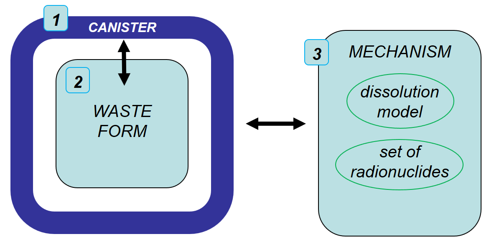

.. _pm_waste_form:

Waste Form
==========

The Waste Form Process Model represents waste package degradation and waste form
dissolution for the simulation of a nuclear waste repository. It has been 
developed under the Generic Disposal Systems Analysis (GDSA) work package, which
is under the Spent Fuel and Waste Disposition Program of the U.S. Department of 
Energy (DOE) Office of Nuclear Energy, as part of the Spent Fuel and Waste 
Science and Technology (SFWST) Campaign. Development of the Waste Form Process
Model is ongoing, and lead by Jennifer Frederick, Paul Mariner, and Glenn 
Hammond.

The GDSA work package is responsible for developing disposal system modeling 
and analysis capability that: (i) spans a wide range of disposal options,
and (ii) must accurately consider unique waste package designs specific to each 
disposal system. Therefore, the ability to represent the large amount of 
possible waste package designs within the process model is essential. This is
accomplished through modularity. The Waste Form Process Model in PFLOTRAN
consists of three main components: (a) the waste form canister, (b) the waste 
form object, and (c) the waste form release mechanism.

   
   The three main components of PFLOTRAN's Waste Form Process Model consists 
   of the waste form canister, the waste form object, and the waste form 
   mechanism.
   
Waste Form Canister
-------------------
   
The waste form canister conceptual model addresses (1) the timing of canister 
breach and (2) the performance of the canister after breach. This model can be
turned on by including the ``CANISTER_DEGRADATION_MODEL`` sub-block within the 
``MECHANISM`` block. In this conceptual 
model, the status of the canister is defined by two abstract terms, canister 
vitality and canister performance. Canister vitality is a normalized measure of 
remaining time or remaining canister wall thickness before canister breach,
and canister performance is a normalized measure of the physical ability of the 
canister to contain the source. Initially, both terms have a value of 1. Before 
canister breach, while corrosion reduces the time remaining or canister wall 
thickness remaining before canister breach, the canister vitality decreases. 
When it reaches zero, the canister is breached and canister performance begins 
to decrease. 

To date, canister performance has not yet been implemented in the waste form 
canister component, but a framework for canister vitality is complete. In this
framework, canister vitality is initialized to 1, and is reduced at each time 
step by the effective canister vitality degradation rate :math:`R_{eff}`, 
according to

.. math::
   :label: canister_vitality_degradation
   
   R_{eff} = R \hspace{0.1 in} e^{\left[{C \left({\frac{1}{333.15} - \frac{1}{T(t,\bf{x})}}\right)}\right]}
   
where :math:`R` is the base canister degradation rate at 60C, :math:`T` is the 
local temperature (in Kelvin), and :math:`C` is the canister material constant. 
This equation assumes that reaction rates are a function of temperature as 
described by the Arrhenius equation. For general corrosion, :math:`R` would
represent the general corrosion rate at 60C in units of L/T, and the associated 
canister vitality would be a measure of the remaining normalized canister 
thickness before breach. The value for :math:`R` can be specified using the 
``CANISTER_VITALITY_RATE`` keyword under the ``WASTE_FORM`` sub-block. 
Alternatively, parameters that define a normal distribution for the value of 
:math:`log_{10}\left({R}\right)` are given in the ``CANISTER_DEGRADATION_MODEL``
sub-block using the keywords ``VITALITY_LOG10_MEAN``, ``VITALITY_LOG10_STDEV``,
``VITALITY_UPPER_TRUNCATION``, for mean, standard deviation, and the upper 
truncation, respectively. The value for :math:`C` is specified using the 
``CANISTER_MATERIAL_CONSTANT`` keyword. Finally, Equation 
:eq:`canister_vitality_degradation` can be ignored by the Waste Form Canister
component, and a specific canister breach time can be specified instead of
assigning :math:`log_{10}\left({R}\right)` or :math:`R` by including the keyword
``CANISTER_BREACH_TIME`` under the ``WASTE_FORM`` sub-block. Once canister 
vitality drops below zero, the canister is considered breached, and a Boolean 
flag is turned on for the waste form object inside of it, allowing the waste 
form inside to begin dissolving.

Waste Form Object
-----------------
The second component of the Waste Form Process Model is the waste form object. 
This object is generic and contains only the information that is required by all 
waste form types. The user defines each waste form object’s location in the 
domain via the ``REGION`` keyword or the ``COORDINATE`` keyword, as well as its 
initial volume via the 
``VOLUME`` keyword, and exposure factor (a surface area multiplying factor to 
the waste form’s effective dissolution rate) via the ``EXPOSURE_FACTOR`` 
keyword. Within the waste form object, the value of its effective dissolution 
rate is stored. Each waste form object has a pointer to the waste form mechanism 
(the third component of the process model), specified by the ``MECHANISM_NAME`` 
keyword, that describes waste form type-specific information. The dissolution 
equation that defines the effective dissolution rate is obtained from the waste 
form mechanism. The waste form object also stores the concentrations of the 
radionuclide inventory. The initial radionuclide inventory is obtained from the 
waste form mechanism.

Radionuclide decay and ingrowth is, by default, internally calculated for the 
set of radionuclides in each waste form according to a 3-generation analytical 
solution derived for multiple parents and grandparents and non-zero initial
daughter concentrations (see Section 3.2.3 of Mariner et al. (2016),
SAND2016-9610R). The solution for radionuclide concentration within the waste 
form is obtained explicitly in time. Internal calculation of radionuclide decay 
and ingrowth also allows the calculation of instantaneous release
fractions for certain radionuclides upon canister breach. A fully-implicit 
solution for multiple-parent, single-daughter radioactive decay and ingrowth 
can be optionally applied by including the keyword ``IMPLICIT_SOLUTION`` within
the ``WASTE_FORM_GENERAL`` block. The implitcit solution is documented 
:ref:`below<implicit-solution>`.

Upon canister breach, the waste form object begins to dissolve according to the 
dissolution model that is defined by the waste form mechanism to which the waste 
form object points. Waste form volume decreases accordingly. The effective 
dissolution rate along with the radionuclide concentrations in the waste form, 
determines the source term (radionuclide release rate) for each waste form.

Waste Form Mechanisms
---------------------
The third component of the Waste Form Process Model is the waste form mechanism. 
In contrast to the other two components, this object is specific to the type of
waste form being simulated and contains information which defines the behavior 
of each specific waste form type. The mechanism contains the value of the waste 
form bulk density specified via the ``MATRIX_DENSITY`` keyword, the set of 
initial radionuclides via the ``SPECIES`` sub-block (initial mass fractions, 
molecular weights, decay rates, daughter species, and instantaneous release 
fractions), and a pointer to the waste form dissolution model. In some cases, 
it also stores the waste form specific surface area via the 
``SPECIFIC_SURFACE_AREA`` keyword. The following types of waste form mechanisms 
are available to the user:

GLASS Mechanism
................
High level waste in the form of glass logs are simulated using the GLASS 
mechanism. The glass dissolution model used in this mechanism is given by

.. math ::
   :label: glass_dissolution
   
   R_g = K_0 10^{\eta pH} e^{-E_a/RT} \left({1 - Q/K}\right)^{1/V} + K_{long}
   
where :math:`K_0` is the intrinsic glass dissolution rate in units of kg 
m\ :sup:`-2`\ day\ :sup:`-1`\, :math:`\eta` is a unitless pH dependence term, 
:math:`pH` is the value of the pH (unitless), :math:`E_a` is an effective 
activation energy in units of J mol\ :sup:`-1`\, :math:`R` is the universal
gas constant in units of J mol\ :sup:`-1`\ K\ :sup:`-1`\, :math:`T` is the 
temperature in Kelvin, :math:`Q` is an ion activity product of the glass 
dissolution (activity of H\ :sub:`4`\SiO\ :sub:`4`), :math:`K` is the equilibrium 
constant for the rate limiting step (activity of H\ :sub:`4`\SiO\ :sub:`4` at 
saturation with the glass), :math:`V` is an exponent term to the affinity term,
and :math:`K_{long}` is the long term dissolution rate when the pore fluid 
solution is at saturation with SiO\ :sub:`2` in units of kg m\ :sup:`-2`\ 
day\ :sup:`-1`\. Two of these parameters (pH and Q) can be calculated as part of 
the simulation using the built-in geochemistry capability in PFLOTRAN rather
than specifying a constant value. Rather than specifying a value for ``PH``
and ``Q`` keywords, one would specify ``AS_CALCULATED``.

This equation can be simplified to the rate specified by Kienzler et al. (2012)
as

.. math::
   :label: Kienzler
   
   R_g = 560 e^{-7397/T(t,\bf{x})}
   
by specifying ``KIENZLER_DISSOLUTION``. The units of :math:`R_g` are kg 
m\ :sup:`-2`\ day\ :sup:`-1`. The dissolution rate for glass is multiplied by
a specific surface area, in units of m\ :sup:`2` kg\ :sup:`-1`, via the 
``SPECIFIC_SURFACE_AREA`` keyword, giving a 
fractional dissolution rate in units of T\ :sup:`-1`. 

DSNF Mechanism (instantaneous)
..............................
For the Instantaneous mechanism (currently called DSNF mechanism in PFLOTRAN), 
at the time step when canister breach occurs the fraction of the radionuclide
entered by the user in the SPECIES sub-block under instantaneous release fraction,
is released over the length of the time step and in the next time step the
rest of the radionuclides are released. This is accomplished by internally
setting the fractional dissolution rate to the value of ``1/dt``, where ``dt``
is the length of the current time step at breach. Concurrently, the volume of
the waste form is reduced to zero. The user must enter 1.0 for all instaneous
release fractions, for all the radionuclides to be released in the time step
that the canister vitality reaches zero. Metallic defense-related spent nuclear
fuel (DSNF) is simulated using this mechanism.

.. _FMDM Mechanism:

FMDM Mechanism
..............
Used nuclear fuel (composed of uranium dioxide) is simulated using the Fuel 
Matrix Degradation Model (FMDM) mechanism. This mechanism also demonstrates
how external dissolution models can be coupled to PFLOTRAN. The dissolution 
model used is obtained via coupling to the FMDM by calling a single external
subroutine developed by Jerden et al. (2015). Details regarding the FMDM 
conceptual model and algorithmic design are provided by Jerden et al. (2015).
This mechanism requires the free ion concentrations of O2(aq), CO3--, H2(aq), 
and Fe++ to be specified in mol/L in the CONCENTRATIONS sub-block card 
of the CONSTRAINT card.

.. _FMDM Surrogate Mechanism:

FMDM Surrogate Mechanism
........................
Surrogate model developed for the FMDM mechanism. It is a single layer
feed-forward neural network model or a k-Nearest Neighbors regressor (kNNr)
implemented in PFLOTRAN. Age of the fuel prior to the beginning of the simulation
is specified through the DECAY_TIME sub-block card of MECHANISM FMDM_SURROGATE or
FMDM_SURROGATE_KNNR for kNNr. The number of nearest neighbors for the kNNr can be
specified through the NEAREST_NEIGHBOR sub-block card and the epsilon value for
considering a zero distance to the nearest neighbor can be specified through the
KNNR_EPS sub-block card. The construction of this surrogate model is documented in
Appendix A of Mariner et al. (2019). The coefficients for the neural network model
can be found in PFLOTRAN_SRC/regression_tests/ufd/ann_surrogate and the FMD generated
table for the kNNr can be found in PFLOTRAN_SRC/regression_tests/ufd/. They are read
in by PFLOTRAN and therefore this folder must be in the directory it is executed in.
This mechanism requires the free ion concentrations of O2(aq),
CO3--, H2(aq), and Fe++ to be specified in mol/L in the CONCENTRATIONS sub-block
card of the CONSTRAINT card. 

WIPP Mechanism
..............
The Waste Isolation Pilot Plant (WIPP) mechanism simulates a waste panel in
a mined salt repository. It is essentially identical to the DSNF (instantaneous)
mechanism. 

CUSTOM Mechanism
................
To allow additional flexibility, the CUSTOM mechanism was created so that a user 
can specify a fractional dissolution rate (in units of 1/T), or a waste form
dissolution rate that is based on specific surface area (in units of M 
L\ :sup:`-2` T\ :sup:`-1`). If the user specifies a surface area dependent 
dissolution rate, a specific surface area (in units of L\ :sup:`2` M\ :sup:`-1`) 
must also be provided.

.. _implicit-solution:

Implicit Solution for Radionuclide Decay and Ingrowth
-----------------------------------------------------
The user can specify the keyword ``IMPLICIT_SOLUTION`` within the 
``WASTE_FORM_GENERAL`` block to solve for decay and ingrowth using an implicit, 
direct solve of the Bateman equations for any number of generations. The 
governing equation for isotope decay and ingrowth is,

.. math::

   \frac {d C_i(t)} {d t} = -\lambda_i C_i(t) + \lambda_p S C_p(t) 

which describes the change in isotope concentration over time
(:math:`\frac {d C_i(t)} {d t}`) due to its own decay (if any)
(:math:`-\lambda_i C_i(t)`) plus ingrowth (if any) from the isotope's
parents (:math:`\lambda_p S C_p(t)`), where :math:`\lambda` is the decay 
rate constant [1/sec] and :math:`S` is a stoichiometry coefficient. 
The equation is discretized and rewritten in terms 
of a residual equation as follows,

.. math::

   f\left({c^{k+1,p}}\right) = \frac {c^{k+1,p} - c^{k}} {\Delta t} - R\left({c^{k+1,p}}\right) 

where :math:`f\left({c^{k+1,p}}\right)` is the residual, :math:`c^{k+1,p}` is
the solution for concentration at the :math:`k+1` time step and the 
:math:`p^{th}` iterate, :math:`\frac {c^{k+1,p} - c^{k}} {\Delta t}` is the
discretized accumulation term (e.g., the left hand side of the governing 
equation above), and :math:`R\left({c^{k+1,p}}\right)` is the
source or sink term (e.g., the right hand side of the governing equation above).

A Jacobian matrix is formed according to,

.. math::

   J_{ij} = \frac {\partial f_i(c^{k+1,p})} {\partial c_j^{k+1,p}}

which is a matrix of all the partial derivatives of the solution with respect 
to each unknown variable. Using Newton's method, which solves the following
system,

.. math::

   J \delta c^p = -f(c^{k+1,p})

the concentration can be updated according to,

.. math::

   c^{k+1,p+1} = c^{k+1,p} + \delta c^p

Note: The governing equation is reformuated in terms of isotopes and the 
isotopes' daughter(s) in the source code, rather than the isotopes and 
isotopes' parent(s) formulation shown here. 

References Cited
----------------
Jerden, J., G.E. Hammond, J.M. Copple, T. Cruse and W.
Ebert (2015), Fuel Matrix Degradation Model:
Integration with Performance Assessment and
Canister Corrosion Model Development. O. o. U. N.
F. Disposition. FCRD-UFD-2015- 000550. US
Department of Energy, Washington, DC.

Kienzler, B., M. Altmaier, C. Bube and V. Metz (2012).
Radionuclide Source Term for HLW Glass, Spent
Nuclear Fuel, and Compacted Hulls and End Pieces
(CSD-C Waste). KIT Scientific Reports 7624.
Karlsruhe Institute of Technology, Baden-
Württemberg, Germany.

Mariner, P.E., E.R. Stein, J.M. Frederick, S.D. Sevougian,
G.E. Hammond, and D.G. Fascitelli (2016),
Advances in Geologic Disposal System Modeling and
Application to Crystalline Rock, FCRD-UFD-2016-
000440, SAND2016-9610R, Sandia National
Laboratories, Albuquerque, NM.

P.E. Mariner, L.A. Connolly, L.J. Cunningham, B.J. Debusschere,
D.C. Dobson, J.M. Frederick, G.E. Hammond, S.H. Jordan, T.C. LaForce,
M.A. Nole, H.D. Park, F.V. Perry, R.D. Rogers, D.T. Seidl,
S.D. Sevougian, E.R. Stein, P.N. Swift, L.P. Swiler, J. Vo,
and M.G. Wallace (2019).
Progress in Deep Geologic Disposal Safety Assessment in the U.S.
since 2010, M2SF-19SNO10304041, SAND2019-12001R, Sandia National
Laboratories, Albuquerque, NM.

