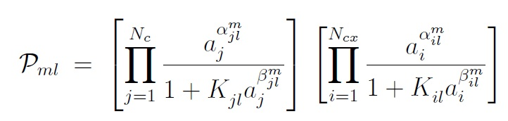

Back to :ref:`card-index`

Back to :ref:`chemistry-card`

Back to :ref:`mineral-kinetics-card`

.. _prefactor-card:

PREFACTOR
=========
Specifies coefficients for defining prefactors in mineral 
precipitation-dissolution reactions.

Required Cards:
---------------

RATE_CONSTANT <float>
 Kinetic rate constant [mol/m\ :sup:`2`\/sec].  (See 
 :ref:`mineral-kinetics-card`)

PREFACTOR_SPECIES <string>
 Name of prefactor species. Appears as subscripts *j* and *i* in above equation corresponding to primary and secondary species.

Optional Cards:
---------------

ACTIVATION_ENERGY <float>
 Activation energy for rate constant :math:`k_{ml}`.

ALPHA <float>
 :math:`\alpha_{jl}^m` parameter in above equation.

BETA <float>
 :math:`\beta_{jl}^m` parameter in above equation.

ATTENUATION_COEF <float>
 :math:`K_{jl}` \ in above equation.

Examples (data from Palandri and Kharaka (2004))
------------------------------------------------

 ::
 
  CHEMISTRY
    ...
    MINERAL_KINETICS
      K-Feldspar
        PREFACTOR
          RATE_CONSTANT -12.41d0 mol/m^2-sec
          ACTIVATION_ENERGY 38.d0
        /
        PREFACTOR
          RATE_CONSTANT -10.06d0 mol/m^2-sec
          ACTIVATION_ENERGY 51.7d0
          PREFACTOR_SPECIES H+
            ALPHA 0.5d0
          /
        /
        PREFACTOR
          RATE_CONSTANT -21.20 mol/m^2-sec
          ACTIVATION_ENERGY 94.1d0
          PREFACTOR_SPECIES H+
            ALPHA -0.823d0
          /
        /
      /
    /
  ...
  END
