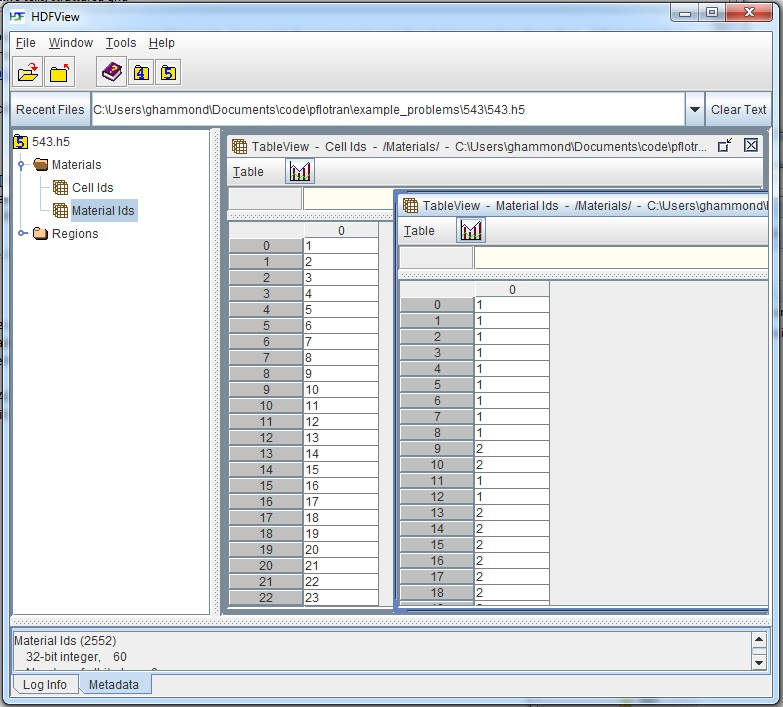

Back to :ref:`card-index`

.. _strata-card:

STRATA
======
Couples material ids and/or properties with a region in the problem domain. 

Required Cards:
---------------
STRATA
 Opens the strata block.

FILE <string>
 Name of an HDF5 file from which material IDs are read for each cell in the entire domain.

or

MATERIAL <string>
 Name of the material property to be associated with a region.  

and

:ref:`region-card` <string>
 Name of region to be associated with a material property.

Optional Cards:
---------------
START_TIME <float> <string>
  Start time when STRATA card is relevant, where <string> indicates the units of
  time. This card is useful for changing a material property at a given point in 
  time (e.g. due to human intrusion). 

END_TIME <float> <string>
  End time when STRATA card is relevant, where <string> indicates the units of
  time.

INACTIVE
  Inactivates all cells in the associated REGION.

REALIZATION_DEPENDENT
  Specifies that material IDs listed in the material ID file are realization 
  dependent.

Examples
--------
Assign Hanford unit material properties to the source zone region:

 ::

  STRATA
    MATERIAL hanford_unit
    REGION source_zone
  /

Assign material properties through material ids read from an HDF5 formatted file.  No need for a region here as material ids are assigned to the entire grid on a cell by cell basis.

 ::

  STRATA
    FILE ./543_material_ids.h5
  /

Evolving strata:

 ::

  MATERIAL_PROPERTY soil1
    ID 1
    ...
    PERMEABILITY
      PERM_ISO 1.d-12
    /
    ...
  END

  MATERIAL_PROPERTY soil2
    ID 2
    ...
    PERMEABILITY
      PERM_ISO 5.d-13
    /
    ...
  END

  STRATA
    REGION all
    MATERIAL soil1
    START_TIME 0.d0 y
    FINAL_TIME 25.d0 y
  END

  STRATA
    REGION all
    MATERIAL soil2
    START_TIME 25.d0 y
    FINAL_TIME 50.d0 y
  END

Example HDF5 file with material ids
...................................
The HDF5 file must have two datasets named **Cell Ids** and **Material Ids** 
within a group named **Materials**.  Use this 
:download:`python script <files/material_id_loader.py>` and associated 
:download:`data file <files/543_material_ids.txt>` as an example of how to load 
material ids into 543_material_ids.h5 (above).
To use this script, you must install compatible versions of the **h5py** and 
**numpy** python libraries.

