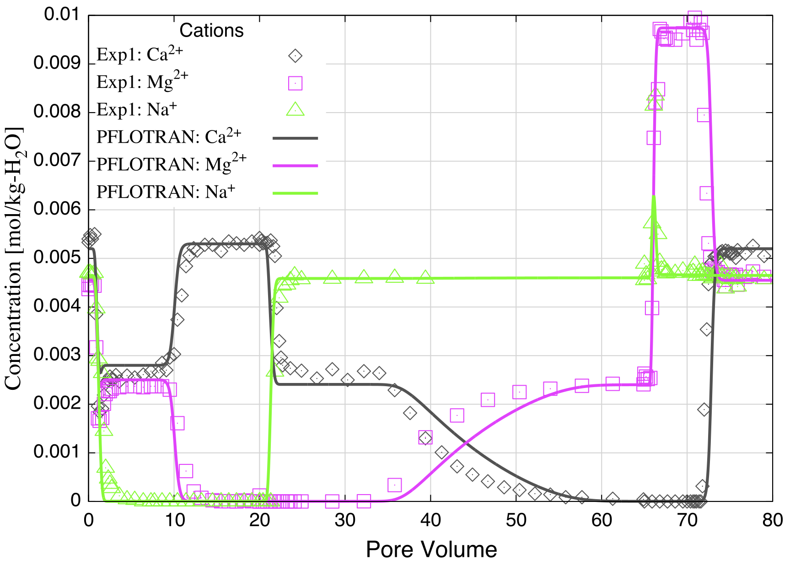
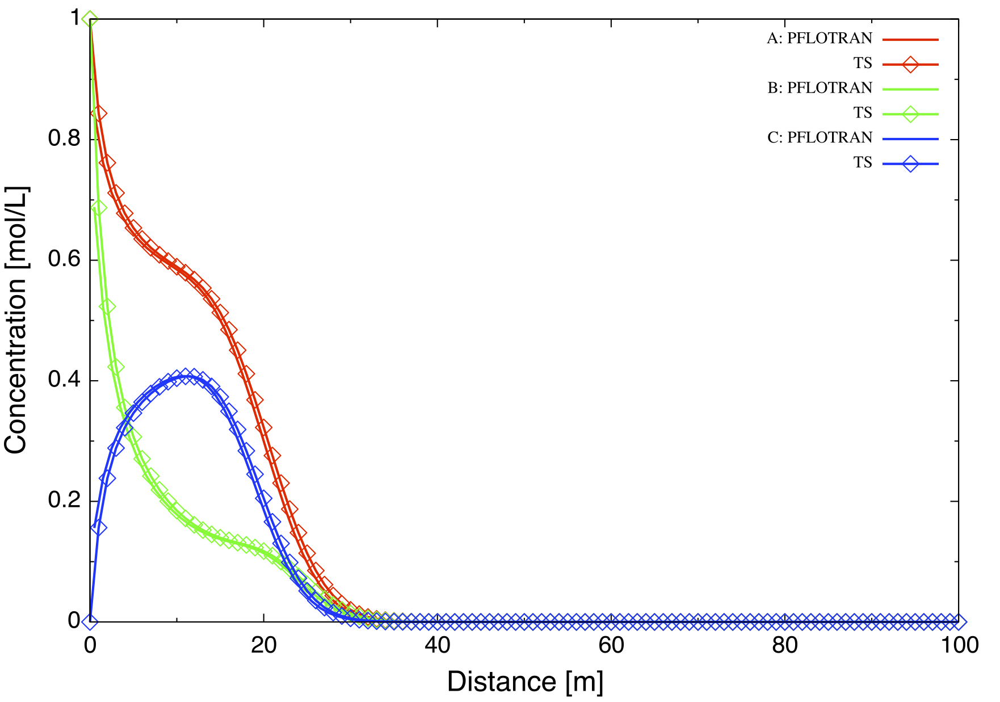
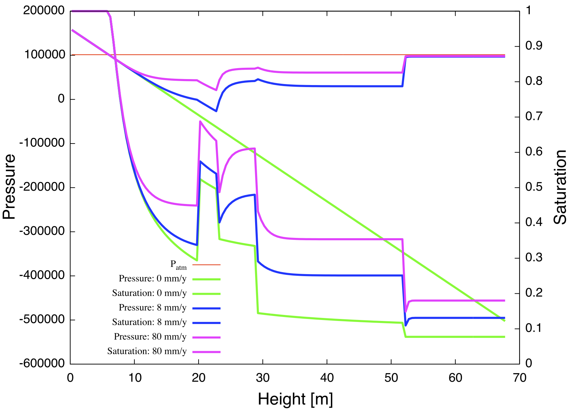
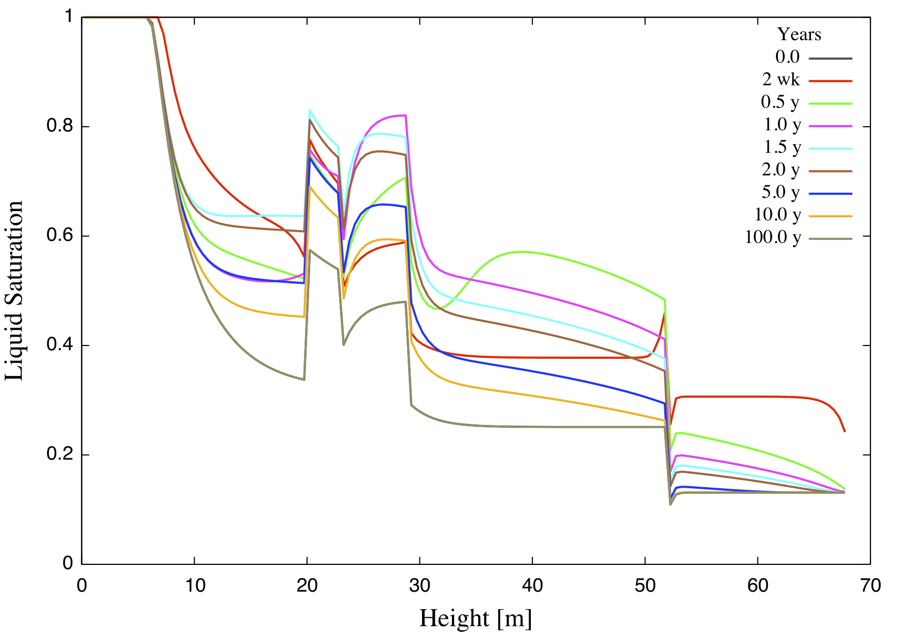
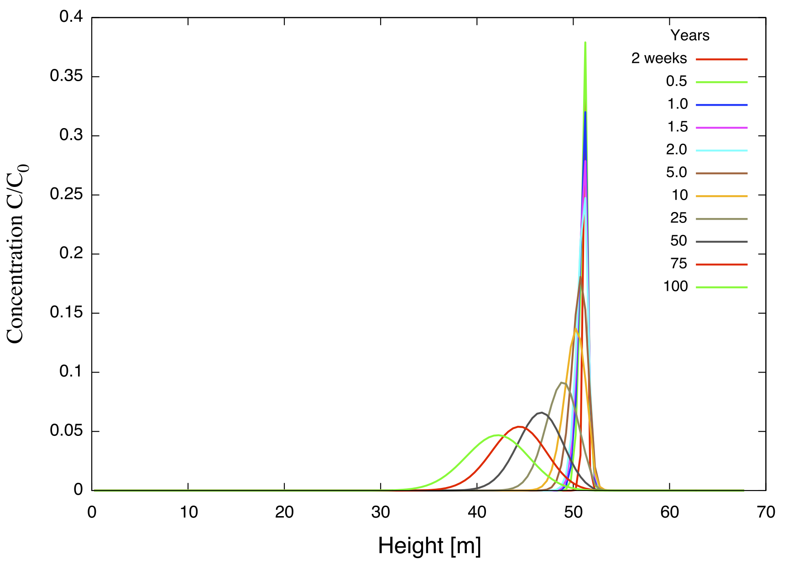
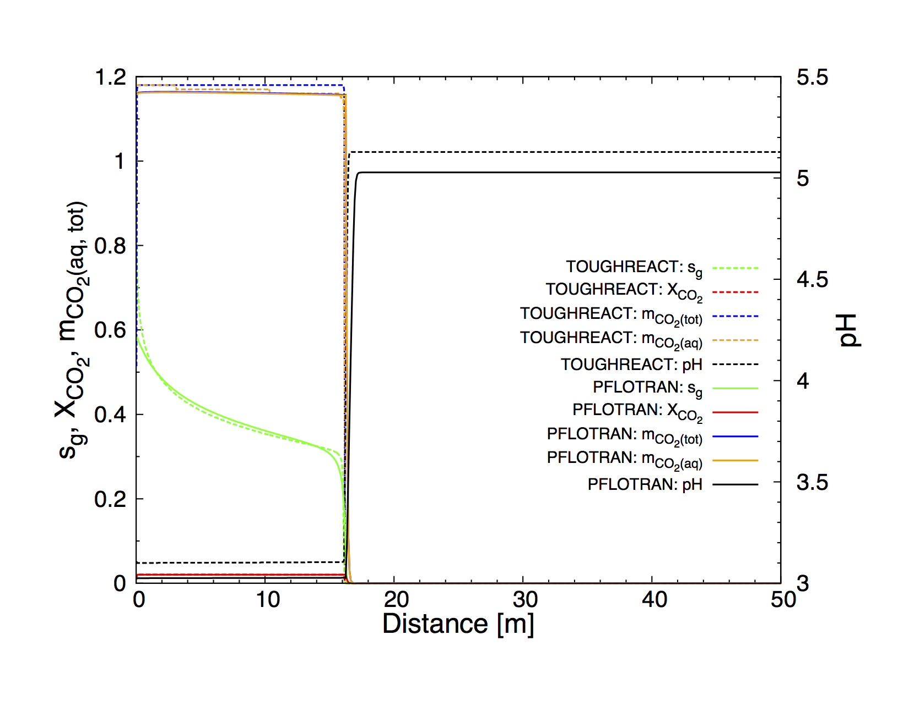
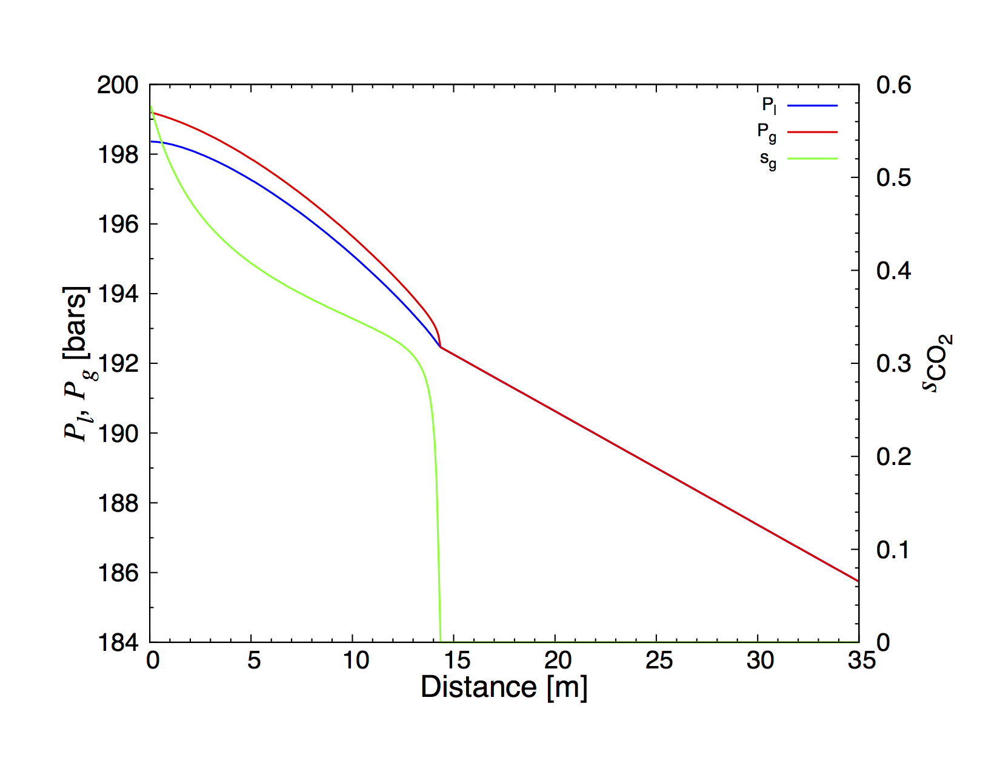
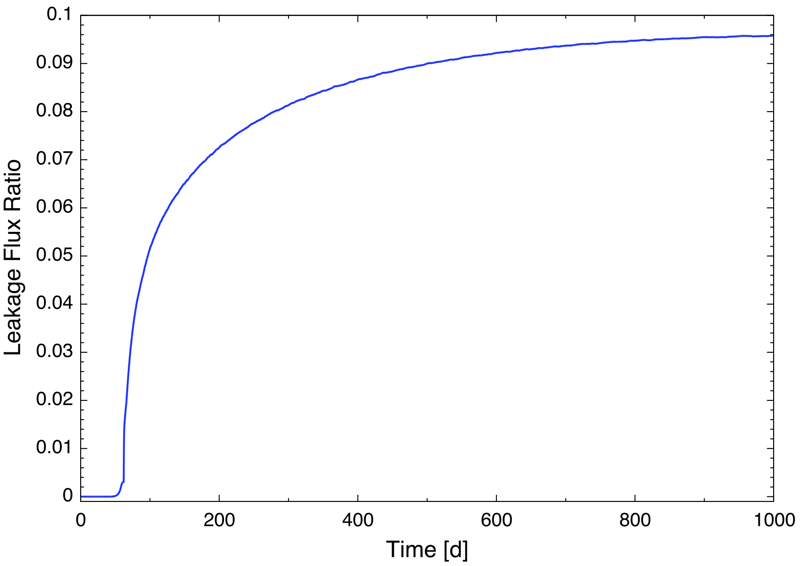
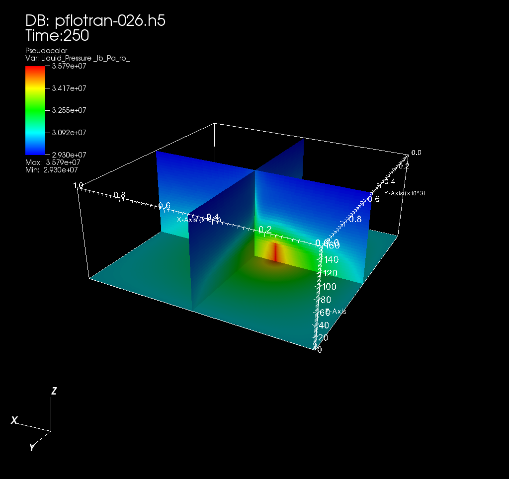

Benchmark Problems
==================

In this section several benchmark problems are introduced illustrating
the capabilities of PFLOTRAN.

Ion Exchange
------------

Voegelin et al. (2000) present results of ion exchange in a soil column
for the system Ca-Mg-Na. Here PFLOTRAN is applied to this problem using
the Gaines-Thomas exchange model. Soil column C1 with length 48.1 cm and
diameter 0.3 cm was used for the simulations. A flow rate of 5.6 cm/min
was used in the experiment. The inlet solution was changed during the
coarse of the experiment at 20 and 65 pore volumes with cation
compositions listed in Table 2 of Voegelin et al. (2000). The CEC of the
soil used in the experiments was determined to have a value of 0.06
:math:`\pm` 0.002 mol/kg. As PFLOTRAN requires the CEC in units of
mol/m\ :math:`^3` this was obtained from the formula

.. math::
   
   \omega = \frac{N_s}{V} =
   \frac{N_s}{M_s}\frac{M_s}{V_s}\frac{V_s}{V} = \rho_s (1-\varphi) {\rm CEC}.
   
Using a porosity of 0.61, the solid grain density :math:`\rho_s` is
given by

.. math::

   \rho_s = \frac{\varphi \rho_l}{1-\varphi} = 3.0344 \text{g/cm$^3$},
 

   Breakthrough curves for Ca2+, Mg2+ and Na+ compared with experimental
   results from Voegelin et al. (2000).

for the mass density per pore volume :math:`\rho_l` = 1.94
g/cm\ :math:`^3` with values from Voegelin et al. (2000). This gives for
the site density per bulk volume :math:`\omega = 71.004`
mol/m\ :math:`^3`. The results of the simulation are shown in `Figure
2 <#fig:fionex>`__ along with data reported by Voegelin et al. (2000).
Self-sharpening fronts can be observed at approximately 10 and 71 at
pore volumes, and a self-broadening front from 30-55 pore volumes where
agreement with experiment is not as good.

The input file for the simulation is listed in Table [tionex].

PFLOTRAN Input File
~~~~~~~~~~~~~~~~~~~

::

    #Description: 1D ion exchange problem

    SIMULATION
      SIMULATION_TYPE SUBSURFACE
      PROCESS_MODELS
        SUBSURFACE_TRANSPORT transport
          MODE GIRT
        /
      /
    END

    SUBSURFACE

    # m/s
    UNIFORM_VELOCITY 5.69333e-4 0.d0 0.d0

    #=========================== runtime ==========================================
    #CHECKPOINT 100
    #WALLCLOCK_STOP 11.75

    # == chemistry ================================================================
    CHEMISTRY
      #OPERATOR_SPLIT
      PRIMARY_SPECIES
        Na+
        #K+
        Ca++
        Mg++
        H+
        HCO3-
        Cl-
        Tracer
      /
      SECONDARY_SPECIES
        OH-
        CO3--
        CO2(aq)
        CaOH+
        CaCO3(aq)
        CaHCO3+
        CaCl+
        MgCO3(aq)
        MgHCO3+
        MgCl+
        HCl(aq)
        #KCl(aq)
        NaCl(aq)
        NaOH(aq)
      /
      GAS_SPECIES
        CO2(g)
      /
      MINERALS
        Halite
      /

      MINERAL_KINETICS
        Halite
          RATE_CONSTANT 1.e-30
        /
      /
      SORPTION
        ION_EXCHANGE_RXN
      # MINERAL Halite
        CEC 71.004  ! mol/m^3
        CATIONS
          Ca++   1.0 REFERENCE
          Na+    0.125893
          Mg++   0.691831
        /
      /
    /
    DATABASE /Users/lichtner/projects/parallel/repository/pflotran/database/hanford.dat
    LOG_FORMULATION
    ACTIVITY_COEFFICIENTS ! NEWTON_ITERATION
    MOLAL
    OUTPUT
      All
      TOTAL
      FREE_ION
      /
    /

    # == reference variables ======================================================
    REFERENCE_POROSITY 0.61d0

    # == time stepping ============================================================
    TIMESTEPPER
      TS_ACCELERATION 8
      MAX_STEPS 100000
      #MAX_STEPS 1
    /

    # == discretization ===========================================================
    GRID
      TYPE structured
      NXYZ 250 1 1
      BOUNDS
        0.d0 0.d0 0.d0
        0.481d0 1.d0 1.d0
      /
    /

    # == flow solvers =============================================================
    NEWTON_SOLVER FLOW
      PRECONDITIONER_MATRIX_TYPE AIJ
      RTOL 1.d-8
      ATOL 1.d-8
      STOL 1.d-30
      ITOL_UPDATE 1.d0
      #NO_INFINITY_NORM
      #NO_PRINT_CONVERGENCE
      #PRINT_DETAILED_CONVERGENCE
    /

    LINEAR_SOLVER FLOW
      #KSP_TYPE PREONLY
      #PC_TYPE LU
      #KSP_TYPE FGMRES !samrai
      #PC_TYPE SHELL !samrai
    /

    # == transport solvers ========================================================
    NEWTON_SOLVER TRANSPORT
      PRECONDITIONER_MATRIX_TYPE AIJ
      RTOL 1.d-8
      ATOL 1.d-8
      STOL 1.d-30
      #NO_INFINITY_NORM
      #NO_PRINT_CONVERGENCE
      #PRINT_DETAILED_CONVERGENCE
    /

    LINEAR_SOLVER TRANSPORT
      #PC_TYPE LU
      #KSP_TYPE PREONLY
      #KSP_TYPE FGMRES ! samrai
      #PC_TYPE SHELL !samrai
    /

    # == fluid properties =========================================================
    FLUID_PROPERTY
      DIFFUSION_COEFFICIENT 1.d-9
      #DIFFUSION_COEFFICIENT 9.33333e-7
    /

    # == material properties ======================================================
    MATERIAL_PROPERTY HD
      ID 1
      SATURATION_FUNCTION default
      POROSITY 0.61
      TORTUOSITY 1.0
      #LONGITUDINAL_DISPERSIVITY 0.001
      PERMEABILITY
        PERM_ISO 5.43d-13
      /
    /

    # == saturation / permeability functions ======================================
    SATURATION_FUNCTION HD
      SATURATION_FUNCTION_TYPE VAN_GENUCHTEN
      RESIDUAL_SATURATION 0.115
      LAMBDA 0.286
      ALPHA 1.9401d-4
    /

    #=========================== saturation functions =============================
    SATURATION_FUNCTION default
    /

    # == output ===================================================================
    OUTPUT
      TIMES s 10307.1 33498.2 41228.6
      PERIODIC_OBSERVATION TIMESTEP 1
      #PERIODIC TIMESTEP 1
      #PERIODIC TIME 0.04 y
      SCREEN PERIODIC 10
      #FORMAT HDF5
      FORMAT TECPLOT POINT
      VELOCITIES
    /

    # == times ====================================================================
    TIME
      FINAL_TIME 41228.6 s
      INITIAL_TIMESTEP_SIZE 1. s
      MAXIMUM_TIMESTEP_SIZE 20. s
      MAXIMUM_TIMESTEP_SIZE 1. s at 10200. s
      MAXIMUM_TIMESTEP_SIZE 20. s at 10350 s
      MAXIMUM_TIMESTEP_SIZE 1. s at 33300 s
      MAXIMUM_TIMESTEP_SIZE 20. s at 33600 s
    /

    # == regions ==================================================================
    REGION all
      COORDINATES
        0.d0 0.d0 0.d0
        0.481d0 1.d0 1.d0
      /
    /

    REGION west
      FACE WEST
      COORDINATES
        0. 0. 0.
        0. 1. 1.
      /
    /

    REGION east
      FACE EAST
      COORDINATES
        0.481 0. 0.
        0.481 1. 1.
      /
    /

    OBSERVATION
      REGION east
    /

    # == flow conditions ==========================================================
    skip
    FLOW_CONDITION west
      TYPE
        FLUX NEUMANN
      /
      FLUX 0.317098d-7 ! 1 m/y
      #FLUX 1.5855d-9 ! 5 cm/y
      #FLUX file 200w_recharge_1951-2000_daily.dat
    /
    noskip

    FLOW_CONDITION Initial
      TYPE
        PRESSURE HYDROSTATIC
      /
      DATUM 0.d0 0.d0 0.d0
      PRESSURE 101325.d0
    /

    FLOW_CONDITION west
      TYPE
        PRESSURE HYDROSTATIC
      /
      DATUM 0.d0 0.d0 0.d0
      PRESSURE 101425.d0
    END

    FLOW_CONDITION east
      TYPE
        PRESSURE HYDROSTATIC
      /
      DATUM 0.d0 0.d0 0.d0
      PRESSURE 101325.d0
    END

    # == transport conditions =====================================================
    TRANSPORT_CONDITION Initial
      TYPE DIRICHLET
      CONSTRAINT_LIST
        0.d0 Initial
      /
    /

    TRANSPORT_CONDITION east
      TYPE DIRICHLET
      CONSTRAINT_LIST
        0.d0 Initial
      /
    /

    TRANSPORT_CONDITION west
      TYPE DIRICHLET
      CONSTRAINT_LIST
        0.d0    Inlet1
        10307.1 Inlet2
        33498.2 Inlet3
      /
    /

    # == couplers =================================================================
    INITIAL_CONDITION Initial
      #FLOW_CONDITION Initial
      TRANSPORT_CONDITION Initial
      REGION all
    /

    BOUNDARY_CONDITION
      #FLOW_CONDITION west
      TRANSPORT_CONDITION west
      REGION west
    END

    BOUNDARY_CONDITION
      #FLOW_CONDITION east
      TRANSPORT_CONDITION east
      REGION east
    END

    # == stratigraphy =============================================================
    STRATA
      MATERIAL HD
      REGION all
    /

    # == transport constraints ====================================================
    CONSTRAINT Initial
      CONCENTRATIONS
        Na+           4.65d-3  T
        #K+            2.d-4    T
        Ca++          5.2d-3   T
        Mg++          4.55e-3  T
        H+            4.6     pH
        HCO3-        -3.5      G   CO2(g)
        Cl-           1.d-3    Z
        Tracer        4.65d-3  T
      /
      MINERALS
        Halite        0.5 1.
      /
    /

    CONSTRAINT Inlet1
      CONCENTRATIONS
        Na+           1.d-16  T
        #K+            1.d-10  T
        Ca++          5.3d-3  T
        Mg++          1.e-16  T
        H+            4.6    pH
        HCO3-        -3.5     G   CO2(g)
        Cl-           3.d-4   Z
        Tracer        9.4d-3  T
      /
    /

    CONSTRAINT Inlet2
      CONCENTRATIONS
        Na+           4.6d-3  T
        #K+            1.d-10  T
        Ca++          1.d-16  T
        Mg++          2.4e-3  T
        H+            4.6    pH
        HCO3-        -3.5     G   CO2(g)
        Cl-           3.d-4   Z
        Tracer        9.4d-3  T
      /
    /

    CONSTRAINT Inlet3
      CONCENTRATIONS
        Na+           4.65d-3 T
        #K+            1.d-10  T
        Ca++          5.2d-3  T
        Mg++          4.55e-3 T
        H+            4.6    pH
        HCO3-        -3.5     G   CO2(g)
        Cl-           3.d-4   Z
        Tracer        9.4d-3  T
      /
    /

    END_SUBSURFACE

GENERAL\_REACTION Example
-------------------------

Problem Description
~~~~~~~~~~~~~~~~~~~

A single irreversible reaction is considered of the form

.. math::
   
   A + 2 B \rightarrow C,
   
for flow in a fully saturated 1D column of length 100 m with a Darcy
velocity of 1 m/y, diffusion coefficient of :math:`10^{-9}`
m\ :math:`^2`/s and porosity equal to 0.25. The conservation equation
for advection, diffusion and reaction is given by

.. math::
   
   \frac{{{\partial}}}{{{\partial}}t} \varphi C_l + {\boldsymbol{\nabla}}\cdot{\boldsymbol{F}}_l = - \varphi \nu_l {{{\mathcal R}}}, \ \ \ \ (l=A,\,B,\,C),
   
with stoichiometric coefficients :math:`\nu_A = 1`, :math:`\nu_B = 2`,
and :math:`\nu_C=-1`. The flux :math:`{\boldsymbol{F}}_l` consists of
contributions from advection and diffusion

.. math::
   
   {\boldsymbol{F}}_l = {\boldsymbol{q}}C_l - \varphi D {\boldsymbol{\nabla}}C_l.
   
The forward reaction rate is based on a elementary aqueous reaction

.. math::
   
   {{{\mathcal R}}}= k_f C_A^{\nu_A} C_B^{\nu_B}.
   
Dividing through by porosity (assuming :math:`\varphi` = constant), the
transport equation becomes

.. math::
   
   \frac{{{\partial}}C_l}{{{\partial}}t} + {\boldsymbol{\nabla}}\cdot{\boldsymbol{v}}C_l - D {\boldsymbol{\nabla}}\cdot{\boldsymbol{\nabla}}C_l + \nu_l^{} k_{f}^{} C_A^{\nu_A} C_B^{\nu_B} = 0,
   
with average pore velocity

.. math::
   
   {\boldsymbol{v}}= \frac{{\boldsymbol{q}}}{\varphi}.
   
Initial and boundary conditions imposed on the solution are given by

.. math::
   
   C(x,t=0) = C_\infty,
   C(x=0,\,t) = C_0,
   \left.\frac{{{\partial}}C}{{{\partial}}x} \right|_{x=l_x} = 0.
   
Simulation Results
~~~~~~~~~~~~~~~~~~

Results are shown in `Figure 3 <#fig:fabc>`__ for the concentrations of
species A, B, C at 5 years obtained from PFLOTRAN and a prototype code
written in C++ based on the PETSc TS time stepping class. The code uses
a backward Euler (TSBEULER) time integrator with nodes placed at the
grid cell corners. The slight discrepancy between the results of the two
codes may be due to the use of a finite volume cell-centered grid in
PFLOTRAN, versus the corner-node grid used in the prototype code.

   Comparison of concentrations for species A, B, C plotted as a
   function of distance for an elapsed time of 5 years for PFLOTRAN and
   a prototype code based on PETSc’s TS class.

PFLOTRAN Input File
~~~~~~~~~~~~~~~~~~~

::

    #Description: 1D general reaction with the aqueous reaction A + 2 B -> C.

    SIMULATION
      SIMULATION_TYPE SUBSURFACE
      PROCESS_MODELS
        SUBSURFACE_TRANSPORT transport
          MODE GIRT
        /
      /
    END

    SUBSURFACE

    #=========================== useful tranport parameters ==================
    UNIFORM_VELOCITY 1.d0 0.d0 0.d0 m/yr

    REFERENCE_DENSITY 1000.d0

    #=========================== chemistry ========================================
    CHEMISTRY
      PRIMARY_SPECIES
        A(aq)
        B(aq)
        C(aq)
      /
      GENERAL_REACTION
        REACTION A(aq) + 2 * B(aq) <-> C(aq)
        FORWARD_RATE 5.d-8
        BACKWARD_RATE 0.d0
      /
      DATABASE /Users/lichtner/pflotran/pflotran/database/hanford.dat
      OUTPUT
        all
        TOTAL
      /
    END

    #=========================== solver options ===================================
    LINEAR_SOLVER TRANSPORT
      SOLVER DIRECT
    END

    #=========================== discretization ===================================
    GRID
      TYPE structured
      NXYZ 100 1 1
      BOUNDS
        0.d0 0.d0 0.d0
        100.d0 100.d0 1.d0
      /
    END

    #=========================== fluid properties =================================
    FLUID_PROPERTY
      DIFFUSION_COEFFICIENT 1.d-9
    END

    #=========================== material properties ==============================
    MATERIAL_PROPERTY soil1
      ID 1
      POROSITY 0.25d0
      TORTUOSITY 1.d0
      ROCK_DENSITY 1650.d0
    END

    #=========================== output options ===================================
    OUTPUT
      TIMES y 5.
      FORMAT TECPLOT POINT
    END

    #=========================== times ============================================
    TIME
      FINAL_TIME 5.d0 y
      INITIAL_TIMESTEP_SIZE 1.d0 h
      MAXIMUM_TIMESTEP_SIZE 1.d-2 y
    END

    #=========================== regions ==========================================
    REGION all
      COORDINATES
        0.d0 0.d0 0.d0
        100.d0 1.d0 1.d0
      /
    END

    REGION west
      FACE WEST
      COORDINATES
        0.d0 0.d0 0.d0
        0.d0 1.d0 1.d0
      /
    END

    REGION east
      FACE EAST
      COORDINATES
        100.d0 0.d0 0.d0
        100.d0 1.d0 1.d0
      /
    END

    #=========================== transport conditions =============================
    TRANSPORT_CONDITION initial
      TYPE DIRICHLET
      CONSTRAINT_LIST
        0.d0 initial
      /
    END

    TRANSPORT_CONDITION inlet
      TYPE DIRICHLET
      CONSTRAINT_LIST
        0.d0 inlet
      /
    END

    TRANSPORT_CONDITION outlet
      TYPE ZERO_GRADIENT
      CONSTRAINT_LIST
        0.d0 inlet
      /
    END

    #=========================== constraints ======================================
    CONSTRAINT initial
      CONCENTRATIONS
        A(aq) 1.d-16 T
        B(aq) 1.d-16 T
        C(aq) 1.d-16 T
      /
    END

    CONSTRAINT inlet
      CONCENTRATIONS
        A(aq) 1.d0   T
        B(aq) 1.d0   T
        C(aq) 1.d-16 T
      /
    END

    #=========================== condition couplers ===============================
    # initial condition
    INITIAL_CONDITION
      TRANSPORT_CONDITION initial
      REGION all
    END

    BOUNDARY_CONDITION outlet
      TRANSPORT_CONDITION outlet
      REGION east
    END

    BOUNDARY_CONDITION inlet
      TRANSPORT_CONDITION inlet
      REGION west
    END

    #=========================== stratigraphy couplers ============================
    STRATA
      REGION all
      MATERIAL soil1
    END

    END_SUBSURFACE

RICHARDS Mode with Tracer: SX-115 Hanford Tank Farm
---------------------------------------------------

Problem Description
~~~~~~~~~~~~~~~~~~~

The saturation profile is computed for both steady-state and transient
conditions in a 1D vertical column consisting of a layered porous medium
representing the Hanford sediment in the vicinity of the S/SX tank farm.
The transient case simulates a leak from the base of the SX-115 tank.
This problem description is taken from Lichtner et al. (2004).

Governing Equations
~~~~~~~~~~~~~~~~~~~

The moisture profile is calculated using parameters related to the
Hanford sediment at the S/SX tank farm based on the Richards equation
for variably saturated porous media. The Hanford sediment is composed of
five layers with the properties listed in Tables [t1] and [t2]. The
governing equations consist of Richards equation for variably saturated
fluid flow given by

.. math::

   \frac{{{\partial}}}{{{\partial}}t} \varphi s\rho + {\boldsymbol{\nabla}}\cdot{\boldsymbol{q}}\rho = Q,
   
and solute transport of a tracer

.. math::
   
   \frac{{{\partial}}}{{{\partial}}t}\varphi C + {\boldsymbol{\nabla}}\cdot\big({\boldsymbol{q}}C - \varphi s \tau D {\boldsymbol{\nabla}}C\big) = Q_C.
   
In these equations :math:`\varphi` denotes the spatially variable
porosity of the porous medium assumed to constant within each
stratigraphic layer, :math:`s` gives the saturation state of the porous
medium, :math:`\rho` represents the fluid density in general a function
of pressure and temperature, :math:`C` denotes the solute concentration,
:math:`D` denotes the diffusion/dispersion coefficient, :math:`\tau`
represents tortuosity, :math:`Q` and :math:`Q_C` denote source/sink
terms, and :math:`{\boldsymbol{q}}` denotes the Darcy velocity defined
by

.. math::
   
   {\boldsymbol{q}}= - \frac{k_{\rm sat}k_r}{\mu} {\boldsymbol{\nabla}}(p-\rho g z),
   
with saturated permeability :math:`k_{\rm sat}`, relative permeability
:math:`k_r`, fluid viscosity :math:`\mu`, pressure :math:`p`, formula
weight of water :math:`W`, acceleration of gravity :math:`g`, and height
:math:`z`. Van Genuchten capillary properties are used for relative
relative permeability according to the relation

.. math::
   :label: kr
   
   k_{r} = \sqrt{s_{\rm eff}} \left\{1 - \left[1- \left( s_l^{\rm
   eff} \right)^{1/m} \right]^m \right\}^2,
   
where :math:`s_{\rm eff}` is related to capillary pressure :math:`P_c`
by the equation

.. math::
   :label: sat
  
   s_{\rm eff} = \left[1+\left( \alpha |P_c| \right)^n
   \right]^{-m},
 
where :math:`s_{\rm eff}` is defined by

.. math::
   :label: seff1
   
   s_{\rm eff} = \frac{s - s_r}{1 - s_r},
   
and where :math:`s_r` denotes the residual saturation. The quantity
:math:`n` is related to :math:`m` by the expression

.. math::
   :label: lambda
   
   m = 1-\frac{1}{n}, \ \ \ \ \ n = \frac{1}{1-m}.
   
The capillary pressure :math:`P_c` and fluid pressure :math:`p` are
related by the (constant) gas pressure :math:`p_g^0`

.. math::
   
   P_c = p_g^0-p,
   
where :math:`p_g^0 = 101,325` Pa is set to atmospheric pressure.

Semi-Analytical Solution for Steady-State Conditions
^^^^^^^^^^^^^^^^^^^^^^^^^^^^^^^^^^^^^^^^^^^^^^^^^^^^

For steady-state conditions the saturation profile satisfies the
equation

.. math::
   
   \frac{d}{dz} \rho q_z = 0,
   
or assuming an incompressible fluid

.. math::
   
   q_z = q_z^0,
   
where :math:`q_z^0` denotes infiltration at the surface. Thus the
pressure is obtained as a function of :math:`z` by solving the ODE

.. math::
   :label: dpdz
   
   \frac{dp}{dz} = -\frac{\mu q_z^0}{k_{\rm sat} k_r} - \rho g,
   
using Eqns. :eq:`kr` and :eq:`sat` to express
the relative permeability :math:`k_r` as a function of pressure. For the
special case of zero infiltration it follows that

.. math::
   
   p(z) = p_0 - \rho g (z-z_0),
   
with :math:`p(z_0) = p_0`. The saturation profile is obtained from
Eqns. :eq:`sat` and :eq:`seff1`.

Watertable
^^^^^^^^^^
The position of the watertable is defined by vanishing of the capillary
pressure

.. math::
   
   P_c(z_{\rm wt}) = 0,
   
where :math:`z_{\rm wt}` denotes the height of the watertable. For the
case with no infiltration at the surface it follows that

.. math::
   
   z_{\rm wt} = z_0 + \frac{p_0-p_g}{\rho g},
   
with the boundary condition :math:`p(z_0) = p_0` and :math:`z_0` denotes
the datum. If :math:`p_0` is set equal to :math:`p_g`, then
:math:`z_{\rm wt} = z_0`, or the height of the watertable is equal to
the datum. The same holds true also with constant nonzero infiltration.

Model Parameters
~~~~~~~~~~~~~~~~

Model parameters used in the simulations are listed in :ref:`Table 1 <table-1>` and
:ref:`Table 2 <table-2>`. Although not needed here, thermal properties are also listed.
Diffusivity was set to :math:`10^{-9}` m\ :math:`^2` s\ :math:`^{-1}`
and tortuosity was set to one.

.. _table-1:

.. table:: Stratigraphic sequence used in the calculations, after Ward et
    al. (1996). 

    +-------------------------+-----------+-----------------+
    | Formation               | Abbrev.   | Thickness [m]   |
    +=========================+===========+=================+
    | Backfill                | BF        | 16.0            |
    +-------------------------+-----------+-----------------+
    | Hanford Fine Sand       | HF        | 23.0            |
    +-------------------------+-----------+-----------------+
    | Plio-Pleistocene        | PP        | 6.0             |
    +-------------------------+-----------+-----------------+
    | Upper Ringold Gravel    | URG       | 3.0             |
    +-------------------------+-----------+-----------------+
    | Middle Ringold Gravel   | MRG       | 20.0            |
    +-------------------------+-----------+-----------------+

|
|
    
.. _table-2:

.. table:: Parameters for material and thermal properties for intrinsic rock
    density :math:`\rho_s`, heat capacity :math:`c`, wet and dry thermal conductivity
    :math:`\kappa`, porosity :math:`\varphi`, residual water saturation
    :math:`s_r`, van Genuchten parameters :math:`\alpha` and
    :math:`\lambda`, and vertical water saturated permeability
    :math:`k_{\rm sat}`. Data taken from Khaleel and Freeman (1995), Khaleel
    et al. (2001), and Pruess et al. (2002).
    :widths: 20 40 30 30 30 30 30

    +--------------------------+----------------------------------------+-------------+------------+-------------+------------+------------+
    |                          |                                        |                          | Formation:                            |
    +--------------------------+----------------------------------------+-------------+------------+-------------+------------+------------+
    | Property                 |           [units]                      |     BF      |  HF        |    PP       |   URG      |    MRG     |
    +==========================+========================================+=============+============+=============+============+============+
    | :math:`\rho_s`           | [g cm\ :math:`^{-3}`]                  |     2.8     |  2.8       |    2.8      |   2.8      |    2.8     |
    +--------------------------+----------------------------------------+-------------+------------+-------------+------------+------------+
    | :math:`c`                | [J kg\ :math:`^{-1}` K\ :math:`^{-1}`] |    800      |    800     |    800      |   800      |    800     | 
    +--------------------------+----------------------------------------+-------------+------------+-------------+------------+------------+
    | :math:`\kappa_{\rm dry}` | [W m\ :math:`^{-1}` K\ :math:`^{-1}`]  |    0.5      |    0.5     |    0.5      |   0.5      |    0.5     |
    +--------------------------+----------------------------------------+-------------+------------+-------------+------------+------------+
    | :math:`\kappa_{\rm wet}` | [W m\ :math:`^{-1}` K\ :math:`^{-1}`]  |     2       |     2      |     2       |    2       |   2        | 
    +--------------------------+----------------------------------------+-------------+------------+-------------+------------+------------+
    | :math:`\varphi`          | [---]                                  |  0.2585     |  0.3586    |   0.4223    | 0.2625     | 0.1643     |
    +--------------------------+----------------------------------------+-------------+------------+-------------+------------+------------+
    | :math:`s_r`              | [---]                                  |  0.0774     | 0.0837     |   0.2595    | 0.2130     | 0.0609     |
    +--------------------------+----------------------------------------+-------------+------------+-------------+------------+------------+
    | :math:`\alpha`           | [Pa\ :math:`^{-1}`]                    | 1.008e-3    |  9.408e-5  |  6.851e-5   |  2.966e-5  |  6.340e-5  |
    +--------------------------+----------------------------------------+-------------+------------+-------------+------------+------------+
    | :math:`m`                | [---]                                  |  0.658      | 0.4694     |  0.4559     | 0.3859     |  0.3922    |
    +--------------------------+----------------------------------------+-------------+------------+-------------+------------+------------+
    | :math:`k_{\mathrm{sat}}` | [ m\ :math:`^2`]                       |  1.240e-12  | 3.370e-13  |  3.735e-14  | 1.439e-13  | 2.004e-13  |
    +--------------------------+----------------------------------------+-------------+------------+-------------+------------+------------+

Simulation Results
~~~~~~~~~~~~~~~~~~

The calculations are carried out for an isothermal system using Richards
equation. First, the steady-state saturation profile is obtained without
the tank leak present. Then using the steady-state profile as the
initial condition the tank leak is turned on. This can be easily
accomplished using CHECKPOINTING and RESTART keywords. The results for
the steady-state saturation and pressure profiles are shown in `Figure
4 <#fig:f1>`__ for infiltration rates at the surface of 0, 8 and 80
mm/y. The mean infiltration rate at the Hanford site is approximately 8
mm/y. A 1D column 68 m heigh with the water table located at a height of
6 m from the bottom is used in the simulation. A uniform grid spacing of
0.5 m is used to discretize Richards equation.

Shown in `Figure 5 <#fig:f2>`__ is the saturation at different times
following a two week leak releasing 60,000 gallons from the SX-115 tank
at a depth of 16 m. In the simulation a release rate of
:math:`1.87 \times 10^{-3}` kg/s is used.

   Steady-state saturation and pressure profiles for infiltration rates
   of 0, 8 and 80 mm/y. The water table is located at 6 m from the
   bottom of the computational domain.

   Simulation of a tank leak with a duration of two weeks showing the
   saturation profile for different times indicated in the figure for an
   infiltration rate of 8 mm/y.

   The solute concentration profile corresponding to the above figure
   for different times indicated in the figure for an infiltration rate
   of 8 mm/y.

PFLOTRAN Input File
~~~~~~~~~~~~~~~~~~~

Listing for the PFLOTRAN input file coupling Richards mode to a tracer
is given below. Note that the stratigraphic zone specification in
``REGION`` is grid independent as is the grid size specification in
keyword ``GRID``. Therefore to change the grid spacing only the
line:\ ``NXYZ 1 1 136``, needs to be changed. Also note that lines
beginning with ``#`` are read as a comment as is input following ``!``.

Note that the input file looks for the RESTART file for the transient
run in the subdirectory: ``./ss/sx115-restart.chk``.

PFLOTRAN input file ``sx115.in``:

::

    #Description: 1D test problem for tracer transport for Hanford SX-115 waste tank.

    SIMULATION
      SIMULATION_TYPE SUBSURFACE
      PROCESS_MODELS
        SUBSURFACE_FLOW flow
          MODE RICHARDS
        /
        SUBSURFACE_TRANSPORT transport
          MODE GIRT
        /
      /
    END

    SUBSURFACE

    #=========================== chemistry ========================================
    CHEMISTRY
      PRIMARY_SPECIES
        Tracer
      /
      OUTPUT
        all
        FREE_ION
      /
    END

    #=========================== runtime ==========================================
    #CHECKPOINT 100000
    RESTART ./ss/sx115-restart.chk 0.d0
    #OVERWRITE_RESTART_TRANSPORT
    #WALLCLOCK_STOP 11.75

    #=========================== solver options ===================================
    TIMESTEPPER FLOW
      #MAX_STEPS -1
      TS_ACCELERATION 8
      INITIALIZE_TO_STEADY_STATE 1.d0
    END

    NEWTON_SOLVER FLOW
      #RTOL 1.d-12
      RTOL 1.d-20
      #ATOL 1.d-12
      #STOL 1.e-60
      #DTOL 1.e4
      ITOL_UPDATE 1.d0
      #NO_INFINITY_NORM
      #NO_PRINT_CONVERGENCE
      #PRINT_DETAILED_CONVERGENCE
    END

    LINEAR_SOLVER FLOW
      #KSP_TYPE GMRES
      #PC_TYPE NONE
      #KSP_TYPE PREONLY
      #PC_TYPE LU
      #SOLVER GMRES
    END

    NEWTON_SOLVER TRANSPORT
      RTOL 1.d-12
      ATOL 1.d-12
      STOL 1.e-60
      DTOL 1.e4
      #ITOL_UPDATE 1.d-4
      #NO_INFINITY_NORM
      #NO_PRINT_CONVERGENCE
      #PRINT_DETAILED_CONVERGENCE
    END

    LINEAR_SOLVER TRANSPORT
      #KSP_TYPE GMRES
      #PC_TYPE NONE
      #KSP_TYPE PREONLY
      #PC_TYPE LU
      #SOLVER GMRES
    END

    #=========================== discretization ===================================
    GRID
      TYPE structured
      ORIGIN 0.d0 0.d0 0.d0
      NXYZ 1 1 136
      BOUNDS
        0.d0 0.d0 0.d0
        1.d0 1.d0 68.d0
      /
    END

    #=========================== fluid properties =================================
    FLUID_PROPERTY
      DIFFUSION_COEFFICIENT 1.d-9
    END

    #=========================== material properties ==============================
    MATERIAL_PROPERTY Backfill
      ID 1
      POROSITY 0.2585d0
      TORTUOSITY 0.5d0
      SATURATION_FUNCTION BF
      PERMEABILITY
        PERM_X 1.24e-12
        PERM_Y 1.24e-12
        PERM_Z 1.24e-12
      /
    END

    MATERIAL_PROPERTY Hanford-Fine-Sand
      ID 2
      POROSITY 0.3586
      TORTUOSITY 0.5d0
      SATURATION_FUNCTION HF
      PERMEABILITY
        PERM_X 3.37028e-13
        PERM_Y 3.37028e-13
        PERM_Z 3.37028e-13
      /
    END

    MATERIAL_PROPERTY Plio-Pleistocene
      ID 3
      POROSITY 0.4223d0
      TORTUOSITY 0.5d0
      SATURATION_FUNCTION PP
      PERMEABILITY
        PERM_X 3.73463e-14
        PERM_Y 3.73463e-14
        PERM_Z 3.73463e-14
      /
    END

    MATERIAL_PROPERTY Upper-Ringold-Gravel
      ID 4
      POROSITY 0.2625d0
      TORTUOSITY 0.5d0
      SATURATION_FUNCTION URG
      PERMEABILITY
        PERM_X 1.4392e-13
        PERM_Y 1.4392e-13
        PERM_Z 1.4392e-13
      /
    END

    MATERIAL_PROPERTY Middle-Ringold-Gravel
      ID 5
      POROSITY 0.1643
      TORTUOSITY 0.5d0
      SATURATION_FUNCTION MRG
      PERMEABILITY
        PERM_X 2.00395e-13
        PERM_Y 2.00395e-13
        PERM_Z 2.00395e-13
      /
    END

    #=========================== saturation functions =============================

    CHARACTERISTIC_CURVES BF
      SATURATION_FUNCTION VAN_GENUCHTEN
        M 0.6585d0
        ALPHA  1.008d-3
        LIQUID_RESIDUAL_SATURATION 0.0774
      /
      PERMEABILITY_FUNCTION MUALEM_VG_LIQ
        M 0.6585d0
        LIQUID_RESIDUAL_SATURATION 0.0774
      /
    END

    CHARACTERISTIC_CURVES HF
      SATURATION_FUNCTION VAN_GENUCHTEN
        M 0.46944d0
        ALPHA  9.40796d-5
        LIQUID_RESIDUAL_SATURATION 0.08366d0
      /
      PERMEABILITY_FUNCTION MUALEM_VG_LIQ
        M 0.46944d0
        LIQUID_RESIDUAL_SATURATION 0.08366d0
      /
    END

    CHARACTERISTIC_CURVES PP
      SATURATION_FUNCTION VAN_GENUCHTEN
        M 0.45587d0
        ALPHA  6.85145d-5
        LIQUID_RESIDUAL_SATURATION 0.25953d0
      /
      PERMEABILITY_FUNCTION MUALEM_VG_LIQ
        M 0.45587d0
        LIQUID_RESIDUAL_SATURATION 0.25953d0
      /
    END

    CHARACTERISTIC_CURVES URG
      SATURATION_FUNCTION VAN_GENUCHTEN
        M 0.38594d0
        ALPHA  2.96555d-5
        LIQUID_RESIDUAL_SATURATION 0.21295d0
      /
      PERMEABILITY_FUNCTION MUALEM_VG_LIQ
        M 0.38594d0
        LIQUID_RESIDUAL_SATURATION 0.21295d0
      /
    END

    CHARACTERISTIC_CURVES MRG
      SATURATION_FUNCTION VAN_GENUCHTEN
        M 0.39217d0
        ALPHA  6.34015e-5
        LIQUID_RESIDUAL_SATURATION 0.06086d0
      /
      PERMEABILITY_FUNCTION MUALEM_VG_LIQ
        M 0.39217d0
        LIQUID_RESIDUAL_SATURATION 0.06086d0
      /
    END

    #=========================== output options ===================================
    OUTPUT
      #SCREEN PERIODIC 10
      #MASS_BALANCE
      TIMES y 0.0383562 0.5 1.0 1.5 2.0 5.0 10.0 25. 50. 75. 100.
      FORMAT TECPLOT POINT
    # VELOCITIES
      PRINT_COLUMN_IDS
      PERIODIC_OBSERVATION TIMESTEP 1
    END

    #=========================== times ============================================
    TIME
      FINAL_TIME 100.d0 y
      INITIAL_TIMESTEP_SIZE 1.d-6 y
      MAXIMUM_TIMESTEP_SIZE 1.d-2 y
      MAXIMUM_TIMESTEP_SIZE 1.d0 y at 10 y
      MAXIMUM_TIMESTEP_SIZE 10.d0 y at 100 y
    END

    #=========================== regions ==========================================
    REGION all
      COORDINATES
        0.d0 0.d0 0.d0
        1.d0 1.d0 136.d0
      /
    END

    REGION MRG
      COORDINATES
        0.d0 0.d0 0.d0
        1.d0 1.d0 20.d0
      /
    END

    REGION URG
      COORDINATES
        0.d0 0.d0 20.d0
        1.d0 1.d0 23.d0
      /
    END

    REGION PP
      COORDINATES
        0.d0 0.d0 23.d0
        1.d0 1.d0 29.d0
      /
    END

    REGION HF
      COORDINATES
        0.d0 0.d0 29.d0
        1.d0 1.d0 52.d0
      /
    END

    REGION BF
      COORDINATES
        0.d0 0.d0 52.d0
        1.d0 1.d0 68.d0
      /
    END

    #=============boundaries=================

    REGION west
      FACE WEST
      COORDINATES
        0.d0 0.d0 0.d0
        0.d0 1.d0 68.d0
      /
    END

    REGION east
      FACE EAST
      COORDINATES
        1.d0 0.d0 0.d0
        1.d0 1.d0 68.d0
      /
    END

    REGION north
      FACE NORTH
      COORDINATES
        0.d0 1.d0 0.d0
        1.d0 1.d0 68.d0
      /
    END

    REGION south
      FACE SOUTH
      COORDINATES
        0.d0 0.d0 0.d0
        1.d0 0.d0 68.d0
      /
    END

    REGION top
      FACE TOP
      COORDINATES
        0.d0 0.d0 68.d0
        1.d0 1.d0 68.d0
      /
    END

    REGION bottom
      FACE BOTTOM
      COORDINATES
        0.d0 0.d0 0.d0
        1.d0 1.d0 0.d0
      /
    END

    REGION well
      COORDINATES
        1.d0 1.d0 52.d0
        1.d0 1.d0 52.d0
      /
    END

    #=========================== flow conditions ==================================
    FLOW_CONDITION initial
      TYPE
        PRESSURE HYDROSTATIC
      /
      DATUM 0.d0 0.d0 6.d0
      PRESSURE 101325.d0
    END

    FLOW_CONDITION infiltration
      TYPE
        FLUX NEUMANN
      /
    # FLUX 2.53678e-8 ! 0.08 m/yr
    # FLUX 2.53678e-9 ! 0.08 m/yr
      FLUX 2.53678e-10 ! 8 mm/yr
    # FLUX 0.d0
    END

    FLOW_CONDITION water_table
      TYPE
        PRESSURE HYDROSTATIC
      /
      DATUM 0.d0 0.d0 6.d0
      PRESSURE 101325.d0
      #PRESSURE 1.4e5 ! 200 meter piezometric head (200*997.32*9.81)
    END

    FLOW_CONDITION source
      TYPE
        RATE mass_rate
      /
      RATE LIST
      TIME_UNITS s
      DATA_UNITS kg/s
      0.  0.187e-4
      1.21293e6 0.
      /
    END

    #=========================== transport conditions =============================
    TRANSPORT_CONDITION initial
      TYPE ZERO_GRADIENT
      CONSTRAINT_LIST
        0.d0 initial
      /
    END

    TRANSPORT_CONDITION boundary
      TYPE ZERO_GRADIENT
      CONSTRAINT_LIST
        0.d0 initial
      /
    END

    TRANSPORT_CONDITION infiltration
      TYPE DIRICHLET
      CONSTRAINT_LIST
        0.d0 infiltration
      /
    END

    TRANSPORT_CONDITION source
      TYPE DIRICHLET
      CONSTRAINT_LIST
        0.d0 well
      /
    /

    #=========================== condition couplers ===============================
    # initial condition
    INITIAL_CONDITION
      FLOW_CONDITION initial
      TRANSPORT_CONDITION initial
      REGION all
    END

    # top boundary condition
    BOUNDARY_CONDITION top
      #FLOW_CONDITION initial
      FLOW_CONDITION infiltration
      TRANSPORT_CONDITION initial
      REGION top
    END

    # bottom boundary condition
    BOUNDARY_CONDITION bottom
      FLOW_CONDITION water_table
      TRANSPORT_CONDITION initial
      REGION bottom
    END

    # well source/sink
    #skip
    SOURCE_SINK well
      FLOW_CONDITION source
      TRANSPORT_CONDITION source
      REGION well
    END
    #noskip

    # infiltration source/sink
    skip
    SOURCE_SINK infil
      FLOW_CONDITION infiltration
      TRANSPORT_CONDITION infiltration
      REGION top
    END
    noskip

    #=========================== stratigraphy couplers ============================
    STRATA
      REGION MRG
      MATERIAL Middle-Ringold-Gravel
    END

    STRATA
      REGION URG
      MATERIAL Upper-Ringold-Gravel
    END

    STRATA
      REGION PP
      MATERIAL Plio-Pleistocene
    END

    STRATA
      REGION HF
      MATERIAL Hanford-Fine-Sand
    END

    STRATA
      REGION BF
      MATERIAL Backfill
    END

    skip
    STRATA
      REGION all
      MATERIAL Middle-Ringold-Gravel
    END
    noskip

    #=========================== constraints ======================================

    CONSTRAINT well
      CONCENTRATIONS
        Tracer 1.d0 T
      /
    END

    CONSTRAINT infiltration
      CONCENTRATIONS
        Tracer 1.d0 T
      /
    END

    CONSTRAINT initial
      CONCENTRATIONS
        Tracer 1.d-16 T
      /
    END

    END_SUBSURFACE

MPHASE
------

:math:`\mathrm{CO_2}` Sequestration: 1D Example Problem and Comparison with TOUGHREACT
~~~~~~~~~~~~~~~~~~~~~~~~~~~~~~~~~~~~~~~~~~~~~~~~~~~~~~~~~~~~~~~~~~~~~~~~~~~~~~~~~~~~~~

This example problem involves sequentially coupling of
``MPHASE`` and ``CHEMISTRY``. The chemical system consists of four
primary species and 5 secondary species. Supercritical
:math:`\mathrm{CO_2}` is injected into a well located at the west
boundary. A Dirichlet pressure boundary condition is imposed at the east boundary
and no flow at the west boundary. The problem definition with associated parameters is given in
Table [tco2].

+-----------------------------+----------------------------------+----------------------------------------------------------+
| Description                 | Symbol                           | Value                                                    |
+=============================+==================================+==========================================================+
| Domain                      | :math:`l`                        | 100 m                                                    |
+-----------------------------+----------------------------------+----------------------------------------------------------+
| Permeability                | :math:`k`                        | :math:`10^{-15}` m\ :math:`^2`                           |
+-----------------------------+----------------------------------+----------------------------------------------------------+
| Porosity                    | :math:`\varphi`                  | 0.12                                                     |
+-----------------------------+----------------------------------+----------------------------------------------------------+
| Tortuosity                  | :math:`\tau`                     | 1                                                        |
+-----------------------------+----------------------------------+----------------------------------------------------------+
| Injection Rate              | :math:`Q_{{\rm CO_2}}`           | :math:`5\times 10^{-5}` kg/s, duration 0.4 y             |
+-----------------------------+----------------------------------+----------------------------------------------------------+
| Characteristic Curves       | modified van Genuchten           | [see Eqns. :eq:`pc` - :eq:`sg`]                          |
+-----------------------------+----------------------------------+----------------------------------------------------------+
|                             | :math:`\lambda`                  | 0.6                                                      |
+-----------------------------+----------------------------------+----------------------------------------------------------+
|                             | :math:`{{\alpha}}`               | :math:`1.9 \times 10^{-5}` Pa\ :math:`^{-1}`             |
+-----------------------------+----------------------------------+----------------------------------------------------------+
|                             | :math:`s_{rl}`                   | 0                                                        |
+-----------------------------+----------------------------------+----------------------------------------------------------+
|                             | :math:`s_{rg}`                   | 0                                                        |
+-----------------------------+----------------------------------+----------------------------------------------------------+
|                             | :math:`P_c^{\rm max}`            | :math:`10^7` Pa                                          |
+-----------------------------+----------------------------------+----------------------------------------------------------+
| Rock Density                | :math:`\rho_r`                   | 2650 kg/m\ :math:`^3`                                    |
+-----------------------------+----------------------------------+----------------------------------------------------------+
| Rock Specific Heat          | :math:`c_r`                      | 1000 J/kg/K                                              |
+-----------------------------+----------------------------------+----------------------------------------------------------+
| Rock Thermal Conductivity   | :math:`\kappa_{\rm wet,\,dry}`   | 0.5 W/m/K                                                |
+-----------------------------+----------------------------------+----------------------------------------------------------+

Table: Problem definition and parameters used in the 1D
:math:`\mathrm{CO_2}` sequestration example.

The PFLOTRAN initial aqueous solution corresponds to a brine with NaCl
concentration of 0.5 m. Mineral reactions are not considered. The
initial fluid composition taken from pflotran.out is listed in
Table [tinitial\_co2].

+--------------------------------------------------+
| Transport Condition: Initial                     |
+==================================================+
| iterations: 20                                   |
+--------------------------------------------------+
| pH: 5.0273                                       |
+--------------------------------------------------+
| ionic strength: 4.7915E-01 [mol/L]               |
+--------------------------------------------------+
| charge balance: 1.1102E-16                       |
+--------------------------------------------------+
| pressure: 1.6450E+07 [Pa]                        |
+--------------------------------------------------+
| temperature: 54.50 [C]                           |
+--------------------------------------------------+
| density H2O: 992.99 [kg/m^3]                     |
+--------------------------------------------------+
| ln / activity H2O: 0.0000E+00 1.0000E+00 [---]   |
+--------------------------------------------------+
| mole fraction H2O: 9.8093E-01 [---]              |
+--------------------------------------------------+
| mass fraction H2O: 9.7160E-01 [---]              |
+--------------------------------------------------+

+-------------------+--------------+---------------+--------------+--------------+
| primary species   | free molal   | total molal   | act coef     | constraint   |
+===================+==============+===============+==============+==============+
| H+                | 1.1727E-05   | 2.5844E-17    | 8.0079E-01   | chrg         |
+-------------------+--------------+---------------+--------------+--------------+
| Na+               | 4.7913E-01   | 5.0000E-01    | 6.8288E-01   | total aq     |
+-------------------+--------------+---------------+--------------+--------------+
| Cl-               | 4.7913E-01   | 5.0000E-01    | 6.4459E-01   | total aq     |
+-------------------+--------------+---------------+--------------+--------------+
| CO2(aq)           | 1.1380E-04   | 1.2551E-04    | 1.1053E+00   | CO2(g)       |
+-------------------+--------------+---------------+--------------+--------------+

+------------+--------------+--------------+--------------+
| complex    | molality     | act coef     | logK         |
+============+==============+==============+==============+
| NaCl(aq)   | 2.0866E-02   | 1.0000E+00   | 6.8511E-01   |
+------------+--------------+--------------+--------------+
| HCO3-      | 1.1713E-05   | 6.8288E-01   | 6.2239E+00   |
+------------+--------------+--------------+--------------+
| OH-        | 1.2056E-08   | 6.6467E-01   | 1.3123E+01   |
+------------+--------------+--------------+--------------+
| NaOH(aq)   | 1.6487E-09   | 1.0000E+00   | 1.3325E+01   |
+------------+--------------+--------------+--------------+
| CO3--      | 3.2433E-10   | 2.0899E-01   | 1.6323E+01   |
+------------+--------------+--------------+--------------+

The defining equations for the saturation and relative permeability
functions for the aqueous solution and supercritical
:math:`\mathrm{CO_2}` are given by the van Genuchten -Corey relations.
For the aqueous solution van Genuchten curves are used for capillary
pressure :math:`P_c`

.. math::
   :label: pc
   
   P_c(s_e) = \frac{1}{{{\alpha}}}\Big[\big(s_e\big)^{-1/\lambda} -1\big]^{1-\lambda},
   
and relative permeability :math:`k_{rl}`

.. math::
   
   k_{rl} = \sqrt{s_e}\left\{1-\left[1-\big( s_e \big)^{1/\lambda}\right]^\lambda\right\}^2,
   
with effective saturation :math:`s_e` defined by

.. math::
   
   s_e = \frac{s_l - s_{lr}}{1-s_{lr}}.
   
For the supercritical :math:`\mathrm{CO_2}` phase the Corey curve is
used defined by

.. math::
   
   k_{rg} = \big(1-s'\big)^2 \big[1-(s')^2\big],
   
with

.. math::
   :label: sg
   
   s' = \frac{s_l-s_{lr}}{1-s_{lr}-s_{gr}}.
   
Shown in `Figure 6 <#fig:fco2>`__ is a comparison of PFLOTRAN with
TOUGHREACT (TOUGHREACT results provided by Alt-Epping and Wanner,
private communication). The same thermodynamic database is used for both
codes. Only slight differences can be seen. The :math:`\mathrm{CO_2}`
aqueous and total concentrations are essentially identical for PFLOTRAN
in the low pH region where supercritical :math:`\mathrm{CO_2}` is
present, with slight differences for TOUGHREACT.

   Comparison with TOUGHREACT (dashed curves) and PFLOTRAN (solid
   curves) after an elapsed time of 0.4 y corresponding to the end of
   injection. Reasonable agreement is obtained between the two codes.

   Liquid (blue curve) and supercritical :math:`\mathrm{CO_2}` (red
   curve) pressures predicted by PFLOTRAN after an elapsed time of 0.4 y
   corresponding to the end of injection. Also shown is the
   :math:`\mathrm{CO_2}` saturation (green curve).

Note that the :math:`\mathrm{CO_2}` aqueous concentration (and mole
fraction :math:`X_{\rm CO_2}` although not visible in the figure)
obtained from PFLOTRAN is not exactly constant. This is caused,
presumably, by a change in pressure as shown in `Figure 7 <#fig:fp>`__
for the liquid and :math:`\mathrm{CO_2}` pressures in addition to the
:math:`\mathrm{CO_2}` saturation :math:`s_{\rm CO_2}`.

:math:`\mathrm{CO_2}` Sequestration in the Presence of a Leaky Well
~~~~~~~~~~~~~~~~~~~~~~~~~~~~~~~~~~~~~~~~~~~~~~~~~~~~~~~~~~~~~~~~~~~

The simulation domain has a lateral extent of :math:`1,000\times 1,000`
m and vertical height of 160 m. The leaky well is at the center of the
domain and the injection well is 100 m east. There are two aquifers at
the top and bottom of the domain, each 30 m thick, and an aquitard with
thickness of 100 m sandwiched between the two aquifers. The leaky well
is modeled as a porous medium with a higher permeability compared to the
formation. Parameter values used in the simulation are listed in
Table [tleaky\_params]. Other parameters used for characteristic curves,
heat conduction, etc. may be found in the input file listing (see
Table [tleaky-co2in]).

The initial conditions consist of hydrostatic pressure, and isothermal
temperature of 34\ :math:`^\circ`\ C. The initial pressure at the bottom
of the domain is :math:`3.086\times 10^7` Pa (at 3,000 m depth). At the
lateral boundaries, hydrostatic boundary conditions are imposed on the
system. The boundaries at the top and bottom of the domain are no flow
boundary conditions. :math:`\mathrm{CO_2}` is injected at a constant
rate of 8.87 kg/s for the duration of the simulation of 1000 days and at
a constant temperature of 33.6\ :math:`^\circ`\ C.

The computational domain was discretized into
:math:`200 \times 200 \times 32` grid blocks with spacing
:math:`\Delta x = \Delta y = 5` m, and :math:`\Delta z = 5` m. The total
number of degrees of freedom are 3,840,000. The problem was run on 512
processes on the supercomputer Yellowstone at the NCAR-Wyoming
Supercomputing Center.

+--------------+------------------------------+----------------+-----------------+
| Unit         | Permeability [m:math:`^2`]   | Porosity [—]   | Depth [m]       |
+==============+==============================+================+=================+
| Aquifer      | :math:`2 \times 10^{-14}`    | 0.15           | 0–30, 130–160   |
+--------------+------------------------------+----------------+-----------------+
| Aquitard     | :math:`1 \times 10^{-18}`    | 0.15           | 30–130          |
+--------------+------------------------------+----------------+-----------------+
| Leaky well   | :math:`1 \times 10^{-12}`    | 0.15           | 0–160           |
+--------------+------------------------------+----------------+-----------------+

Table: Model parameters.

Results of the simulation for an elapsed time of 250 days are shown in
`Figure 8 <#fig:f250d>`__ for liquid pressure and saturation of
supercritical CO\ :sub:`2`. Supercritical CO\ :sub:`2`
proceeds up the leaky well until it ponds at the top of the domain where
a closed boundary is imposed.

The leakage of CO\ :sub:`2` through the leaky well as a
function of time is shown in `Figure 9 <#fig:fleaky_flx>`__. This is
defined as the CO\ :sub:`2` mass flow midway between the top
and bottom domain divided by the injection rate. The maximum value in
the leak occurs at approximately 800 d. The leak begins at approximately
50 d. The results can be compared to Ebigo et al. (2007), Figure 8. It
should be noted that the leakage rate is highly sensitive to the lateral
grid spacing.

   Leakage rate relative to injection rate.
   

