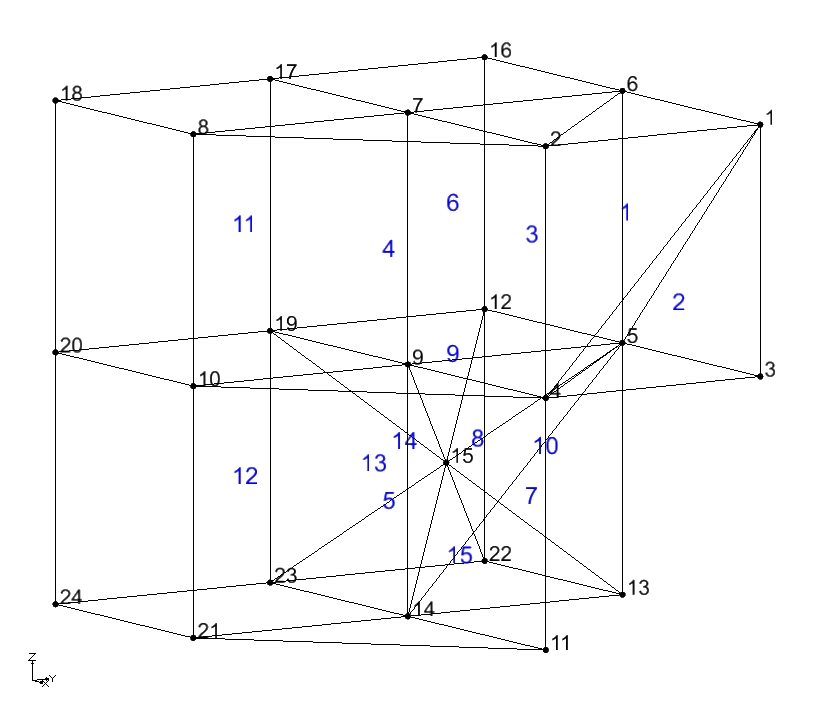
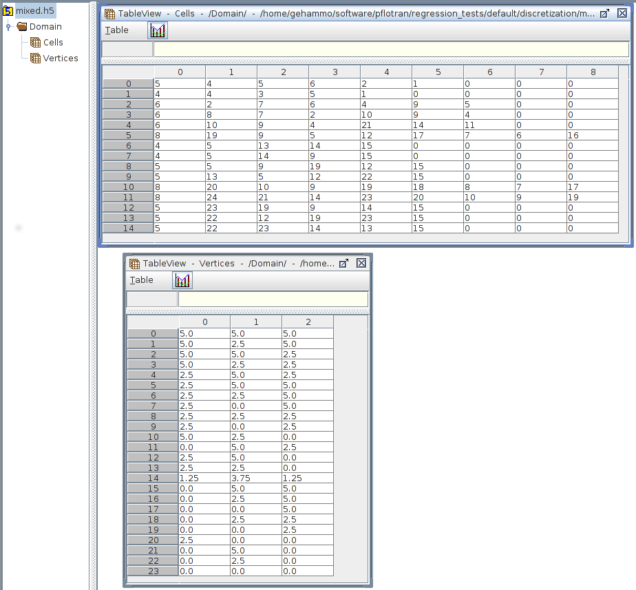

Back to :ref:`card-index`

Back to :ref:`grid-card`

.. _unstructured-implicit-grid-card:

UNSTRUCTURED
============

Defines a standard finite element format where cells (elements) are defined by lists of vertices and vertices are defined by coordinates. We often refer to these as *implicit* unstructured grids. See :download:`PFLOTRAN_cell_numbering_schemes.pdf <../files/PFLOTRAN_cell_numbering_schemes.pdf>` for cell face and vertex numbering schemes.

.. TODO(anyone): replace ExodusII cell numbering figures with our own.

ASCII File Format
-----------------

The first line specifies the number of cells and vertices. Cells are then specified, one per line with a single character that defines cell type followed by a list of the cell's vertices (see :download:`PFLOTRAN_cell_numbering_schemes.pdf <../files/PFLOTRAN_cell_numbering_schemes.pdf>` for vertex numbering schemes.)
Vertices are specified, one per line after cells through a list of coordinates (in units of meters). **Vertex IDs follow 1-based numbering.**

NUM_CELLS: Number of cells in grid

NUM_VERTICES: Number of vertices in grid

CELL_TYPE

 * T = tetrahedron (4 vertices)
 * P = pyramid (5 vertices)
 * W = wedge (6 vertices)
 * H = hexahedron (8 vertices)

VERTEX\_#: Vertex ID (1-based ordering)

VERTEX_X_COORDINATE: X coordinate of vertex [m]

 ::

  NUM_CELLS NUM_VERTICES
  CELL_TYPE VERTEX_1 VERTEX_2 ... VERTEX_N
  ...
  CELL_TYPE VERTEX_1 VERTEX_2 ... VERTEX_N
  VERTEX_X_COORDINATE VERTEX_Y_COORDINATE VERTEX_Z_COORDINATE
  ...
  VERTEX_X_COORDINATE VERTEX_Y_COORDINATE VERTEX_Z_COORDINATE

Example
.......

Example implicit unstructured grid in ASCII format (see `mixed.ugi`_).

.. _mixed.ugi: https://bitbucket.org/pflotran/pflotran/src/master/regression_tests/default/discretization/mixed.ugi

 ::

  15 24
  P 4 5 6 2 1
  T 4 3 5 1
  W 2 7 6 4 9 5
  W 8 7 2 10 9 4
  W 10 9 4 21 14 11
  H 19 9 5 12 17 7 6 16
  T 5 13 14 15
  T 5 14 9 15
  P 5 9 19 12 15
  P 13 5 12 22 15
  H 20 10 9 19 18 8 7 17
  H 24 21 14 23 20 10 9 19
  P 23 19 9 14 15
  P 22 12 19 23 15
  P 22 23 14 13 15
  5.000000e+00 5.000000e+00 5.000000e+00
  5.000000e+00 2.500000e+00 5.000000e+00
  5.000000e+00 5.000000e+00 2.500000e+00
  5.000000e+00 2.500000e+00 2.500000e+00
  2.500000e+00 5.000000e+00 2.500000e+00
  2.500000e+00 5.000000e+00 5.000000e+00
  2.500000e+00 2.500000e+00 5.000000e+00
  2.500000e+00 0.000000e+00 5.000000e+00
  2.500000e+00 2.500000e+00 2.500000e+00
  2.500000e+00 0.000000e+00 2.500000e+00
  5.000000e+00 2.500000e+00 0.000000e+00
  0.000000e+00 5.000000e+00 2.500000e+00
  2.500000e+00 5.000000e+00 0.000000e+00
  2.500000e+00 2.500000e+00 0.000000e+00
  1.250000e+00 3.750000e+00 1.250000e+00
  0.000000e+00 5.000000e+00 5.000000e+00
  0.000000e+00 2.500000e+00 5.000000e+00
  0.000000e+00 0.000000e+00 5.000000e+00
  0.000000e+00 2.500000e+00 2.500000e+00
  0.000000e+00 0.000000e+00 2.500000e+00
  2.500000e+00 0.000000e+00 0.000000e+00
  0.000000e+00 5.000000e+00 0.000000e+00
  0.000000e+00 2.500000e+00 0.000000e+00
  0.000000e+00 0.000000e+00 0.000000e+00

Image of the mixed.ugi.  *This is solely a small test grid from the regression tests. It does not reflect a realistic subsurface domain.*

HDF5 File Format
----------------

Two HDF5 datasets (*Cells* and *Vertices*) are placed within an named *Domain* within the HDF5 file. *Cells* defines the cell type and the cell's vertices, while *Vertices* defines the vertex coordinates. As an example, consider the ASCII example above with 15 cells and 24 vertices. 

Cells
.....

*Domain/Cells* is a 2D integer (i4) dataset and sized 15x9 (number of cells X 9) [e.g. NumPy.zeros((15,9),dtype='i4')]. The second dimension of size 9 specifies the cell type in the first index and the cell vertex IDs in the remaining 8 indices, similar to the ASCII format above. The maximum number of vertices is 8.  Thus, 1 + 8 = 9. (see :download:`PFLOTRAN_cell_numbering_schemes.pdf <../files/PFLOTRAN_cell_numbering_schemes.pdf>` for vertex numbering schemes.)

Integer Cell Types:

 * 4 = tetrahedron (4 vertices)
 * 5 = pyramid (5 vertices)
 * 6 = wedge (6 vertices)
 * 8 = hexahedron (8 vertices)

Note that the remaining columns on each row in the HDF5 dataset are padded with zeros to preserve a rectangular dataset. **Vertex IDs follow 1-based numbering.**

Vertices
........

*Domain/Vertices* is a 2D double precision (f8) dataset and sized 24x3 (number of vertices X 3) [e.g. NumPy.zeros((24,3),dtype='f8')]. The first dimension is the number of vertices and the second dimension accommodates the (3) X, Y, and Z coordinates.

Example
.......

Example implicit unstructured grid in HDF5 format (see `mixed.h5`_). *Note the zero-based numbering at the left side is HDFView's numbering, not the cell ID.*

.. _mixed.h5: https://bitbucket.org/pflotran/pflotran/src/master/regression_tests/default/discretization/mixed.h5

