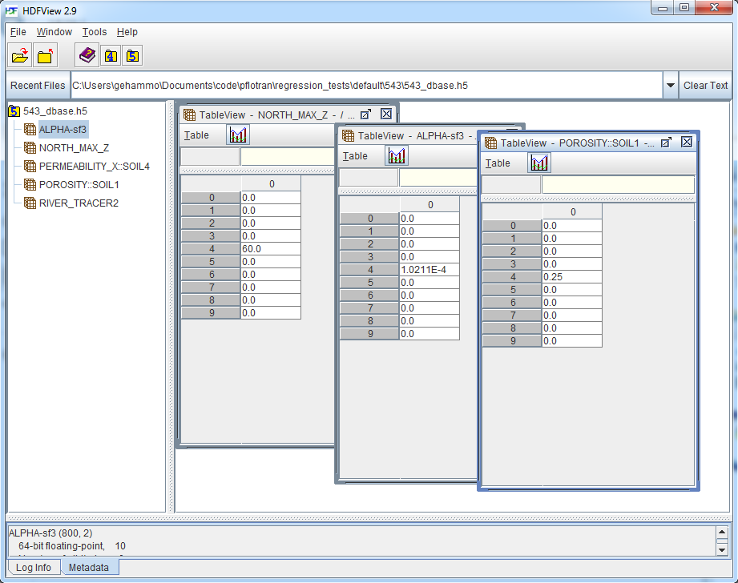

Back to :ref:`card-index`

.. _dbase-filename-card:

DBASE_FILENAME
==============
Allows the user to define input parameters through an external database stored 
in an ASCII text or HDF5 file.  These parameters can be realization dependent 
where an array of values is provided and indexed by the realization id.

Required Cards:
---------------
DBASE_FILENAME <string>
  Indicates the path/filename of the external database to be employed.  

DBASE_VALUE <string> 
  Indicates the name of the parameter to be read from the database file.  
  This card combination may be entered anywhere a double precision value is 
  read from the input file.  See examples below:

Examples
--------

 ::

  DBASE_FILENAME 543_dbase.h5
  ...
  MATERIAL_PROPERTY soil1
    ...
    POROSITY DBASE_VALUE POROSITY::SOIL1
  END  
  MATERIAL_PROPERTY soil4
    ...
      PERM_X DBASE_VALUE PERMEABILITY_X::SOIL4
  END
  ...
  CHARACTERISTIC_CURVES sf3
    ...
    ALPHA DBASE_VALUE ALPHA-sf3
  END
  ...
  REGION north
    FACE NORTH
    COORDINATES
      0.d0 46.d0 0.d0
      60.d0 46.d0 DBASE_VALUE NORTH_MAX_Z
    /
  END
  ...
  CONSTRAINT river_water
    CONCENTRATIONS
      Tracer   1.e-3                        F
      Tracer2  DBASE_VALUE RIVER_TRACER2    F
    /
  END

In the above example, values for POROSITY, PERM_X, ALPHA, the Z coordinate, 
and Tracer2 concentration are assigned based on the database stored in 
543_dbase.h5 and the command line argument -realization_id 5 (note the 
zero-based index of 4 in the HDF5 file is actually the 5th realization).  
An example script for creating the database file may be found in 
``PFLOTRAN_DIR/src/python/dbase_creator.py``. The figure below shows a snapshot
of what the file 543_dbase.h5 looks like using the program ``hdfview``.

